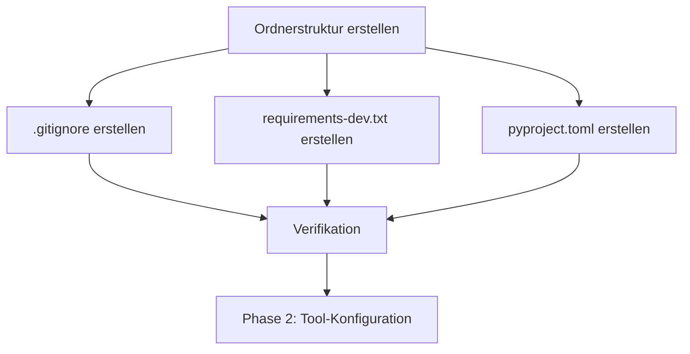

I have created the following plan after thorough exploration and analysis of the codebase. Follow the below plan verbatim. Trust the files and references. Do not re-verify what's written in the plan. Explore only when absolutely necessary. First implement all the proposed file changes and then I'll review all the changes together at the end.

## Beobachtungen

Das Workspace ist aktuell leer (nur `.claude/` Verzeichnis vorhanden). Es handelt sich um ein echtes Greenfield-Setup ohne bestehende Python-Projektstruktur. Der Projektname "codemap" und die Anforderung für strikte TDD-Enforcement sind klar definiert. Die Basis-Struktur muss alle notwendigen Verzeichnisse und Konfigurationsdateien für ein modernes Python-Projekt mit pytest, mypy, ruff und MkDocs enthalten.

## Ansatz

Die Implementierung erfolgt durch Erstellung der kompletten Ordnerstruktur und aller Basis-Konfigurationsdateien in einem Schritt. Der Fokus liegt auf der physischen Struktur und den Dependency-Definitionen, ohne bereits Tool-Konfigurationen oder Tests zu implementieren (diese folgen in späteren Phasen). Die Struktur folgt modernen Python-Best-Practices mit `src/`-Layout für bessere Testbarkeit.

## Implementierungsschritte

### 1. Ordnerstruktur erstellen

Erstelle folgende Verzeichnisstruktur im Workspace-Root:

```
/Users/philippbriese/Documents/dev/projects/Production/ContextCurator/
├── src/
│   └── codemap/
│       ├── __init__.py
│       └── core/
│           └── __init__.py
├── tests/
│   ├── __init__.py
│   ├── conftest.py
│   └── unit/
│       └── __init__.py
└── docs/
```

**Verzeichnisse:**
- `src/codemap/` - Haupt-Package für den Anwendungscode
- `src/codemap/core/` - Core-Modul als Platzhalter für zukünftige Implementierung
- `tests/unit/` - Unit-Tests (weitere Verzeichnisse wie `integration/` können später hinzugefügt werden)
- `docs/` - Dokumentationsquellen für MkDocs

**Leere Python-Dateien:**
- `file:src/codemap/__init__.py` - Package-Initialisierung (vorerst leer, Version kommt in Phase 3)
- `file:src/codemap/core/__init__.py` - Core-Modul-Initialisierung (leer)
- `file:tests/__init__.py` - Tests als Package markieren
- `file:tests/unit/__init__.py` - Unit-Tests als Package markieren
- `file:tests/conftest.py` - Pytest-Konfiguration und Fixtures (vorerst leer)

### 2. .gitignore erstellen

Erstelle `file:.gitignore` im Root mit folgenden Einträgen:

**Python-Standard:**
- `__pycache__/`, `*.py[cod]`, `*$py.class`
- `*.so`, `*.egg`, `*.egg-info/`, `dist/`, `build/`

**Virtual Environments:**
- `venv/`, `env/`, `ENV/`, `.venv/`

**IDE/Editor:**
- `.vscode/`, `.idea/`, `*.swp`, `*.swo`, `.DS_Store`

**Testing & Coverage:**
- `.pytest_cache/`, `.coverage`, `htmlcov/`, `.tox/`

**Documentation:**
- `site/` (MkDocs Build-Output)

**Type Checking:**
- `.mypy_cache/`, `.dmypy.json`, `dmypy.json`

**Ruff:**
- `.ruff_cache/`

### 3. requirements-dev.txt erstellen

Erstelle `file:requirements-dev.txt` im Root mit allen Dependencies:

**Core Dependencies:**
```
pydantic>=2.0.0
tree-sitter>=0.20.0
tree-sitter-language-pack
pathspec
```

**TDD/QA Tools:**
```
pytest
pytest-cov
pytest-sugar
ruff
mypy
```

**Documentation:**
```
mkdocs-material
mkdocstrings[python]
```

**Hinweis:** Jede Dependency auf einer eigenen Zeile für bessere Wartbarkeit. Versions-Pins nur wo explizit gefordert (pydantic>=2.0.0, tree-sitter>=0.20.0), sonst neueste kompatible Versionen.

### 4. pyproject.toml mit Basis-Metadaten erstellen

Erstelle `file:pyproject.toml` im Root mit folgenden Sektionen:

**[build-system]:**
- `requires = ["setuptools>=68.0"]`
- `build-backend = "setuptools.build_meta"`

**[project]:**
- `name = "codemap"`
- `version = "0.1.0"`
- `description = "Professional Python project with strict TDD enforcement"`
- `requires-python = ">=3.11"`
- `readme = "README.md"`
- `authors = [{name = "Your Name", email = "your.email@example.com"}]`
- `classifiers` für Python 3.11+, Development Status :: 3 - Alpha
- `dependencies = []` (Runtime-Dependencies, vorerst leer da alles in requirements-dev.txt)

**[project.optional-dependencies]:**
- `dev = []` mit Verweis auf requirements-dev.txt via Kommentar

**[tool.setuptools.packages.find]:**
- `where = ["src"]`

**Hinweis:** Tool-spezifische Konfigurationen (`[tool.pytest.ini_options]`, `[tool.coverage.*]`, `[tool.mypy]`, `[tool.ruff]`) werden in Phase 2 hinzugefügt.

### 5. Verifikation der Struktur

Nach Erstellung sollte die Struktur wie folgt aussehen:

```
ContextCurator/
├── .gitignore
├── pyproject.toml
├── requirements-dev.txt
├── src/
│   └── codemap/
│       ├── __init__.py
│       └── core/
│           └── __init__.py
├── tests/
│   ├── __init__.py
│   ├── conftest.py
│   └── unit/
│       └── __init__.py
└── docs/
```

**Prüfpunkte:**
- Alle Verzeichnisse existieren
- Alle `__init__.py` Dateien sind vorhanden (können leer sein)
- `.gitignore` deckt alle relevanten Python-Artefakte ab
- `requirements-dev.txt` enthält alle 10 Dependencies
- `pyproject.toml` enthält valide TOML-Syntax mit Projekt-Metadaten

## Abhängigkeiten



**Hinweise:**
- Diese Phase hat keine externen Abhängigkeiten
- Alle Dateien können parallel erstellt werden nach Ordnerstruktur-Setup
- Phase 2 baut auf dieser Basis-Struktur auf und erweitert `pyproject.toml`
- Phase 3 fügt Code und Tests hinzu
- Phase 4 erstellt Dokumentation