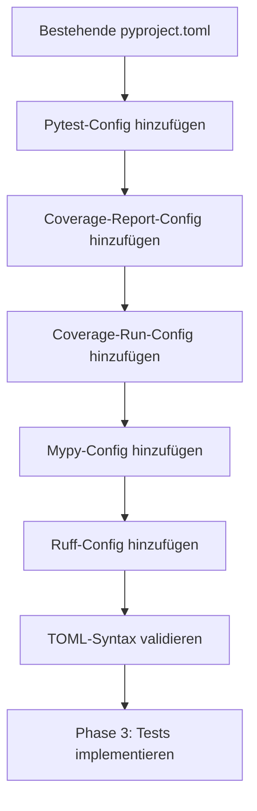

I have created the following plan after thorough exploration and analysis of the codebase. Follow the below plan verbatim. Trust the files and references. Do not re-verify what's written in the plan. Explore only when absolutely necessary. First implement all the proposed file changes and then I'll review all the changes together at the end.

## Beobachtungen

Die Basis-Projektstruktur aus Phase 1 ist vorhanden mit `pyproject.toml`, das aktuell nur Build-System und Projekt-Metadaten enthält. Jetzt müssen strikte Tool-Konfigurationen für pytest, coverage, mypy und ruff hinzugefügt werden, um TDD mit 100% Coverage-Anforderung zu erzwingen. Die Konfiguration muss so strikt sein, dass ungetesteter Code sofort als Fehler erkannt wird.

## Ansatz

Erweitere die bestehende `file:pyproject.toml` um vier Tool-Sektionen mit maximaler Striktheit. Pytest wird mit automatischen Coverage-Reports konfiguriert, Coverage mit 100% Mindestabdeckung, mypy im strict-Modus, und ruff mit essentiellen Linting-Rules. Alle Konfigurationen werden zentral in pyproject.toml verwaltet (keine separaten .coveragerc, mypy.ini, etc.), um Single Source of Truth zu gewährleisten.

## Implementierungsschritte

### 1. Pytest-Konfiguration hinzufügen

Füge `[tool.pytest.ini_options]` Sektion zu `file:pyproject.toml` hinzu:

**addopts Parameter:**
- `--cov=src/codemap` - Coverage nur für Source-Code, nicht für Tests
- `--cov-report=term-missing` - Zeigt fehlende Zeilen direkt im Terminal
- `--cov-report=html` - Generiert HTML-Report in `htmlcov/` für detaillierte Analyse
- `--strict-markers` - Verhindert Tippfehler bei Test-Markern
- `--strict-config` - Fehler bei ungültigen Konfigurationen
- `-ra` - Zeigt Zusammenfassung aller Test-Ergebnisse

**testpaths Parameter:**
- `["tests"]` - Definiert explizit Test-Verzeichnis

**python_files, python_classes, python_functions:**
- Standard-Patterns: `test_*.py`, `Test*`, `test_*`

### 2. Coverage-Report-Konfiguration hinzufügen

Füge `[tool.coverage.report]` Sektion hinzu:

**fail_under Parameter:**
- `100` - Build schlägt fehl bei weniger als 100% Coverage (strikte TDD-Enforcement)

**exclude_lines Parameter:**
- `"pragma: no cover"` - Explizite Ausnahmen markieren
- `"if __name__ == .__main__.:"` - Main-Guards ausschließen
- `"def __repr__"` - String-Repräsentationen ausschließen
- `"def __str__"` - String-Konvertierungen ausschließen
- `"raise AssertionError"` - Defensive Assertions ausschließen
- `"raise NotImplementedError"` - Abstract Methods ausschließen
- `"if TYPE_CHECKING:"` - Type-Checking-Only Imports ausschließen
- `"@(abc\\.)?abstractmethod"` - Abstract Methods ausschließen

**show_missing Parameter:**
- `true` - Zeigt fehlende Zeilen im Report

**precision Parameter:**
- `2` - Zwei Dezimalstellen für Coverage-Prozentsatz

### 3. Coverage-Run-Konfiguration hinzufügen

Füge `[tool.coverage.run]` Sektion hinzu:

**source Parameter:**
- `["src/codemap"]` - Nur Source-Code messen, nicht Dependencies

**omit Parameter:**
- `["*/tests/*"]` - Tests selbst nicht in Coverage einbeziehen
- `["*/conftest.py"]` - Pytest-Fixtures nicht messen
- `["*/__pycache__/*"]` - Compiled Files ausschließen

**branch Parameter:**
- `true` - Branch-Coverage aktivieren (misst if/else Zweige)

### 4. Mypy-Konfiguration hinzufügen

Füge `[tool.mypy]` Sektion hinzu:

**strict Parameter:**
- `true` - Aktiviert alle strikten Type-Checking-Flags

**python_version Parameter:**
- `"3.11"` - Target Python-Version

**warn_return_any Parameter:**
- `true` - Warnt bei Funktionen die `Any` zurückgeben

**warn_unused_configs Parameter:**
- `true` - Warnt bei ungenutzten Mypy-Konfigurationen

**disallow_untyped_defs Parameter:**
- `true` - Erzwingt Type-Hints für alle Funktionen (bereits in strict enthalten, aber explizit)

**disallow_any_unimported Parameter:**
- `true` - Verhindert `Any` durch fehlende Imports

**no_implicit_optional Parameter:**
- `true` - `Optional` muss explizit sein

**warn_redundant_casts Parameter:**
- `true` - Warnt bei unnötigen Type-Casts

**warn_unused_ignores Parameter:**
- `true` - Warnt bei unnötigen `# type: ignore` Kommentaren

**show_error_codes Parameter:**
- `true` - Zeigt Error-Codes für besseres Debugging

### 5. Ruff-Konfiguration hinzufügen

Füge `[tool.ruff]` Sektion hinzu:

**line-length Parameter:**
- `100` - Maximale Zeilenlänge (moderner Standard, nicht 80)

**target-version Parameter:**
- `"py311"` - Target Python 3.11

**select Parameter:**
- `["E"]` - pycodestyle errors
- `["F"]` - Pyflakes (undefined names, unused imports)
- `["I"]` - isort (Import-Sortierung)
- `["N"]` - pep8-naming (Naming Conventions)
- `["W"]` - pycodestyle warnings

**fix Parameter:**
- `true` - Auto-Fix wo möglich (z.B. Import-Sortierung)

**Füge `[tool.ruff.lint]` Sub-Sektion hinzu:**
- `ignore = []` - Keine Exceptions (vorerst)

**Füge `[tool.ruff.format]` Sub-Sektion hinzu:**
- `quote-style = "double"` - Double Quotes als Standard
- `indent-style = "space"` - Spaces statt Tabs

### 6. Verifikation der Konfiguration

Nach Hinzufügen der Sektionen sollte `file:pyproject.toml` folgende Struktur haben:

```
[build-system]
[project]
[tool.setuptools.packages.find]
[tool.pytest.ini_options]
[tool.coverage.report]
[tool.coverage.run]
[tool.mypy]
[tool.ruff]
[tool.ruff.lint]
[tool.ruff.format]
```

**Prüfpunkte:**
- TOML-Syntax ist valide (keine Syntax-Fehler)
- Alle String-Werte in Quotes
- Arrays korrekt formatiert mit eckigen Klammern
- Boolean-Werte lowercase (true/false, nicht True/False)
- Numerische Werte ohne Quotes (100, nicht "100")

## Abhängigkeiten



**Hinweise:**
- Alle Tool-Konfigurationen sind unabhängig voneinander, können aber sequenziell hinzugefügt werden
- Die Reihenfolge der Sektionen in pyproject.toml ist nicht relevant
- Nach dieser Phase ist das Projekt bereit für Test-Implementierung (Phase 3)
- Die strikte Coverage-Anforderung (100%) wird erst in Phase 3 getestet, wenn Tests existieren