I have created the following plan after thorough exploration and analysis of the codebase. Follow the below plan verbatim. Trust the files and references. Do not re-verify what's written in the plan. Explore only when absolutely necessary. First implement all the proposed file changes and then I'll review all the changes together at the end.

## Observations

The workspace is in the initial setup phase with planning documents present but no physical project files yet created. The task requires creating MkDocs documentation infrastructure with Material theme configured for a dark mode aesthetic (slate scheme, teal primary color) and automatic API documentation via mkdocstrings. The configuration must integrate with the `src/codemap/` package structure established in previous phases and provide navigation between a welcome page and auto-generated API reference.

## Approach

Create a complete MkDocs documentation setup using Material theme with modern features and mkdocstrings for automatic API documentation generation. The configuration will use a dark slate theme with teal accents for professional appearance, enable instant navigation and code copying features for better UX, and configure mkdocstrings to discover the `src/codemap/` package automatically. Two documentation pages will be created: a welcoming index page explaining the project's TDD philosophy and an API reference page that auto-generates from docstrings using the `::: codemap.core` directive.

## Implementation Steps

### 1. Create MkDocs Configuration File

Create `file:mkdocs.yml` in the project root with the following structure:

**Site Metadata:**
- `site_name: "Codemap"`
- `site_description: "A strict TDD Python project for code mapping and analysis"`
- `site_author: "Codemap Team"`

**Theme Configuration:**
- Use `theme.name: material`
- Configure `theme.palette` with `scheme: slate` (dark mode) and `primary: teal`
- Enable `theme.features`:
  - `navigation.instant` - instant loading without full page reload
  - `navigation.sections` - organize navigation in collapsible sections
  - `content.code.copy` - add copy button to code blocks

**Plugins:**
- `search` - built-in search functionality
- `mkdocstrings` with nested configuration:
  - `handlers.python.paths: [src]` - tell mkdocstrings to find packages in `src/` directory
  - `handlers.python.options.show_source: true` - show source code links
  - `handlers.python.options.docstring_style: google` - use Google-style docstrings

**Navigation Structure:**
- `nav` section with two entries:
  - `Home: index.md`
  - `API Reference: api.md`

### 2. Create Documentation Index Page

Create `file:docs/index.md` with the following content structure:

**Header Section:**
- Main title: "# Codemap"
- Subtitle describing the project as a strict TDD Python project

**Welcome Section:**
- Brief introduction explaining the project's purpose (code mapping and analysis)
- Highlight the strict TDD approach with 100% coverage requirement

**Key Features Section:**
- Bullet list emphasizing:
  - Strict Test-Driven Development (100% coverage enforced)
  - Type safety with mypy strict mode
  - Modern tooling (pytest, ruff, mkdocs-material)
  - Automatic API documentation

**Getting Started Section:**
- Installation instructions: `pip install -e ".[dev]"`
- Quick command to run tests: `pytest`
- Link to API Reference page

**Philosophy Section:**
- Explain the TDD workflow: Red → Green → Refactor
- Emphasize that untested code is considered broken
- Reference to `CONTRIBUTING.md` for detailed workflow (to be created in next phase)

### 3. Create API Reference Page

Create `file:docs/api.md` with the following structure:

**Header:**
- Title: "# API Reference"
- Brief description: "Automatically generated API documentation from source code docstrings."

**Auto-Generated Documentation:**
- Use mkdocstrings directive: `::: codemap.core`
- Add configuration options:
  ```markdown
  ::: codemap.core
      options:
        show_root_heading: true
        show_source: true
        members_order: source
  ```

**Additional Sections (placeholders for future expansion):**
- Comment indicating where additional module references will be added as the project grows
- Example: `<!-- ::: codemap.parsers -->` (commented out for now)

### 4. Verify Configuration Compatibility

Ensure the configuration aligns with:
- The `src/codemap/` package structure from Phase 1
- The `mkdocs-material` and `mkdocstrings[python]` dependencies in `requirements-dev.txt`
- The strict tooling setup in `pyproject.toml` from Phase 2

**Validation Points:**
- `paths: [src]` in mkdocstrings matches the `src/` layout
- Navigation links (`index.md`, `api.md`) match created files
- Theme features are compatible with mkdocs-material latest version
- The `::: codemap.core` directive will work once `src/codemap/core/__init__.py` exists (from Phase 4)

## Visual Overview

```mermaid
graph TD
    A[mkdocs.yml] --> B[Material Theme Config]
    A --> C[mkdocstrings Plugin]
    A --> D[Navigation Structure]
    
    B --> B1[Slate Scheme]
    B --> B2[Teal Primary Color]
    B --> B3[Navigation Features]
    
    C --> C1[Python Handler]
    C1 --> C2[paths: src]
    
    D --> E[docs/index.md]
    D --> F[docs/api.md]
    
    E --> E1[Welcome Content]
    E --> E2[TDD Philosophy]
    E --> E3[Getting Started]
    
    F --> F1[::: codemap.core]
    F1 --> F2[Auto-generated Docs]
    
    C2 --> G[src/codemap/core/]
    G --> F2
    
    style A fill:#2d5f5d
    style B fill:#1a3a38
    style C fill:#1a3a38
    style E fill:#264d4a
    style F fill:#264d4a
```



## File Reference Summary

| File | Purpose | Key Configuration |
|------|---------|-------------------|
| `file:mkdocs.yml` | MkDocs configuration | Material theme (slate/teal), mkdocstrings plugin, navigation |
| `file:docs/index.md` | Project homepage | Welcome text, TDD philosophy, getting started guide |
| `file:docs/api.md` | API documentation | `::: codemap.core` directive for auto-generation |