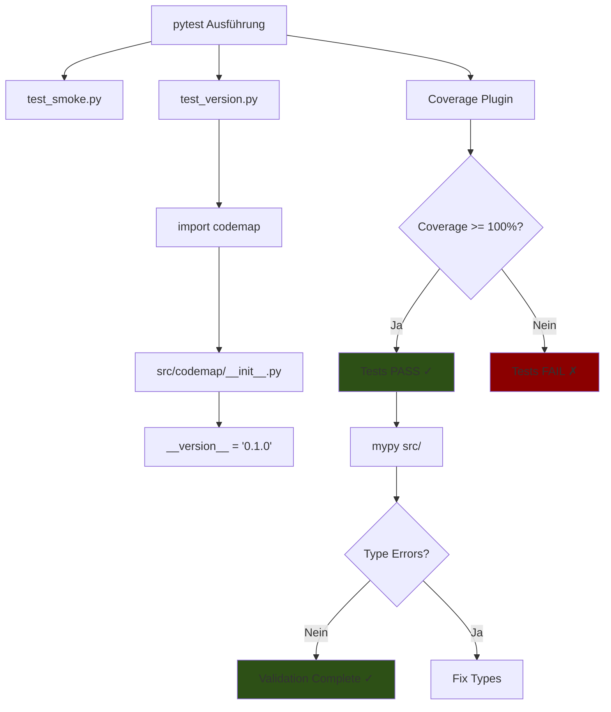

I have created the following plan after thorough exploration and analysis of the codebase. Follow the below plan verbatim. Trust the files and references. Do not re-verify what's written in the plan. Explore only when absolutely necessary. First implement all the proposed file changes and then I'll review all the changes together at the end.

## Beobachtungen

Das Projekt verfügt bereits über die Basis-Infrastruktur aus den vorherigen Phasen: Ordnerstruktur (`src/codemap/core/`, `tests/unit/`), strikte Tool-Konfiguration in `pyproject.toml` (pytest mit `--cov=src/codemap`, Coverage mit `fail_under=100`, mypy strict mode, ruff), und MkDocs-Dokumentation. Die `__init__.py`-Dateien sind vorhanden aber leer. Jetzt folgt der TDD-Proof-of-Concept: minimale Tests und Code, die beweisen, dass die strikte Pipeline (100% Coverage, Type-Checking) funktioniert.

## Ansatz

Implementierung nach klassischem TDD-Zyklus: **Rot → Grün → Refactor**. Zuerst werden zwei Unit-Tests geschrieben (`test_smoke.py`, `test_version.py`), die initial fehlschlagen (Rot). Dann wird minimaler Code in `src/codemap/__init__.py` hinzugefügt (`__version__`), um Tests grün zu machen. Die strikte Coverage-Regel (`fail_under=100`) stellt sicher, dass jede Zeile getestet ist. Dies validiert die gesamte Toolchain (pytest, coverage.py, mypy, ruff) und etabliert den TDD-Workflow für zukünftige Entwicklung.

---

## Implementierungsschritte

### 1. Version-Attribut in Package-Root hinzufügen

**Datei:** `file:src/codemap/__init__.py`

- Füge die Zeile `__version__ = "0.1.0"` hinzu (einziger Inhalt der Datei)
- Dies macht das Package importierbar und stellt die Version für Tests bereit
- Entspricht der Version in `pyproject.toml` (Single Source of Truth für Metadaten)

---

### 2. Smoke Test für grundlegende Python-Funktionalität erstellen

**Datei:** `file:tests/unit/test_smoke.py`

- Erstelle eine Test-Funktion `test_basic_math()`
- Der Test soll verifizieren: `assert 1 + 1 == 2`
- **Zweck:** Beweist, dass pytest korrekt läuft und die Test-Discovery funktioniert
- Dieser triviale Test dient als Baseline und wird immer grün sein

**Hinweis:** Keine Imports notwendig, da nur Python-Basics getestet werden.

---

### 3. Version-Test für Package-Metadaten erstellen

**Datei:** `file:tests/unit/test_version.py`

- Importiere das `codemap` Package: `import codemap`
- Erstelle eine Test-Funktion `test_version_exists()`
- Der Test soll zwei Assertions enthalten:
  1. `assert hasattr(codemap, "__version__")` – prüft Existenz des Attributs
  2. `assert isinstance(codemap.__version__, str)` – prüft Typ (String)
- Optional: `assert codemap.__version__ == "0.1.0"` für exakte Version

**Zweck:** Validiert, dass das Package korrekt strukturiert ist und Metadaten exportiert.

---

### 4. Test-Ausführung und Coverage-Validierung

**Kommandos zum Ausführen:**

```bash
# Installation der Dependencies (falls noch nicht geschehen)
pip install -r requirements-dev.txt

# Tests ausführen (mit automatischer Coverage durch pyproject.toml)
pytest

# Erwartetes Ergebnis:
# - 2 Tests passed (test_basic_math, test_version_exists)
# - Coverage: 100% für src/codemap/__init__.py
# - HTML-Report generiert in htmlcov/index.html
```

**Validierung:**

- Pytest muss **grün** sein (alle Tests bestanden)
- Coverage-Report muss **100%** zeigen (wegen `fail_under=100` in `pyproject.toml`)
- Keine fehlenden Zeilen im `--cov-report=term-missing` Output
- Falls Coverage < 100%: pytest schlägt automatisch fehl (strikte Regel)

---

### 5. Type-Checking und Linting durchführen

**Kommandos:**

```bash
# Mypy: Type-Checking (strict mode)
mypy src/

# Ruff: Linting und Auto-Fix
ruff check src/ tests/
ruff format src/ tests/
```

**Erwartetes Ergebnis:**

- **Mypy:** Keine Fehler (die `__version__`-Zeile ist type-safe)
- **Ruff:** Keine Violations (Code folgt PEP 8, Import-Sortierung korrekt)

---

## Verifikations-Checkliste

Nach Implementierung müssen folgende Bedingungen erfüllt sein:

| Kriterium | Erwartung | Validierung |
|-----------|-----------|-------------|
| **Tests vorhanden** | 2 Tests in `tests/unit/` | `pytest --collect-only` zeigt 2 Items |
| **Tests bestehen** | Alle grün | `pytest` Exit-Code 0 |
| **Coverage 100%** | Keine ungetesteten Zeilen | Coverage-Report zeigt 100% |
| **Type-Safety** | Keine mypy-Fehler | `mypy src/` Exit-Code 0 |
| **Code-Qualität** | Keine ruff-Violations | `ruff check` Exit-Code 0 |
| **Dokumentation** | API-Docs generierbar | `mkdocs build` ohne Fehler |

---

## Architektur-Übersicht



---

## TDD-Zyklus für diese Phase

1. **🔴 ROT:** Tests schreiben (`test_smoke.py`, `test_version.py`) → pytest schlägt fehl (ImportError oder AttributeError)
2. **🟢 GRÜN:** `__version__` in `__init__.py` hinzufügen → pytest erfolgreich, Coverage 100%
3. **🔵 REFACTOR:** Nicht notwendig (Code bereits minimal), aber Type-Checking und Linting durchführen

---

## Wichtige Hinweise

- **Reihenfolge beachten:** Tests **vor** Code schreiben (TDD-Prinzip)
- **Coverage-Striktheit:** Jede neue Zeile in `src/` muss getestet sein, sonst schlägt pytest fehl
- **Type Annotations:** Für `__version__` nicht zwingend nötig (Literal String), aber für zukünftigen Code essentiell
- **Keine Dummy-Tests:** Beide Tests haben echten Wert (Smoke Test = Baseline, Version Test = Package-Integrität)