I have created the following plan after thorough exploration and analysis of the codebase. Follow the below plan verbatim. Trust the files and references. Do not re-verify what's written in the plan. Explore only when absolutely necessary. First implement all the proposed file changes and then I'll review all the changes together at the end.

## Beobachtungen

Das Projekt folgt strikten TDD-Konventionen mit 100% Coverage-Pflicht (`fail_under = 100` in `file:pyproject.toml`). Bestehende Tests in `file:tests/unit/test_setup_check.py` zeigen klare Patterns: AAA-Pattern mit Kommentaren, Test-Klassen für zusammenhängende Tests, vollständige Type Hints, Docstrings für jede Funktion. Die `tmp_path` Fixture von pytest wird für temporäre Dateisystem-Tests verwendet. Das Projekt nutzt `pathlib` für moderne, type-safe Pfad-Operationen.

## Ansatz

Erstelle `file:tests/unit/scout/test_tree.py` nach dem Red-Phase-Prinzip: Tests schreiben, bevor die Implementation existiert. Nutze `tmp_path` Fixture für deterministische Teststrukturen. Organisiere Tests in Klassen nach Funktionalität (Basis-Funktionalität, max_depth, Ignorierung, Sortierung, Edge-Cases). Folge den etablierten Konventionen: AAA-Pattern, Type Hints, Docstrings, explizite Assertions für deterministisches Tree-Format.

## Implementierungsschritte

### 1. Verzeichnisstruktur vorbereiten

Erstelle das Verzeichnis `tests/unit/scout/` mit `__init__.py`:
- Erstelle `tests/unit/scout/__init__.py` (leere Datei für Package-Struktur)

### 2. Test-Datei `tests/unit/scout/test_tree.py` erstellen

**Datei-Header:**
```python
"""Unit tests for TreeGenerator in codemap.scout.tree module."""

from pathlib import Path
import pytest
from codemap.scout.tree import TreeGenerator
```

### 3. Test-Klasse für Basis-Funktionalität

**Klasse `TestTreeGeneratorBasic`:**
- `test_generate_returns_string()`: Verifiziere, dass `generate()` einen String zurückgibt
- `test_generate_empty_directory()`: Teste leeres Verzeichnis (nur Root-Name)
- `test_generate_single_file()`: Teste Verzeichnis mit einer Datei
- `test_generate_single_directory()`: Teste Verzeichnis mit einem Unterordner

**Teststruktur mit `tmp_path`:**
```python
def test_generate_single_file(tmp_path: Path) -> None:
    """Test tree generation for directory with single file."""
    # Arrange
    (tmp_path / "README.md").write_text("content")
    generator = TreeGenerator()
    
    # Act
    result = generator.generate(tmp_path)
    
    # Assert
    assert isinstance(result, str)
    assert "README.md" in result
```

### 4. Test-Klasse für max_depth Funktionalität

**Klasse `TestTreeGeneratorMaxDepth`:**
- `test_generate_respects_max_depth_default()`: Teste Standard max_depth=2
- `test_generate_max_depth_zero()`: Teste max_depth=0 (nur Root)
- `test_generate_max_depth_one()`: Teste max_depth=1 (Root + direkte Kinder)
- `test_generate_max_depth_three()`: Teste max_depth=3 (tiefere Verschachtelung)

**Verschachtelte Teststruktur:**
```python
def test_generate_respects_max_depth_default(tmp_path: Path) -> None:
    """Test that default max_depth=2 is respected."""
    # Arrange
    (tmp_path / "src").mkdir()
    (tmp_path / "src" / "main.py").write_text("content")
    (tmp_path / "src" / "utils").mkdir()
    (tmp_path / "src" / "utils" / "helper.py").write_text("content")  # Tiefe 2
    (tmp_path / "src" / "utils" / "deep").mkdir()
    (tmp_path / "src" / "utils" / "deep" / "nested.py").write_text("content")  # Tiefe 3
    
    generator = TreeGenerator()
    
    # Act
    result = generator.generate(tmp_path)  # default max_depth=2
    
    # Assert
    assert "main.py" in result
    assert "utils/" in result
    assert "helper.py" in result
    assert "nested.py" not in result  # Tiefe 3 sollte nicht angezeigt werden
```

### 5. Test-Klasse für Ignorierung versteckter Verzeichnisse

**Klasse `TestTreeGeneratorIgnoreHidden`:**
- `test_generate_ignores_git_directory()`: Teste `.git` wird ignoriert
- `test_generate_ignores_venv_directory()`: Teste `.venv` wird ignoriert
- `test_generate_ignores_pycache_directory()`: Teste `__pycache__` wird ignoriert
- `test_generate_ignores_multiple_hidden()`: Teste mehrere versteckte Ordner gleichzeitig

**Teststruktur:**
```python
def test_generate_ignores_git_directory(tmp_path: Path) -> None:
    """Test that .git directory is always ignored."""
    # Arrange
    (tmp_path / ".git").mkdir()
    (tmp_path / ".git" / "config").write_text("content")
    (tmp_path / "README.md").write_text("content")
    
    generator = TreeGenerator()
    
    # Act
    result = generator.generate(tmp_path, max_depth=5)
    
    # Assert
    assert ".git" not in result
    assert "config" not in result
    assert "README.md" in result
```

### 6. Test-Klasse für alphabetische Sortierung

**Klasse `TestTreeGeneratorSorting`:**
- `test_generate_sorts_files_alphabetically()`: Teste Dateien alphabetisch sortiert
- `test_generate_sorts_directories_alphabetically()`: Teste Ordner alphabetisch sortiert
- `test_generate_sorts_mixed_deterministically()`: Teste gemischte Sortierung (Ordner und Dateien)

**Deterministische Sortierung:**
```python
def test_generate_sorts_mixed_deterministically(tmp_path: Path) -> None:
    """Test that files and directories are sorted alphabetically together."""
    # Arrange
    (tmp_path / "zebra.py").write_text("content")
    (tmp_path / "alpha").mkdir()
    (tmp_path / "beta.py").write_text("content")
    (tmp_path / "gamma").mkdir()
    
    generator = TreeGenerator()
    
    # Act
    result = generator.generate(tmp_path)
    
    # Assert
    lines = result.strip().split("\n")
    # Erwarte alphabetische Reihenfolge: alpha/, beta.py, gamma/, zebra.py
    assert lines.index("alpha/") < lines.index("beta.py")
    assert lines.index("beta.py") < lines.index("gamma/")
    assert lines.index("gamma/") < lines.index("zebra.py")
```

### 7. Test-Klasse für Tree-Format und Einrückungen

**Klasse `TestTreeGeneratorFormat`:**
- `test_generate_tree_structure_format()`: Teste vollständiges Tree-Format mit Einrückungen
- `test_generate_uses_tree_symbols()`: Teste korrekte Tree-Symbole (`├──`, `└──`, `│`)
- `test_generate_indentation_consistency()`: Teste konsistente Einrückung pro Ebene

**Komplexe Teststruktur:**
```python
def test_generate_tree_structure_format(tmp_path: Path) -> None:
    """Test complete tree structure with correct indentation and symbols."""
    # Arrange
    (tmp_path / ".git").mkdir()  # sollte ignoriert werden
    (tmp_path / "src").mkdir()
    (tmp_path / "src" / "main.py").write_text("content")
    (tmp_path / "src" / "utils").mkdir()
    (tmp_path / "src" / "utils" / "helper.py").write_text("content")
    (tmp_path / "README.md").write_text("content")
    
    generator = TreeGenerator()
    
    # Act
    result = generator.generate(tmp_path, max_depth=2)
    
    # Assert
    expected_lines = [
        f"{tmp_path.name}/",
        "├── README.md",
        "└── src/",
        "    ├── main.py",
        "    └── utils/",
    ]
    
    for expected_line in expected_lines:
        assert expected_line in result, f"Expected line not found: {expected_line}"
    
    # Verifiziere, dass .git nicht im Output ist
    assert ".git" not in result
```

### 8. Edge-Cases testen

**Zusätzliche Tests in bestehenden Klassen:**
- `test_generate_with_nonexistent_path()`: Teste Fehlerbehandlung für nicht-existierenden Pfad (sollte Exception werfen)
- `test_generate_with_file_instead_of_directory()`: Teste Fehlerbehandlung wenn Pfad eine Datei ist
- `test_generate_with_symlinks()`: Teste Verhalten bei symbolischen Links (optional, falls relevant)

### 9. Pytest ausführen (Red Phase)

Führe `pytest tests/unit/scout/test_tree.py` aus:
- **Erwartetes Ergebnis:** Alle Tests schlagen fehl mit `ImportError: cannot import name 'TreeGenerator' from 'codemap.scout.tree'`
- Dies bestätigt die Red-Phase des TDD-Zyklus

### 10. Dokumentation und Struktur

**Datei-Organisation:**
```
tests/unit/scout/test_tree.py
├── Module Docstring
├── Imports (pathlib, pytest, TreeGenerator)
├── TestTreeGeneratorBasic (4 Tests)
├── TestTreeGeneratorMaxDepth (4 Tests)
├── TestTreeGeneratorIgnoreHidden (4 Tests)
├── TestTreeGeneratorSorting (3 Tests)
├── TestTreeGeneratorFormat (3 Tests)
└── Edge-Case Tests (2-3 Tests)
```

**Gesamt: ~20 Tests** für umfassende Coverage aller Anforderungen

## Erwartetes Tree-Format

Das erwartete Output-Format sollte folgendem Muster entsprechen:

```
project/
├── README.md
└── src/
    ├── main.py
    └── utils/
        └── helper.py
```

**Format-Spezifikationen:**
- Root-Verzeichnis endet mit `/`
- `├──` für nicht-letzte Einträge
- `└──` für letzte Einträge
- `│` für vertikale Fortsetzung (bei Bedarf)
- 4 Leerzeichen Einrückung pro Ebene
- Verzeichnisse enden mit `/`
- Dateien ohne Suffix

## Mermaid Diagramm: Test-Struktur

```mermaid
graph TD
    A[test_tree.py] --> B[TestTreeGeneratorBasic]
    A --> C[TestTreeGeneratorMaxDepth]
    A --> D[TestTreeGeneratorIgnoreHidden]
    A --> E[TestTreeGeneratorSorting]
    A --> F[TestTreeGeneratorFormat]
    
    B --> B1[test_generate_returns_string]
    B --> B2[test_generate_empty_directory]
    B --> B3[test_generate_single_file]
    B --> B4[test_generate_single_directory]
    
    C --> C1[test_generate_respects_max_depth_default]
    C --> C2[test_generate_max_depth_zero]
    C --> C3[test_generate_max_depth_one]
    C --> C4[test_generate_max_depth_three]
    
    D --> D1[test_generate_ignores_git_directory]
    D --> D2[test_generate_ignores_venv_directory]
    D --> D3[test_generate_ignores_pycache_directory]
    D --> D4[test_generate_ignores_multiple_hidden]
    
    E --> E1[test_generate_sorts_files_alphabetically]
    E --> E2[test_generate_sorts_directories_alphabetically]
    E --> E3[test_generate_sorts_mixed_deterministically]
    
    F --> F1[test_generate_tree_structure_format]
    F --> F2[test_generate_uses_tree_symbols]
    F --> F3[test_generate_indentation_consistency]
```



## Konventionen einhalten

**Type Hints:**
- Alle Funktionen: `def test_xyz(tmp_path: Path) -> None:`
- Import von `Path` aus `pathlib`

**Docstrings:**
- Jede Test-Funktion erhält einen beschreibenden Docstring
- Format: `"""Test that <expected behavior>."""`

**AAA-Pattern:**
- Explizite Kommentare: `# Arrange`, `# Act`, `# Assert`
- Klare Trennung der drei Phasen

**Assertions:**
- Spezifische Assertions mit aussagekräftigen Fehlermeldungen
- `assert expected in result, f"Expected '{expected}' not found in output"`