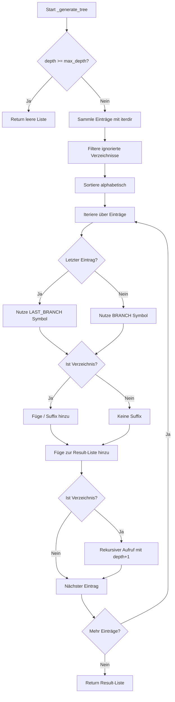
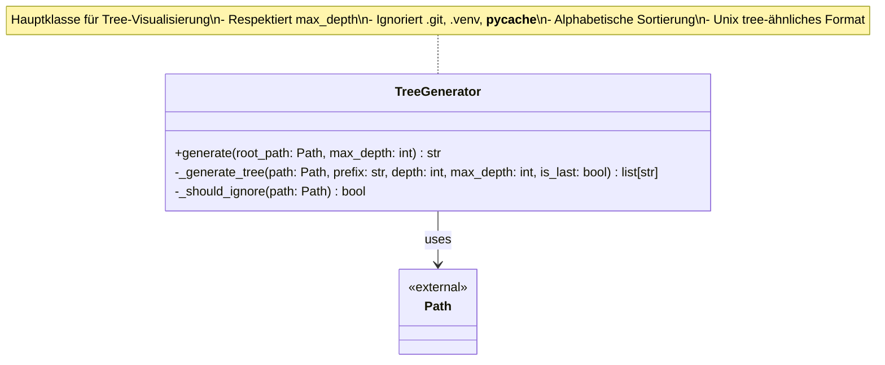

I have created the following plan after thorough exploration and analysis of the codebase. Follow the below plan verbatim. Trust the files and references. Do not re-verify what's written in the plan. Explore only when absolutely necessary. First implement all the proposed file changes and then I'll review all the changes together at the end.

## Beobachtungen

Das Projekt folgt strikten TDD-Konventionen mit 100% Coverage-Pflicht (`fail_under = 100` in `file:pyproject.toml`). Die Tests in `file:tests/unit/scout/test_tree.py` (Red Phase) definieren das erwartete Verhalten: `TreeGenerator.generate()` muss einen String mit Unix-tree-ähnlicher Struktur zurückgeben, `max_depth=2` respektieren, versteckte Verzeichnisse (`.git`, `.venv`, `__pycache__`) ignorieren und alphabetisch sortieren. Das Projekt nutzt `pathlib.Path` für type-safe Pfad-Operationen und mypy mit `strict = true`.

## Ansatz

Implementiere `TreeGenerator` in `file:src/codemap/scout/tree.py` mit rekursiver Verzeichnis-Traversierung via `pathlib`. Nutze eine Hilfsmethode `_generate_tree()` für die Rekursion mit Tiefenverfolgung. Hardcode die Ignorier-Liste für versteckte Verzeichnisse. Sortiere Einträge alphabetisch mit `sorted()`. Generiere Tree-Symbole (`├──`, `└──`, `│`) basierend auf Position im Verzeichnis. Stelle sicher, dass alle Type Hints und Docstrings den mypy/ruff-Standards entsprechen.

## Implementierungsschritte

### 1. Package-Struktur erstellen

Erstelle das Package `src/codemap/scout/`:
- Erstelle Verzeichnis `src/codemap/scout/`
- Erstelle `src/codemap/scout/__init__.py` mit Docstring und `__all__` Export:

```python
"""Scout module for code exploration and visualization.

This module provides tools for exploring and visualizing code structures.
"""

from codemap.scout.tree import TreeGenerator

__all__ = ["TreeGenerator"]
```

### 2. TreeGenerator Klasse in `src/codemap/scout/tree.py` implementieren

**Datei-Header mit Imports:**
```python
"""Tree generator for visualizing directory structures.

This module provides TreeGenerator class for creating visual representations
of directory structures similar to the Unix tree command.
"""

from pathlib import Path
```

**Klassen-Struktur:**

| Komponente | Beschreibung | Type Hints |
|------------|--------------|------------|
| `TreeGenerator` | Hauptklasse für Tree-Generierung | - |
| `generate()` | Public API Methode | `(root_path: Path, max_depth: int = 2) -> str` |
| `_generate_tree()` | Private rekursive Hilfsmethode | `(path: Path, prefix: str, depth: int, max_depth: int, is_last: bool) -> list[str]` |
| `_should_ignore()` | Private Methode für Ignorier-Logik | `(path: Path) -> bool` |

### 3. Konstanten und Ignorier-Liste definieren

Definiere Modul-Level Konstanten:
```python
IGNORED_DIRS: set[str] = {".git", ".venv", "__pycache__"}
BRANCH: str = "├── "
LAST_BRANCH: str = "└── "
VERTICAL: str = "│   "
SPACE: str = "    "
```

### 4. `TreeGenerator.__init__()` implementieren

Einfacher Konstruktor ohne Parameter:
```python
def __init__(self) -> None:
    """Initialize TreeGenerator."""
    pass
```

### 5. `TreeGenerator.generate()` Public API implementieren

**Signatur:** `def generate(self, root_path: Path, max_depth: int = 2) -> str`

**Logik:**
- Validiere `root_path`: Muss existieren und ein Verzeichnis sein (raise `ValueError` wenn nicht)
- Initialisiere Result-Liste mit Root-Name: `[f"{root_path.name}/"]`
- Rufe `_generate_tree()` für Root-Verzeichnis auf (depth=0)
- Füge Ergebnisse zur Result-Liste hinzu
- Returniere `"\n".join(result)`

**Fehlerbehandlung:**
- `ValueError` wenn `root_path` nicht existiert
- `ValueError` wenn `root_path` keine Directory ist

### 6. `TreeGenerator._should_ignore()` implementieren

**Signatur:** `def _should_ignore(self, path: Path) -> bool`

**Logik:**
- Returniere `path.name in IGNORED_DIRS`
- Einfache Lookup-Operation für Performance

### 7. `TreeGenerator._generate_tree()` rekursive Hilfsmethode

**Signatur:** `def _generate_tree(self, path: Path, prefix: str, depth: int, max_depth: int, is_last: bool) -> list[str]`

**Parameter:**
- `path`: Aktuelles Verzeichnis
- `prefix`: Einrückung für aktuelle Ebene
- `depth`: Aktuelle Tiefe (0-basiert)
- `max_depth`: Maximale Tiefe
- `is_last`: Ob dies der letzte Eintrag im Parent ist

**Algorithmus:**



**Implementierungs-Details:**

1. **Tiefenprüfung:** Wenn `depth >= max_depth`, returniere leere Liste
2. **Einträge sammeln:** 
   - Nutze `list(path.iterdir())` für alle Einträge
   - Filtere mit `_should_ignore()`
   - Sortiere mit `sorted(entries, key=lambda p: p.name.lower())`
3. **Iteration:**
   - Enumerate mit Index für `is_last` Bestimmung
   - Bestimme Symbol: `LAST_BRANCH` wenn letzter, sonst `BRANCH`
   - Bestimme neuen Prefix: `prefix + SPACE` wenn letzter, sonst `prefix + VERTICAL`
4. **Formatierung:**
   - Verzeichnisse: `f"{prefix}{symbol}{entry.name}/"`
   - Dateien: `f"{prefix}{symbol}{entry.name}"`
5. **Rekursion:**
   - Nur für Verzeichnisse: `result.extend(_generate_tree(entry, new_prefix, depth + 1, max_depth, is_last_in_subdir))`

### 8. Type Hints und mypy Compliance

**Alle Methoden müssen vollständige Type Hints haben:**
- Return Types: `-> None`, `-> str`, `-> bool`, `-> list[str]`
- Parameter Types: `Path`, `str`, `int`, `bool`
- Keine `Any` Types erlaubt (mypy strict mode)

**Docstrings für alle Methoden:**
```python
def generate(self, root_path: Path, max_depth: int = 2) -> str:
    """Generate a tree structure visualization of a directory.
    
    Args:
        root_path: Root directory to visualize.
        max_depth: Maximum depth to traverse (default: 2).
        
    Returns:
        String representation of directory tree.
        
    Raises:
        ValueError: If root_path does not exist or is not a directory.
    """
```

### 9. Beispiel-Output Format

Für folgende Struktur:
```
project/
├── .git/          (ignoriert)
├── README.md
└── src/
    ├── main.py
    └── utils/
        └── helper.py
```

Erwarteter Output bei `max_depth=2`:
```
project/
├── README.md
└── src/
    ├── main.py
    └── utils/
```

**Format-Regeln:**
- Root endet mit `/`
- Verzeichnisse enden mit `/`
- `├──` für nicht-letzte Einträge (mit Leerzeichen: `├── `)
- `└──` für letzte Einträge (mit Leerzeichen: `└── `)
- `│` für vertikale Fortsetzung in Einrückung
- 4 Leerzeichen pro Einrückungsebene

### 10. Tests ausführen (Green Phase)

Führe `pytest tests/unit/scout/test_tree.py -v` aus:
- **Erwartetes Ergebnis:** Alle Tests bestehen
- Verifiziere Coverage: `pytest --cov=src/codemap/scout --cov-report=term-missing`
- Coverage sollte 100% sein für `file:src/codemap/scout/tree.py`

### 11. Code-Qualität sicherstellen

**mypy ausführen:**
```bash
mypy src/codemap/scout/tree.py
```
- Keine Fehler erlaubt
- Alle Type Hints müssen korrekt sein

**ruff ausführen:**
```bash
ruff check src/codemap/scout/tree.py
ruff format src/codemap/scout/tree.py
```
- Keine Linting-Fehler
- Code automatisch formatieren

### 12. Modul-Struktur Übersicht



## Datei-Referenzen

| Datei | Zweck |
|-------|-------|
| `file:src/codemap/scout/__init__.py` | Package Initialisierung mit Export |
| `file:src/codemap/scout/tree.py` | TreeGenerator Implementation |
| `file:tests/unit/scout/test_tree.py` | Bestehende Tests (Red Phase) |
| `file:pyproject.toml` | Konfiguration für mypy, ruff, pytest |

## Wichtige Konventionen

1. **Alphabetische Sortierung:** Nutze `sorted(entries, key=lambda p: p.name.lower())` für case-insensitive Sortierung
2. **Determinismus:** Sortierung muss konsistent sein für reproduzierbare Tests
3. **Einrückung:** 4 Leerzeichen pro Ebene (nicht Tabs)
4. **Verzeichnis-Suffix:** Alle Verzeichnisse enden mit `/`
5. **Ignorier-Liste:** Hardcoded Set für Performance und Sicherheit