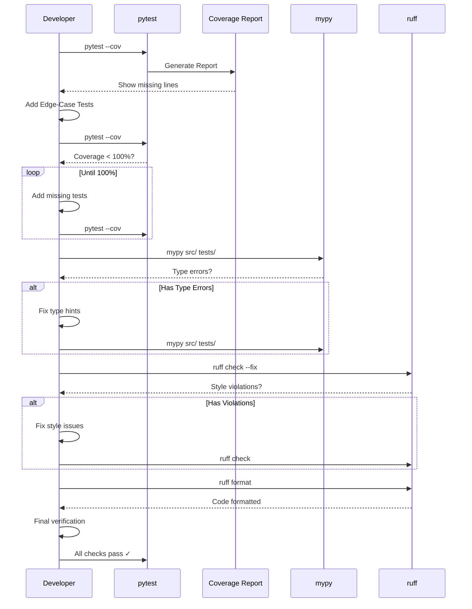

I have created the following plan after thorough exploration and analysis of the codebase. Follow the below plan verbatim. Trust the files and references. Do not re-verify what's written in the plan. Explore only when absolutely necessary. First implement all the proposed file changes and then I'll review all the changes together at the end.

## Beobachtungen

Das Projekt erzwingt strikte Qualitätsstandards: `fail_under = 100` in `file:pyproject.toml` für Coverage, `mypy --strict` für Type Safety, und `ruff` mit Regeln E, F, I, N, W. Die bisherigen Implementierungen (`file:tests/unit/scout/test_tree.py` und `file:src/codemap/scout/tree.py`) sollten existieren. Jetzt folgt die Refactor-Phase: Coverage-Lücken identifizieren, Edge-Cases ergänzen, Linter-Fehler beheben, Code-Qualität optimieren.

## Ansatz

Systematische Verifikation in drei Schritten: (1) Coverage-Report analysieren und fehlende Branches/Lines identifizieren, (2) mypy/ruff ausführen und Type-/Style-Fehler beheben, (3) Edge-Case-Tests ergänzen für 100% Coverage. Fokus auf deterministische Tests, explizite Error-Handling-Tests, und Refactoring für Lesbarkeit ohne Funktionalität zu ändern.

## Implementierungsschritte

### 1. Coverage-Report generieren und analysieren

**Pytest mit Coverage ausführen:**
```bash
pytest tests/unit/scout/test_tree.py --cov=src/codemap/scout --cov-report=term-missing --cov-report=html
```

**Coverage-Report interpretieren:**
- Terminal-Output zeigt fehlende Zeilen (z.B. `tree.py: 45-47`)
- HTML-Report öffnen: `open htmlcov/index.html` (detaillierte Visualisierung)
- Identifiziere nicht getestete Branches (if/else, try/except)
- Notiere fehlende Lines und deren Kontext

**Typische Coverage-Lücken bei TreeGenerator:**
- Error-Handling-Pfade (z.B. `ValueError` bei ungültigem `root_path`)
- Edge-Cases: `max_depth=0`, leere Verzeichnisse, einzelne Dateien
- Spezielle Pfad-Typen: Symlinks, Dateien statt Verzeichnisse
- Boundary-Conditions: sehr tiefe Verschachtelungen, viele Dateien

### 2. Edge-Case-Tests ergänzen

**In `file:tests/unit/scout/test_tree.py` neue Test-Klasse hinzufügen:**

**Klasse `TestTreeGeneratorEdgeCases`:**

**Test: Nicht-existierender Pfad**
```python
def test_generate_raises_error_for_nonexistent_path(tmp_path: Path) -> None:
    """Test that generate raises ValueError for non-existent path."""
    # Arrange
    nonexistent = tmp_path / "does_not_exist"
    generator = TreeGenerator()
    
    # Act & Assert
    with pytest.raises(ValueError, match="Path does not exist"):
        generator.generate(nonexistent)
```

**Test: Datei statt Verzeichnis**
```python
def test_generate_raises_error_for_file_path(tmp_path: Path) -> None:
    """Test that generate raises ValueError when path is a file."""
    # Arrange
    file_path = tmp_path / "file.txt"
    file_path.write_text("content")
    generator = TreeGenerator()
    
    # Act & Assert
    with pytest.raises(ValueError, match="Path is not a directory"):
        generator.generate(file_path)
```

**Test: max_depth=0 (nur Root)**
```python
def test_generate_max_depth_zero_shows_only_root(tmp_path: Path) -> None:
    """Test that max_depth=0 shows only root directory."""
    # Arrange
    (tmp_path / "file.txt").write_text("content")
    (tmp_path / "subdir").mkdir()
    generator = TreeGenerator()
    
    # Act
    result = generator.generate(tmp_path, max_depth=0)
    
    # Assert
    assert f"{tmp_path.name}/" in result
    assert "file.txt" not in result
    assert "subdir" not in result
```

**Test: Leeres Verzeichnis**
```python
def test_generate_empty_directory_shows_only_root(tmp_path: Path) -> None:
    """Test that empty directory shows only root name."""
    # Arrange
    generator = TreeGenerator()
    
    # Act
    result = generator.generate(tmp_path)
    
    # Assert
    assert result.strip() == f"{tmp_path.name}/"
    assert result.count("\n") == 1  # Nur eine Zeile
```

**Test: Sehr tiefe Verschachtelung**
```python
def test_generate_deep_nesting_respects_max_depth(tmp_path: Path) -> None:
    """Test that deeply nested structure respects max_depth limit."""
    # Arrange
    deep_path = tmp_path / "a" / "b" / "c" / "d" / "e"
    deep_path.mkdir(parents=True)
    (deep_path / "deep.txt").write_text("content")
    generator = TreeGenerator()
    
    # Act
    result = generator.generate(tmp_path, max_depth=3)
    
    # Assert
    assert "a/" in result
    assert "b/" in result
    assert "c/" in result
    assert "d/" not in result  # Tiefe 4 überschreitet max_depth=3
    assert "deep.txt" not in result
```

**Test: Gemischte versteckte Verzeichnisse**
```python
def test_generate_ignores_all_hidden_directories(tmp_path: Path) -> None:
    """Test that all hidden directories are ignored simultaneously."""
    # Arrange
    (tmp_path / ".git").mkdir()
    (tmp_path / ".venv").mkdir()
    (tmp_path / "__pycache__").mkdir()
    (tmp_path / "visible").mkdir()
    (tmp_path / "file.py").write_text("content")
    generator = TreeGenerator()
    
    # Act
    result = generator.generate(tmp_path, max_depth=5)
    
    # Assert
    assert ".git" not in result
    assert ".venv" not in result
    assert "__pycache__" not in result
    assert "visible/" in result
    assert "file.py" in result
```

**Test: Negative max_depth**
```python
def test_generate_raises_error_for_negative_max_depth(tmp_path: Path) -> None:
    """Test that generate raises ValueError for negative max_depth."""
    # Arrange
    generator = TreeGenerator()
    
    # Act & Assert
    with pytest.raises(ValueError, match="max_depth must be non-negative"):
        generator.generate(tmp_path, max_depth=-1)
```

### 3. mypy ausführen und Type-Fehler beheben

**mypy auf gesamtes Projekt ausführen:**
```bash
mypy src/codemap tests/
```

**Häufige mypy-Fehler und Lösungen:**

| Fehler | Ursache | Lösung |
|--------|---------|--------|
| `Missing return statement` | Funktion ohne explizites `return` | `return None` oder `-> None` hinzufügen |
| `Incompatible return value type` | Falscher Return-Type | Type Hint korrigieren (z.B. `-> str` statt `-> list[str]`) |
| `Need type annotation for variable` | Variable ohne Type Hint | `lines: list[str] = []` statt `lines = []` |
| `Argument has incompatible type` | Falscher Parameter-Type | Type Hint anpassen oder Cast verwenden |
| `Untyped decorator` | Decorator ohne Type Hints | Type Hints für Decorator hinzufügen |

**Spezifische Checks für TreeGenerator:**
- `_generate_tree()` muss `-> list[str]` zurückgeben
- `_should_ignore()` muss `-> bool` zurückgeben
- Alle Parameter müssen Type Hints haben: `root_path: Path`, `max_depth: int`
- Private Methoden brauchen auch vollständige Type Hints

**Beispiel-Fix:**
```python
# Vorher (mypy-Fehler):
def _generate_tree(self, path, current_depth, max_depth, prefix):
    lines = []
    # ...
    return lines

# Nachher (mypy-konform):
def _generate_tree(
    self, 
    path: Path, 
    current_depth: int, 
    max_depth: int, 
    prefix: str
) -> list[str]:
    lines: list[str] = []
    # ...
    return lines
```

### 4. ruff ausführen und Style-Fehler beheben

**ruff check ausführen:**
```bash
ruff check src/codemap tests/
```

**ruff format ausführen:**
```bash
ruff format src/codemap tests/
```

**Häufige ruff-Fehler und Auto-Fixes:**

| Code | Beschreibung | Lösung |
|------|--------------|--------|
| `E501` | Line too long (>100 chars) | Zeile umbrechen oder `ruff format` ausführen |
| `F401` | Unused import | Import entfernen |
| `F841` | Unused variable | Variable entfernen oder mit `_` prefixen |
| `I001` | Import not sorted | `ruff check --fix` für Auto-Sort |
| `N802` | Function name should be lowercase | Funktion umbenennen (z.B. `GenerateTree` → `generate_tree`) |
| `W291` | Trailing whitespace | `ruff format` entfernt automatisch |

**Spezifische Checks für TreeGenerator:**
- Imports alphabetisch sortiert: `from pathlib import Path` vor `import pytest`
- Keine ungenutzten Imports (z.B. `from typing import Optional` wenn nicht verwendet)
- Docstrings im korrekten Format (Google-Style oder NumPy-Style)
- Keine trailing whitespaces oder leere Zeilen am Dateiende

**ruff mit Auto-Fix:**
```bash
ruff check --fix src/codemap tests/
```

### 5. Coverage erneut prüfen und 100% verifizieren

**Alle Tests ausführen mit Coverage:**
```bash
pytest tests/unit/scout/test_tree.py --cov=src/codemap/scout --cov-report=term-missing --cov-report=html --cov-fail-under=100
```

**Coverage-Ziel erreichen:**
- Terminal zeigt `TOTAL: 100%` an
- Keine fehlenden Zeilen in `term-missing` Report
- HTML-Report zeigt alle Zeilen grün

**Falls Coverage < 100%:**
1. HTML-Report öffnen: `open htmlcov/index.html`
2. Rote/gelbe Zeilen identifizieren
3. Tests für fehlende Branches hinzufügen
4. Erneut testen bis 100% erreicht

**Branch-Coverage sicherstellen:**
- Jeder `if`/`else`-Zweig muss getestet werden
- Jeder `try`/`except`-Block muss getestet werden
- Alle Error-Pfade müssen durchlaufen werden

### 6. Refactoring für Lesbarkeit

**Code-Review-Checkliste für `file:src/codemap/scout/tree.py`:**

**Naming-Konventionen:**
- Private Methoden mit `_` Prefix: `_generate_tree()`, `_should_ignore()`
- Sprechende Variablennamen: `entries` statt `e`, `is_last` statt `last`
- Konstanten in UPPERCASE: `IGNORED_DIRS = {".git", ".venv", "__pycache__"}`

**Docstrings ergänzen:**
```python
class TreeGenerator:
    """Generate visual tree representation of directory structure.
    
    Produces Unix tree-like output with proper indentation and symbols.
    Ignores hidden directories (.git, .venv, __pycache__) by default.
    """
    
    def generate(self, root_path: Path, max_depth: int = 2) -> str:
        """Generate tree structure string for given directory.
        
        Args:
            root_path: Root directory to generate tree for.
            max_depth: Maximum depth to traverse (default: 2).
            
        Returns:
            String representation of directory tree.
            
        Raises:
            ValueError: If root_path does not exist or is not a directory.
        """
```

**Magic Numbers eliminieren:**
```python
# Vorher:
prefix = " " * 4

# Nachher:
INDENT_SIZE = 4
prefix = " " * INDENT_SIZE
```

**Komplexe Logik extrahieren:**
```python
# Vorher (in _generate_tree):
if entry.name not in {".git", ".venv", "__pycache__"}:
    # ...

# Nachher:
def _should_ignore(self, path: Path) -> bool:
    """Check if path should be ignored."""
    return path.name in {".git", ".venv", "__pycache__"}

# In _generate_tree:
if not self._should_ignore(entry):
    # ...
```

**Sortierung konsistent:**
```python
# Case-insensitive alphabetische Sortierung:
entries = sorted(path.iterdir(), key=lambda p: p.name.lower())
```

### 7. Finale Verifikation

**Alle Quality-Checks ausführen:**
```bash
# 1. Tests mit Coverage
pytest tests/unit/scout/test_tree.py --cov=src/codemap/scout --cov-report=term-missing --cov-fail-under=100

# 2. Type-Checking
mypy src/codemap tests/

# 3. Linting
ruff check src/codemap tests/

# 4. Formatting
ruff format --check src/codemap tests/
```

**Erfolgs-Kriterien:**
- ✅ pytest: Alle Tests bestehen, Coverage = 100%
- ✅ mypy: Keine Fehler, alle Type Hints korrekt
- ✅ ruff check: Keine Violations
- ✅ ruff format: Keine Formatierungs-Änderungen nötig

**Setup-Check ausführen:**
```bash
python setup_check.py
```
Sollte alle Checks bestehen (✓ für jeden Check).

### 8. Dokumentation aktualisieren

**In `file:docs/api.md` TreeGenerator dokumentieren:**
```markdown
## codemap.scout.tree

### TreeGenerator

Generate visual tree representation of directory structures.

**Usage:**
```python
from pathlib import Path
from codemap.scout.tree import TreeGenerator

generator = TreeGenerator()
tree_output = generator.generate(Path("./project"), max_depth=2)
print(tree_output)
```

**Output Example:**
```
project/
├── README.md
└── src/
    ├── main.py
    └── utils/
```

**Parameters:**
- `root_path` (Path): Root directory to scan
- `max_depth` (int): Maximum depth to traverse (default: 2)

**Ignored Directories:**
- `.git`
- `.venv`
- `__pycache__`
```

## Mermaid Diagramm: Refactor-Workflow



## Edge-Cases Übersicht

| Edge-Case | Test-Methode | Erwartetes Verhalten |
|-----------|--------------|----------------------|
| Nicht-existierender Pfad | `test_generate_raises_error_for_nonexistent_path` | `ValueError` |
| Datei statt Verzeichnis | `test_generate_raises_error_for_file_path` | `ValueError` |
| `max_depth=0` | `test_generate_max_depth_zero_shows_only_root` | Nur Root anzeigen |
| Leeres Verzeichnis | `test_generate_empty_directory_shows_only_root` | Nur Root-Name |
| Negative `max_depth` | `test_generate_raises_error_for_negative_max_depth` | `ValueError` |
| Sehr tiefe Verschachtelung | `test_generate_deep_nesting_respects_max_depth` | Limit respektieren |
| Alle versteckten Ordner | `test_generate_ignores_all_hidden_directories` | Alle ignorieren |

## Refactoring-Checkliste

- [ ] Coverage-Report generiert und analysiert
- [ ] Alle Edge-Case-Tests hinzugefügt
- [ ] mypy ohne Fehler
- [ ] ruff check ohne Violations
- [ ] ruff format angewendet
- [ ] 100% Coverage erreicht
- [ ] Docstrings für alle öffentlichen Methoden
- [ ] Magic Numbers durch Konstanten ersetzt
- [ ] Komplexe Logik in private Methoden extrahiert
- [ ] Naming-Konventionen eingehalten
- [ ] API-Dokumentation aktualisiert
- [ ] Finale Verifikation mit `setup_check.py` erfolgreich