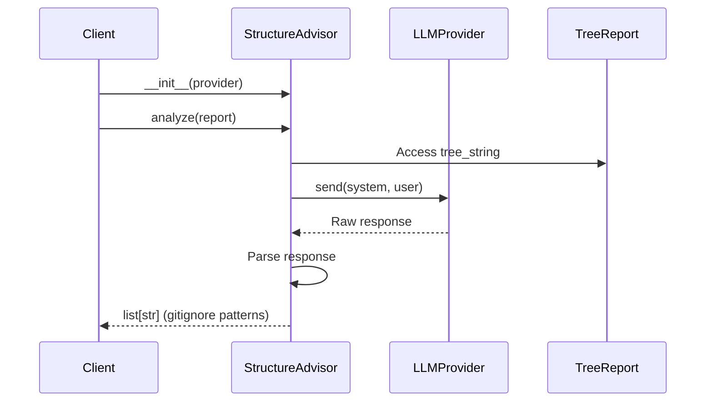

I have created the following plan after thorough exploration and analysis of the codebase. Follow the below plan verbatim. Trust the files and references. Do not re-verify what's written in the plan. Explore only when absolutely necessary. First implement all the proposed file changes and then I'll review all the changes together at the end.

## Observations

The codebase follows strict TDD with 100% coverage, frozen dataclasses, and comprehensive type hints. The `scout` module uses module-level constants (UPPER_CASE with type hints), Google-style docstrings with examples, and dependency injection patterns. The `LLMProvider` protocol is already implemented in `core/llm.py` with a `send(system: str, user: str) -> str` method. The `TreeReport` model contains `tree_string`, `total_files`, `total_folders`, and `estimated_tokens` fields.

## Approach

Create `file:src/codemap/scout/advisor.py` with `StructureAdvisor` class that accepts `LLMProvider` via constructor injection. Define the system prompt as a module-level constant following existing patterns. The `analyze()` method will construct prompts from `TreeReport.tree_string`, call `provider.send()`, and parse the response by stripping markdown code blocks and splitting lines. Update `file:src/codemap/scout/__init__.py` to export `StructureAdvisor`. This maintains separation of concerns, enables deterministic testing with mocks, and prepares for real Cerebras integration without code changes.

## Implementation Steps

### 1. Create `file:src/codemap/scout/advisor.py`

Define module-level constant for system prompt:

```python
SYSTEM_PROMPT: str = "Du bist ein Experte für Software-Architektur. Analysiere den folgenden Dateibaum. Identifiziere Ordner/Dateien, die KEINEN Quellcode enthalten oder generiert sind (z.B. node_modules, venv, dist, assets, images, documentation). Gib NUR die Liste der Pfade im .gitignore Format zurück. Keine Erklärungen."
```

Create `StructureAdvisor` class with:
- `__init__(self, provider: LLMProvider) -> None`: Store provider as instance variable `self._provider`
- `analyze(self, report: TreeReport) -> list[str]`: Main analysis method

### 2. Implement `analyze()` Method Logic

**Prompt Construction:**
- System prompt: Use `SYSTEM_PROMPT` constant
- User prompt: Format as `f"Hier ist der Dateibaum:\n\n{report.tree_string}"`

**LLM Call:**
- Invoke `self._provider.send(SYSTEM_PROMPT, user_prompt)`
- Store response in variable

**Response Parsing:**
- Strip markdown code blocks: Remove lines starting with ` ````, ` ```gitignore`, or ` ``` ` (with any language identifier)
- Remove leading/trailing whitespace from entire response
- Split by newlines: `response.strip().split("\n")`
- Filter empty lines: `[line.strip() for line in lines if line.strip()]`
- Return filtered list of strings

### 3. Add Comprehensive Docstrings

**Module docstring:**
- Describe purpose: "LLM-powered advisor for analyzing directory structures"
- Mention dependency injection pattern
- Reference `LLMProvider` protocol

**Class docstring:**
- Explain role: Analyzes `TreeReport` to identify non-source files/folders
- Document dependency injection via constructor
- Include usage example with `MockProvider`

**Method docstrings:**
- `__init__`: Document `provider` parameter with type and purpose
- `analyze`: Document `report` parameter, return type, parsing logic, and example output format

### 4. Add Type Hints and Imports

Import statements (alphabetically sorted per ruff):
```python
from codemap.core.llm import LLMProvider
from codemap.scout.models import TreeReport
```

Type hints:
- All parameters and return types fully annotated
- Use `list[str]` for return type (not `List[str]`)
- Follow strict mypy requirements

### 5. Update `file:src/codemap/scout/__init__.py`

Add import:
```python
from codemap.scout.advisor import StructureAdvisor
```

Update `__all__`:
```python
__all__ = ["TreeGenerator", "TreeReport", "StructureAdvisor"]
```

Update module docstring to mention advisor functionality.

## File Structure

```
src/codemap/scout/
├── __init__.py          # Export StructureAdvisor
├── advisor.py           # New file with StructureAdvisor class
├── models.py            # Existing TreeReport model
└── tree.py              # Existing TreeGenerator
```

## Key Design Decisions

| Aspect | Decision | Rationale |
|--------|----------|-----------|
| Dependency Injection | Constructor-based | Enables testing with mocks, follows existing patterns |
| Constant Location | Module-level | Consistent with `tree.py` patterns (IGNORED_DIRS, etc.) |
| Parsing Strategy | Strip markdown + split lines | Robust against LLM formatting variations |
| Return Type | `list[str]` | Matches gitignore pattern format, easy to process |
| Error Handling | None in this phase | Tests will drive error handling requirements |

## Integration Points



## Testing Preparation

The implementation enables the following test scenarios (to be implemented in next phase):
- Mock provider returns deterministic responses
- Parsing handles markdown code blocks (` ```gitignore`, ` ``` `)
- Parsing handles prefix text ("Hier ist die Liste:")
- Empty responses return empty list
- Integration with `TreeReport.tree_string`
- Prompt construction correctness (system vs user)