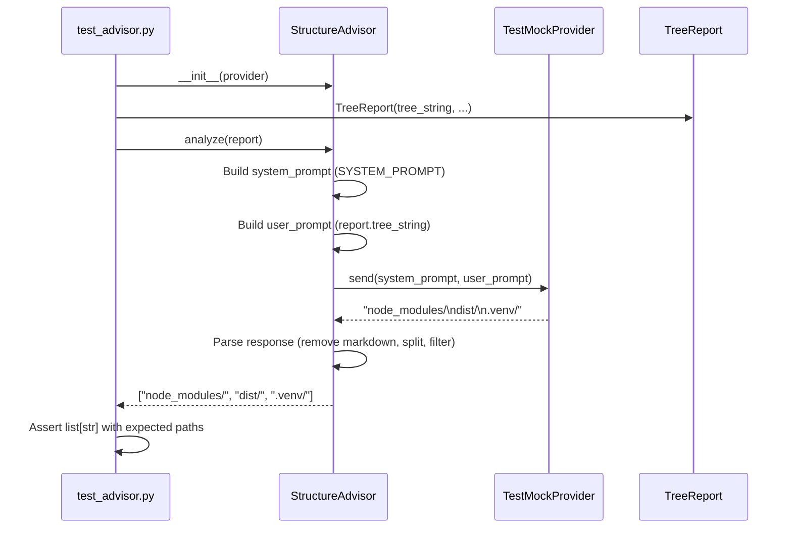

I have created the following plan after thorough exploration and analysis of the codebase. Follow the below plan verbatim. Trust the files and references. Do not re-verify what's written in the plan. Explore only when absolutely necessary. First implement all the proposed file changes and then I'll review all the changes together at the end.

## Beobachtungen

Das Projekt folgt striktem TDD mit 100% Coverage-Anforderung. Bestehende Tests in `file:tests/unit/scout/test_tree.py` zeigen klare Patterns: Multiple Test-Klassen pro Aspekt, Arrange-Act-Assert, vollständige Type Hints, Google-Style Docstrings. `LLMProvider` Protocol und `MockProvider` existieren in `file:src/codemap/core/llm.py`. `TreeReport` ist in `file:src/codemap/scout/models.py` definiert. Die `advisor.py` Implementierung fehlt noch – Tests treiben die Implementierung.

## Ansatz

Erstelle `file:tests/unit/scout/test_advisor.py` mit 4 Test-Klassen: `TestStructureAdvisorBasic` (Initialisierung, DI, Rückgabetyp), `TestStructureAdvisorPromptConstruction` (System-/User-Prompt-Bau, Konstanten-Verwendung), `TestStructureAdvisorParsing` (Markdown-Entfernung, Zeilen-Splitting, Whitespace-Handling), `TestStructureAdvisorEdgeCases` (leere Antworten, ungültige Formate, Robustheit). Implementiere Test-spezifischen `TestMockProvider` für kontrollierte Antworten. Nutze `TreeReport`-Fixtures. Decke alle Pfade ab (100% Coverage). Tests definieren Verhalten vor Implementierung (TDD Red Phase).

## Implementierungsschritte

### 1. Test-Datei erstellen

Erstelle `file:tests/unit/scout/test_advisor.py` mit Standard-Imports:
- `from pathlib import Path`
- `import pytest`
- `from codemap.core.llm import LLMProvider`
- `from codemap.scout.models import TreeReport`
- `from codemap.scout.advisor import StructureAdvisor, SYSTEM_PROMPT`

### 2. Test-MockProvider implementieren

Erstelle `TestMockProvider` Klasse im Test-File:
- Implementiert `LLMProvider` Protocol
- `__init__` speichert `response: str` für kontrollierte Antworten
- `send(system: str, user: str) -> str` gibt gespeicherte Response zurück
- Ermöglicht Verifikation von System-/User-Prompts via Attribute

### 3. TestStructureAdvisorBasic Klasse

Teste grundlegende Funktionalität:
- `test_initialization_with_provider`: Verifiziere DI via `__init__(provider: LLMProvider)`
- `test_analyze_returns_list_of_strings`: Prüfe Rückgabetyp `list[str]`
- `test_analyze_with_empty_tree_report`: TreeReport mit leerem `tree_string`
- `test_analyze_calls_provider_send`: Verifiziere `provider.send()` Aufruf

### 4. TestStructureAdvisorPromptConstruction Klasse

Teste Prompt-Konstruktion:
- `test_system_prompt_constant_exists`: Verifiziere `SYSTEM_PROMPT` Konstante mit exaktem deutschen Text aus User-Anforderung
- `test_system_prompt_passed_to_provider`: Prüfe, dass `SYSTEM_PROMPT` an `provider.send()` übergeben wird
- `test_user_prompt_contains_tree_string`: Verifiziere, dass `report.tree_string` in User-Prompt enthalten ist
- `test_prompts_are_separate_parameters`: System und User als separate `send()` Parameter

### 5. TestStructureAdvisorParsing Klasse

Teste robustes Parsing:
- `test_parse_simple_lines`: Einfache Zeilen ohne Markdown → `["node_modules/", "dist/"]`
- `test_parse_removes_markdown_code_blocks`: Entferne ` ```gitignore` und ` ``` ` Wrapper
- `test_parse_removes_markdown_without_language`: Entferne ` ``` ` ohne Language-Tag
- `test_parse_strips_whitespace`: Entferne Leading/Trailing Whitespace pro Zeile
- `test_parse_filters_empty_lines`: Leere Zeilen nach Whitespace-Entfernung ignorieren
- `test_parse_with_prefix_text`: "Hier ist die Liste:\nnode_modules/\ndist/" → nur Pfade extrahieren
- `test_parse_multiline_response`: Mehrzeilige Antwort korrekt splitten

### 6. TestStructureAdvisorEdgeCases Klasse

Teste Edge Cases:
- `test_analyze_with_empty_provider_response`: Leere Antwort → `[]`
- `test_analyze_with_whitespace_only_response`: Nur Whitespace → `[]`
- `test_analyze_with_mixed_valid_invalid_lines`: Mische gültige Pfade mit Leerzeilen
- `test_analyze_preserves_gitignore_format`: Pfade bleiben unverändert (z.B. `node_modules/`, `*.log`)
- `test_analyze_with_complex_tree_report`: TreeReport mit großem `tree_string` (100+ Zeilen)

### 7. Integration Tests

Teste Integration mit `TreeReport`:
- `test_integration_with_real_tree_report`: Nutze `TreeGenerator` für echten TreeReport, verifiziere `analyze()` Verarbeitung
- `test_integration_preserves_report_immutability`: TreeReport bleibt unverändert nach `analyze()`

### 8. Fixtures definieren

Erstelle pytest Fixtures:
- `@pytest.fixture` `sample_tree_report() -> TreeReport`: Standard TreeReport für Tests
- `@pytest.fixture` `mock_provider_factory() -> Callable[[str], TestMockProvider]`: Factory für TestMockProvider mit konfigurierbarer Response

### 9. Coverage sicherstellen

Verifiziere 100% Coverage:
- Alle Pfade in `analyze()` abgedeckt
- Alle Parsing-Varianten getestet
- Alle Edge Cases behandelt
- Keine `pragma: no cover` nötig (außer Protocol-Definition)

### 10. Dokumentation

Jede Test-Methode mit Google-Style Docstring:
- Kurze Beschreibung des getesteten Verhaltens
- Arrange-Act-Assert Struktur im Code
- Type Hints für alle Parameter und Rückgabewerte

## Architektur-Übersicht



## Test-Struktur

| Test-Klasse | Anzahl Tests | Fokus |
|-------------|--------------|-------|
| `TestStructureAdvisorBasic` | 4 | Initialisierung, DI, Rückgabetyp |
| `TestStructureAdvisorPromptConstruction` | 4 | System-/User-Prompt-Bau |
| `TestStructureAdvisorParsing` | 7 | Markdown-Entfernung, Zeilen-Splitting |
| `TestStructureAdvisorEdgeCases` | 5 | Leere Antworten, ungültige Formate |
| Integration Tests | 2 | TreeReport-Integration |
| **Gesamt** | **22** | **100% Coverage** |