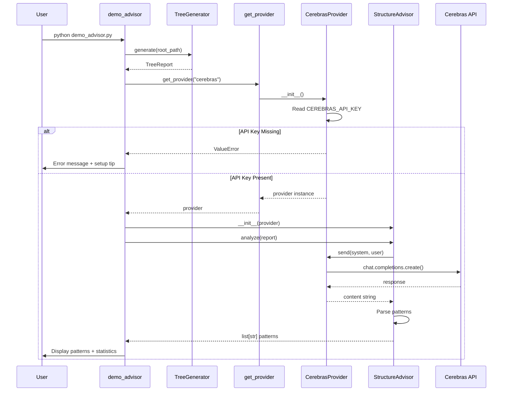

I have created the following plan after thorough exploration and analysis of the codebase. Follow the below plan verbatim. Trust the files and references. Do not re-verify what's written in the plan. Explore only when absolutely necessary. First implement all the proposed file changes and then I'll review all the changes together at the end.

## Observations

The codebase follows a clean TDD architecture with clear separation: `file:src/codemap/scout/tree.py` generates directory trees returning `TreeReport` objects, `file:src/codemap/scout/advisor.py` analyzes them via LLM providers using dependency injection, and `file:src/codemap/core/llm.py` provides the `get_provider()` factory. The existing `file:demo_tree.py` demonstrates the pattern: sys.path manipulation for imports, emoji-rich console output, timing measurements, comprehensive error handling, and statistics display. The `CerebrasProvider` now reads `CEREBRAS_API_KEY` from environment and raises `ValueError` if missing.

## Approach

Create `file:demo_advisor.py` mirroring `file:demo_tree.py`'s structure but extending the workflow to include LLM analysis. The script will: (1) scan the current directory with `TreeGenerator`, (2) pass the `TreeReport` to `StructureAdvisor` initialized with `get_provider("cerebras")`, (3) display the returned gitignore patterns. Error handling will catch `ValueError` for missing API keys and general exceptions during scanning/analysis. The output will follow the existing demo's style with emojis, separators, timing, and statistics, ensuring consistency across demo scripts.

## Implementation Steps

### 1. Create demo_advisor.py in Root Directory

Create a new file `file:demo_advisor.py` at the workspace root (same level as `file:demo_tree.py`).

### 2. Add Imports and sys.path Setup

```python
import sys
import time
from pathlib import Path

# Add 'src' to Python path for module imports
sys.path.append(str(Path.cwd() / "src"))

try:
    from codemap.scout import TreeGenerator
    from codemap.scout.advisor import StructureAdvisor
    from codemap.core.llm import get_provider
except ImportError as e:
    print("Fehler: Konnte 'codemap' nicht importieren.")
    print(f"Details: {e}")
    sys.exit(1)
```

**Rationale**: Follow the exact pattern from `file:demo_tree.py` lines 1-13 for consistency. Import `StructureAdvisor` and `get_provider` in addition to `TreeGenerator`.

### 3. Implement main() Function

Structure the `main()` function with the following flow:

#### 3.1 Initialize and Display Header

```python
def main():
    root_path = Path.cwd()
    print(f"🚀 Starte StructureAdvisor im Ordner: {root_path.name}")
    print("-" * 50)
```

**Rationale**: Mirror `file:demo_tree.py` lines 16-19, but change the title to reflect the advisor functionality.

#### 3.2 Scan Directory with TreeGenerator

```python
    # 1. Tree-Generierung
    print("📂 Scanne Verzeichnisstruktur...")
    generator = TreeGenerator()
    
    start_time = time.time()
    
    try:
        report = generator.generate(root_path)
    except Exception as e:
        print(f"💥 Kritischer Fehler beim Scannen: {e}")
        return
    
    scan_duration = time.time() - start_time
    print(f"✅ Scan abgeschlossen in {scan_duration:.4f} Sekunden")
    print(f"   Dateien: {report.total_files}, Ordner: {report.total_folders}")
    print("-" * 50)
```

**Rationale**: Follow `file:demo_tree.py` lines 22-31 pattern with timing and error handling. Add intermediate status messages for better UX.

#### 3.3 Initialize StructureAdvisor with Error Handling

```python
    # 2. LLM-Provider initialisieren
    print("🤖 Initialisiere Cerebras LLM Provider...")
    try:
        provider = get_provider("cerebras")
        advisor = StructureAdvisor(provider)
    except ValueError as e:
        print(f"❌ Fehler: {e}")
        print("💡 Tipp: Setze die Umgebungsvariable CEREBRAS_API_KEY")
        print("   export CEREBRAS_API_KEY='your-api-key-here'")
        return
    
    print("✅ Provider initialisiert")
    print("-" * 50)
```

**Rationale**: Catch the `ValueError` that `CerebrasProvider.__init__` raises when `CEREBRAS_API_KEY` is not set (see `file:src/codemap/core/llm.py`). Provide helpful error message with setup instructions.

#### 3.4 Analyze with StructureAdvisor

```python
    # 3. Analyse durchführen
    print("🔍 Analysiere Struktur mit LLM...")
    analysis_start = time.time()
    
    try:
        patterns = advisor.analyze(report)
    except Exception as e:
        print(f"💥 Fehler bei der Analyse: {e}")
        return
    
    analysis_duration = time.time() - analysis_start
    print(f"✅ Analyse abgeschlossen in {analysis_duration:.4f} Sekunden")
    print("-" * 50)
```

**Rationale**: Time the LLM analysis separately to show API call duration. Use try-except for robustness against API errors.

#### 3.5 Display Results

```python
    # 4. Ergebnisse ausgeben
    print("📋 VORGESCHLAGENE .GITIGNORE PATTERNS:")
    print()
    
    if patterns:
        for pattern in patterns:
            print(f"   {pattern}")
    else:
        print("   (Keine Vorschläge - Struktur ist bereits optimal)")
    
    print()
    print("-" * 50)
    print("📊 ZUSAMMENFASSUNG:")
    print(f"   Gescannte Dateien:     {report.total_files}")
    print(f"   Gescannte Ordner:      {report.total_folders}")
    print(f"   Gefundene Patterns:    {len(patterns)}")
    print(f"   Scan-Dauer:            {scan_duration:.4f} Sekunden")
    print(f"   Analyse-Dauer:         {analysis_duration:.4f} Sekunden")
    print(f"   Gesamt-Dauer:          {(scan_duration + analysis_duration):.4f} Sekunden")
    print("-" * 50)
```

**Rationale**: Follow `file:demo_tree.py` lines 36-43 output style with emojis and separators. Display the gitignore patterns (result of `advisor.analyze()`) and comprehensive statistics including both scan and analysis timing.

### 4. Add Entry Point

```python
if __name__ == "__main__":
    main()
```

**Rationale**: Standard Python entry point pattern, consistent with `file:demo_tree.py` line 51-52.

## File Structure Overview

```
ContextCurator/
├── demo_tree.py          # Existing: Tree visualization demo
├── demo_advisor.py       # NEW: LLM-powered structure analysis demo
├── src/
│   └── codemap/
│       ├── core/
│       │   └── llm.py    # LLM providers (CerebrasProvider now implemented)
│       └── scout/
│           ├── tree.py   # TreeGenerator
│           ├── advisor.py # StructureAdvisor
│           └── models.py # TreeReport dataclass
```

## Execution Flow



## Expected Output Example

```
🚀 Starte StructureAdvisor im Ordner: ContextCurator
--------------------------------------------------
📂 Scanne Verzeichnisstruktur...
✅ Scan abgeschlossen in 0.0234 Sekunden
   Dateien: 42, Ordner: 15
--------------------------------------------------
🤖 Initialisiere Cerebras LLM Provider...
✅ Provider initialisiert
--------------------------------------------------
🔍 Analysiere Struktur mit LLM...
✅ Analyse abgeschlossen in 1.2345 Sekunden
--------------------------------------------------
📋 VORGESCHLAGENE .GITIGNORE PATTERNS:

   __pycache__/
   *.pyc
   .pytest_cache/
   .coverage
   htmlcov/
   dist/
   build/
   *.egg-info/

--------------------------------------------------
📊 ZUSAMMENFASSUNG:
   Gescannte Dateien:     42
   Gescannte Ordner:      15
   Gefundene Patterns:    8
   Scan-Dauer:            0.0234 Sekunden
   Analyse-Dauer:         1.2345 Sekunden
   Gesamt-Dauer:          1.2579 Sekunden
--------------------------------------------------
```

## Error Handling Scenarios

| Scenario | Exception | Handling |
|----------|-----------|----------|
| Missing API Key | `ValueError` from `CerebrasProvider.__init__` | Display error + setup instructions, exit gracefully |
| Import Failure | `ImportError` | Display error message, `sys.exit(1)` |
| Scan Failure | `Exception` from `TreeGenerator.generate()` | Display error, return from `main()` |
| Analysis Failure | `Exception` from `StructureAdvisor.analyze()` | Display error, return from `main()` |

## Testing Recommendations

While this is a demo script (not covered by unit tests), you can manually verify:

1. **Without API Key**: Run without `CEREBRAS_API_KEY` set → should show helpful error message
2. **With API Key**: Run with valid key → should complete full workflow and display patterns
3. **Invalid Directory**: Modify to scan non-existent path → should catch and display error
4. **Empty Directory**: Run in empty directory → should handle gracefully with 0 files/folders