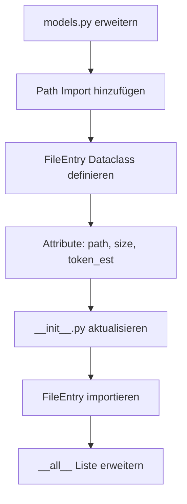

I have created the following plan after thorough exploration and analysis of the codebase. Follow the below plan verbatim. Trust the files and references. Do not re-verify what's written in the plan. Explore only when absolutely necessary. First implement all the proposed file changes and then I'll review all the changes together at the end.

## Beobachtungen

Die Datei `file:src/codemap/scout/models.py` enthält bereits die `TreeReport` Dataclass mit `@dataclass(frozen=True)` Dekorator. Das Modul folgt einem klaren Pattern: Frozen Dataclasses für immutable Datenstrukturen. Die `__init__.py` exportiert aktuell `TreeGenerator`, `TreeReport` und `StructureAdvisor` über `__all__`. Der Import von `Path` aus `pathlib` fehlt noch in `models.py`.

## Ansatz

Ich erweitere `models.py` um die `FileEntry` Dataclass nach dem bestehenden Pattern von `TreeReport`. Die Klasse wird als `frozen=True` definiert für Immutability. Anschließend wird `FileEntry` in `__init__.py` importiert und zu `__all__` hinzugefügt, damit sie Teil der öffentlichen API des Scout-Moduls wird.

## Implementierungsschritte

### 1. Import in `file:src/codemap/scout/models.py` erweitern

- Füge `from pathlib import Path` am Anfang der Datei hinzu (nach dem Docstring, vor `from dataclasses import dataclass`)

### 2. FileEntry Dataclass in `file:src/codemap/scout/models.py` hinzufügen

- Füge die neue Dataclass nach `TreeReport` hinzu (ab Zeile 43)
- Verwende `@dataclass(frozen=True)` Dekorator für Immutability
- Definiere drei Attribute:
  - `path: Path` - Relativer Pfad zur Datei vom Root
  - `size: int` - Dateigröße in Bytes
  - `token_est: int` - Token-Schätzung (wird als `size / 4` berechnet)
- Füge einen aussagekräftigen Docstring hinzu, der dem Stil von `TreeReport` folgt
- Dokumentiere alle Attribute im Docstring

### 3. Export in `file:src/codemap/scout/__init__.py` aktualisieren

- Füge `from codemap.scout.models import FileEntry` zu den bestehenden Imports hinzu (Zeile 9)
- Erweitere die `__all__` Liste um `"FileEntry"` (Zeile 12)
- Behalte die alphabetische Sortierung bei: `["FileEntry", "StructureAdvisor", "TreeGenerator", "TreeReport"]`

