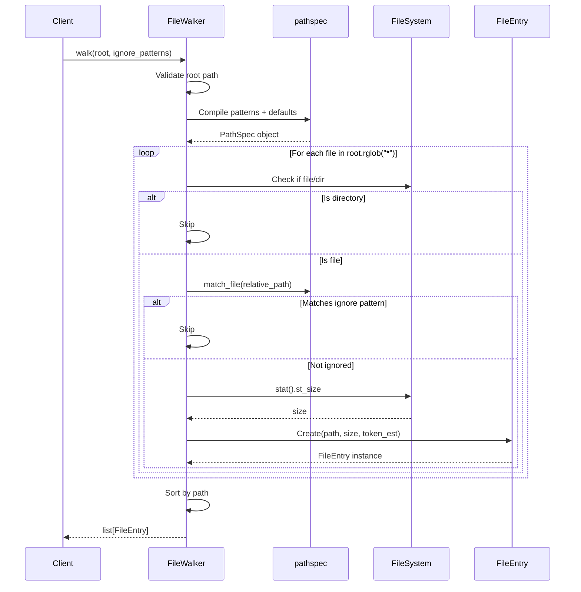

I have created the following plan after thorough exploration and analysis of the codebase. Follow the below plan verbatim. Trust the files and references. Do not re-verify what's written in the plan. Explore only when absolutely necessary. First implement all the proposed file changes and then I'll review all the changes together at the end.

## Observations

The codebase follows strict TDD with 100% coverage requirements. `file:src/codemap/scout/tree.py` provides an excellent reference implementation: it uses `pathspec` for gitignore-style pattern matching, defines `IGNORED_DIRS = {".git", ".venv", "__pycache__"}` as constants, implements graceful error handling for `OSError` during directory traversal, and uses relative paths for pattern matching. The `file:src/codemap/scout/models.py` contains frozen dataclasses with comprehensive docstrings. Test patterns in `file:tests/unit/scout/test_tree.py` show class-based organization with AAA structure, `tmp_path` fixtures, and `monkeypatch` for error simulation.

## Approach

Create `FileWalker` class mirroring `TreeGenerator`'s architecture: use `pathspec.PathSpec` to compile ignore patterns combined with default ignores, traverse directories with `Path.rglob()` or `os.walk()`, filter files against compiled patterns using relative paths, collect file metadata (`stat().st_size`), calculate token estimates (`size // 4`), and return alphabetically sorted `list[FileEntry]`. This approach ensures consistency with existing codebase patterns, leverages proven pathspec integration, and maintains the project's strict TDD and error-handling standards.

## Implementation Instructions

### 1. Create Walker Module Structure

Create `file:src/codemap/scout/walker.py` with module docstring following the pattern in `file:src/codemap/scout/tree.py`:

```python
"""File walker for inventory generation.

This module provides FileWalker class for scanning project directories
and generating cleaned file inventories with metadata.
"""
```

Import required dependencies:
- `from pathlib import Path`
- `import pathspec`
- `from codemap.scout.models import FileEntry`

Define default ignore constants matching `file:src/codemap/scout/tree.py`:
```python
DEFAULT_IGNORES: set[str] = {".git", ".venv", "__pycache__"}
```

### 2. Implement FileWalker Class

Create `FileWalker` class with comprehensive docstring explaining:
- Purpose: scan directories and generate file inventories
- Pattern matching: uses pathspec for gitignore-style patterns
- Default ignores: `.git`, `.venv`, `__pycache__`
- Return type: sorted `list[FileEntry]` with metadata

Add `__init__(self) -> None` method (empty implementation like `TreeGenerator`)

### 3. Implement walk() Method Signature

Define method: `walk(self, root: Path, ignore_patterns: list[str]) -> list[FileEntry]`

Add docstring covering:
- **Args**: `root` (directory to scan), `ignore_patterns` (list of gitignore-style patterns)
- **Returns**: Sorted list of `FileEntry` objects with path, size, token_est
- **Raises**: `ValueError` if root doesn't exist or isn't a directory

### 4. Implement Pattern Compilation

Follow `file:src/codemap/scout/tree.py` pattern in `_load_gitignore()`:

Combine `ignore_patterns` with `DEFAULT_IGNORES` into a single pattern list:
```python
all_patterns = list(DEFAULT_IGNORES) + ignore_patterns
```

Compile using `pathspec.PathSpec.from_lines("gitwildmatch", all_patterns)` to create reusable matcher

### 5. Implement Directory Traversal

Use `root.rglob("*")` to recursively iterate all paths (performant for typical codebases)

For each path:
- Skip if `path.is_dir()` (only collect files)
- Calculate relative path: `relative_path = path.relative_to(root)`
- Normalize for cross-platform: `pattern_path = str(relative_path).replace("\\", "/")`
- Check against pathspec: `if spec.match_file(pattern_path): continue`

Wrap traversal in `try/except OSError` to gracefully handle permission errors (like `file:src/codemap/scout/tree.py` line 198)

### 6. Implement Metadata Collection

For each non-ignored file:
- Get size: `size = path.stat().st_size`
- Calculate token estimate: `token_est = size // 4` (integer division)
- Create `FileEntry(path=relative_path, size=size, token_est=token_est)`
- Append to results list

Wrap `stat()` call in `try/except OSError` to handle files that disappear or become inaccessible during traversal

### 7. Implement Sorting and Return

Sort results alphabetically by path: `results.sort(key=lambda entry: str(entry.path))`

Return sorted list

### 8. Add Input Validation

At method start, validate `root` path (matching `file:src/codemap/scout/tree.py` lines 68-74):
- Check `if not root.exists()`: raise `ValueError(f"Path does not exist: {root}")`
- Check `if not root.is_dir()`: raise `ValueError(f"Path is not a directory: {root}")`

### 9. Export in Public API

Update `file:src/codemap/scout/__init__.py`:
- Add import: `from codemap.scout.walker import FileWalker`
- Add to `__all__`: `["FileWalker", "FileEntry", "StructureAdvisor", "TreeGenerator", "TreeReport"]` (alphabetically sorted)

## Architecture Diagram



## Key Implementation Details

| Aspect | Implementation | Reference |
|--------|---------------|-----------|
| **Pattern Matching** | Use `pathspec.PathSpec.from_lines("gitwildmatch", patterns)` | `file:src/codemap/scout/tree.py` line 113 |
| **Default Ignores** | `{".git", ".venv", "__pycache__"}` as constant | `file:src/codemap/scout/tree.py` line 15 |
| **Path Normalization** | `str(relative_path).replace("\\", "/")` | `file:src/codemap/scout/tree.py` line 154 |
| **Error Handling** | Wrap traversal in `try/except OSError` | `file:src/codemap/scout/tree.py` line 198 |
| **Token Estimation** | `size // 4` (integer division) | User specification |
| **Sorting** | `results.sort(key=lambda e: str(e.path))` | User requirement |
| **Validation** | Check `exists()` and `is_dir()` before traversal | `file:src/codemap/scout/tree.py` lines 68-74 |