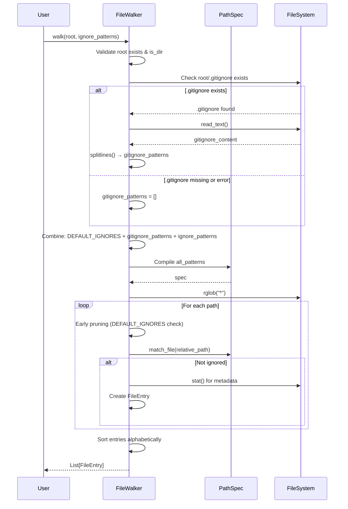

I have created the following plan after thorough exploration and analysis of the codebase. Follow the below plan verbatim. Trust the files and references. Do not re-verify what's written in the plan. Explore only when absolutely necessary. First implement all the proposed file changes and then I'll review all the changes together at the end.

## Observations

The codebase follows strict TDD principles with 100% coverage. `file:src/codemap/scout/walker.py` currently has minimal default ignores (`{".git", ".venv", "__pycache__"}`) and lacks local `.gitignore` reading. `file:src/codemap/scout/tree.py` already implements `.gitignore` reading via `_load_gitignore()` method (lines 93-113), providing a proven pattern to follow. Both modules use `pathspec` library for gitignore-style pattern matching. The existing tests in `file:tests/unit/scout/test_walker.py` demonstrate comprehensive coverage patterns with `tmp_path` fixtures and arrange-act-assert structure.

## Approach

Implement a two-part enhancement: (1) Replace minimal ignore sets with a comprehensive polyglot master list covering System/SCM, Build/Dependencies, Node/Web, Python, PHP/WordPress, Dart/Flutter, Java/JVM, .NET, C/C++, Go, and IDEs; (2) Add `.gitignore` reading to `FileWalker.walk()` by adapting the proven `_load_gitignore()` pattern from `TreeGenerator`. This ensures both modules maintain consistency while providing robust default protection against common junk directories across all major language ecosystems.

## Implementation Steps

### Step 1: Update Constants in Both Modules

**File: `file:src/codemap/scout/walker.py`**

Replace the `DEFAULT_IGNORES` set (line 15) with the comprehensive master list:

```python
DEFAULT_IGNORES: set[str] = {
    # --- System / SCM ---
    ".git", ".svn", ".hg", ".fslckout", "_darcs", ".bzr", ".DS_Store", "Thumbs.db",
    
    # --- General Build / Dependencies ---
    "dist", "build", "out", "target", "bin", "obj",
    "vendor",  # PHP (Composer), Go, Ruby
    
    # --- Node / Web / JS / TS ---
    "node_modules", "bower_components",
    ".npm", ".yarn", ".pnpm-store",
    ".next", ".nuxt", ".output", ".astro",
    ".svelte-kit", ".vercel", ".netlify",
    ".cache", ".parcel-cache", ".turbo",
    "coverage", ".nyc_output",
    
    # --- Python ---
    ".venv", "venv", "env", ".env", "virtualenv",
    "__pycache__", ".pytest_cache", ".mypy_cache", ".ruff_cache", ".hypothesize",
    "htmlcov", ".coverage", "cover", "*.egg-info", ".tox", ".nox", "site-packages",
    
    # --- PHP / WordPress ---
    ".phpunit.cache", ".php-cs-fixer.cache",
    "wp-admin", "wp-includes",  # WordPress Core
    
    # --- Dart / Flutter ---
    ".dart_tool", ".pub-cache", ".flutter-plugins", ".flutter-plugins-dependencies",
    
    # --- Java / JVM ---
    ".gradle", "gradle", ".settings", ".classpath", ".project",
    
    # --- .NET ---
    "packages", "TestResults", ".vs",
    
    # --- C / C++ ---
    "cmake-build-debug", "cmake-build-release", "CMakeFiles",
    
    # --- Go ---
    "pkg",
    
    # --- IDEs ---
    ".idea", ".vscode"
}
```

**File: `file:src/codemap/scout/tree.py`**

Replace the `IGNORED_DIRS` set (line 15) with the **identical** master list shown above to maintain consistency between both modules.

### Step 2: Add `.gitignore` Reading Logic to FileWalker

**File: `file:src/codemap/scout/walker.py`**

Modify the `walk()` method (starting at line 44) to read and incorporate local `.gitignore` patterns:

**Location:** Inside `walk()` method, after input validation (after line 75) and before pattern compilation (before line 78)

Add the following logic:

1. Initialize an empty list for gitignore patterns: `gitignore_patterns: list[str] = []`

2. Check if `.gitignore` exists in root: `gitignore_path = root / ".gitignore"`

3. If it exists, read and parse it with error handling:
   - Use `try/except` block to catch `OSError` and `UnicodeError` (similar to `tree.py` lines 108-111)
   - Read file content using `gitignore_path.read_text()`
   - Split content into lines: `gitignore_content.splitlines()`
   - Assign to `gitignore_patterns`
   - On error, silently continue (allow traversal to proceed)

4. Update pattern combination (line 78) from:
   ```python
   all_patterns = list(DEFAULT_IGNORES) + ignore_patterns
   ```
   to:
   ```python
   all_patterns = list(DEFAULT_IGNORES) + gitignore_patterns + ignore_patterns
   ```

**Pattern Order Rationale:** `DEFAULT_IGNORES` (always applied) → `gitignore_patterns` (project-specific) → `ignore_patterns` (user-provided overrides)

### Step 3: Update Early Pruning Logic

**File: `file:src/codemap/scout/walker.py`**

The early pruning optimization (lines 99-100) currently checks only `DEFAULT_IGNORES`. Since `DEFAULT_IGNORES` now contains the comprehensive master list, this optimization remains valid and efficient. No changes needed here.

### Step 4: Verify Pattern Compilation

**File: `file:src/codemap/scout/walker.py`**

Ensure the `pathspec` compilation (line 79) correctly handles the expanded pattern list. The existing code already supports this:

```python
spec = pathspec.PathSpec.from_lines("gitwildmatch", all_patterns)
```

The `gitwildmatch` format handles both directory names (from `DEFAULT_IGNORES`) and gitignore patterns (from `.gitignore` file) correctly.

## Implementation Flow



## Key Considerations

| Aspect | Implementation Detail |
|--------|----------------------|
| **Error Handling** | Use `try/except (OSError, UnicodeError)` for `.gitignore` reading, silently continue on failure |
| **Pattern Order** | `DEFAULT_IGNORES` → `gitignore_patterns` → `ignore_patterns` (increasing specificity) |
| **Consistency** | Both `walker.py` and `tree.py` must use **identical** master lists |
| **Performance** | Early pruning optimization (line 99-100) remains effective with expanded `DEFAULT_IGNORES` |
| **Cross-Platform** | Existing path normalization (line 103) handles Windows backslashes correctly |
| **Backward Compatibility** | Existing tests remain valid; new tests will verify enhanced functionality |

## Files Modified

- `file:src/codemap/scout/walker.py` - Update `DEFAULT_IGNORES` constant, add `.gitignore` reading logic to `walk()` method
- `file:src/codemap/scout/tree.py` - Update `IGNORED_DIRS` constant to match `DEFAULT_IGNORES`