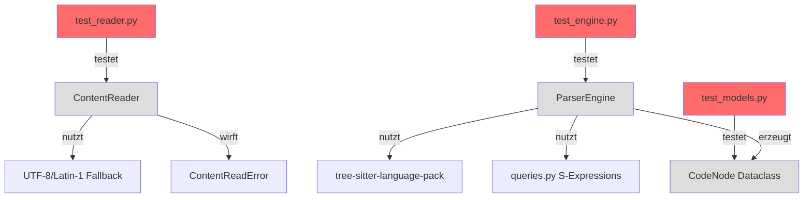

I have created the following plan after thorough exploration and analysis of the codebase. Follow the below plan verbatim. Trust the files and references. Do not re-verify what's written in the plan. Explore only when absolutely necessary. First implement all the proposed file changes and then I'll review all the changes together at the end.

## Beobachtungen zur Codebase

Das Projekt folgt **striktem TDD** mit 100% Coverage-Anforderung. Bestehende Module (`scout`) nutzen frozen dataclasses (`TreeReport`, `FileEntry`) mit umfassenden Tests. Test-Struktur: Klassen-basiert mit deskriptiven Docstrings, Tests für Creation/Frozen/Equality/Edge Cases. Dependencies `tree-sitter` und `tree-sitter-language-pack` sind vorhanden, aber noch nicht genutzt. Das `mapper` Modul wird das erste sein, das tree-sitter für Code-Parsing verwendet.

## Ansatz: Strikte TDD RED Phase

Erstelle **alle Test-Dateien** vor der Implementierung nach dem etablierten Pattern aus `test_models.py` und `test_walker.py`. Fokus auf drei Test-Suites: `test_models.py` (Dataclass-Tests), `test_reader.py` (File I/O mit Encoding-Fallback), `test_engine.py` (Tree-sitter Integration). Nutze `tmp_path` Fixture für File-Tests, Python-Code-Strings für Parser-Tests. Alle Tests müssen **FAIL** (RED Phase), da die Implementierung noch nicht existiert.

## Implementierungsschritte

### 1. Test-Verzeichnis und Init-Datei erstellen

**Datei**: `file:tests/unit/mapper/__init__.py`

Erstelle leere `__init__.py` um das Verzeichnis als Python-Package zu markieren (analog zu `file:tests/unit/scout/__init__.py`).

### 2. CodeNode Dataclass Tests erstellen

**Datei**: `file:tests/unit/mapper/test_models.py`

Erstelle Test-Klasse `TestCodeNode` nach Pattern aus `file:tests/unit/scout/test_models.py`:

**Imports:**
```python
import pytest
from pathlib import Path
from dataclasses import FrozenInstanceError
from codemap.mapper.models import CodeNode
```

**Test-Methoden:**
- `test_codenode_creation`: Instanziierung mit allen Attributen (`type="function"`, `name="foo"`, `start_line=1`, `end_line=3`)
- `test_codenode_is_frozen`: Immutability-Test mit `pytest.raises(FrozenInstanceError)` beim Versuch `node.name = "bar"`
- `test_codenode_equality`: Zwei identische Nodes sind gleich, unterschiedliche nicht
- `test_codenode_all_attributes_accessible`: Verifiziere `hasattr()` für alle Attribute
- `test_codenode_different_types`: Teste verschiedene Node-Typen (`"class"`, `"function"`, `"import"`)

**Erwartetes Verhalten**: Alle Tests **FAIL** mit `ModuleNotFoundError: No module named 'codemap.mapper'`

### 3. ContentReader Tests erstellen

**Datei**: `file:tests/unit/mapper/test_reader.py`

Erstelle Test-Klasse `TestContentReader` mit `tmp_path` Fixture:

**Imports:**
```python
import pytest
from pathlib import Path
from codemap.mapper.reader import ContentReader, ContentReadError
```

**Test-Methoden:**
- `test_read_utf8_file(tmp_path)`: Erstelle Datei mit UTF-8 Content (inkl. Emoji 🚀), lese mit `ContentReader.read_file()`, verifiziere korrekten String
- `test_read_latin1_fallback(tmp_path)`: Erstelle Datei mit Latin-1 Encoding (`encoding='latin-1'`), schreibe Umlaute (ä, ö, ü), verifiziere Fallback funktioniert
- `test_read_nonexistent_file_raises_error()`: Teste mit nicht-existierendem Path, erwarte `ContentReadError`
- `test_read_binary_file_raises_error(tmp_path)`: Erstelle Binary-Datei (z.B. `bytes([0xFF, 0xFE])`), erwarte `ContentReadError`
- `test_read_empty_file(tmp_path)`: Leere Datei sollte leeren String zurückgeben

**Pattern für File-Erstellung:**
```python
def test_read_utf8_file(tmp_path):
    file_path = tmp_path / "test.py"
    file_path.write_text("def foo():\n    pass\n# 🚀", encoding="utf-8")
    
    reader = ContentReader()
    content = reader.read_file(file_path)
    
    assert "def foo()" in content
    assert "🚀" in content
```

**Erwartetes Verhalten**: Alle Tests **FAIL** mit `ModuleNotFoundError`

### 4. ParserEngine Tests erstellen

**Datei**: `file:tests/unit/mapper/test_engine.py`

Erstelle Test-Klassen `TestParserEngine` und `TestLanguageMapping`:

**Imports:**
```python
import pytest
from pathlib import Path
from codemap.mapper.engine import ParserEngine
from codemap.mapper.models import CodeNode
```

**Test-Klasse `TestLanguageMapping`:**
- `test_get_language_id_python()`: Teste `.py` → `"python"`
- `test_get_language_id_unknown_extension()`: Teste `.xyz` → erwarte `ValueError` oder `None`

**Test-Klasse `TestParserEngine`:**
- `test_extracts_function_definition()`: 
  - Input: `"def foo():\n    pass\n"`
  - Erwarte: `CodeNode(type="function", name="foo", start_line=1, end_line=2)`
  
- `test_extracts_class_definition()`:
  - Input: `"class MyClass:\n    pass\n"`
  - Erwarte: `CodeNode(type="class", name="MyClass", start_line=1, end_line=2)`

- `test_extracts_import_statement()`:
  - Input: `"import os\n"`
  - Erwarte: `CodeNode(type="import", name="os", start_line=1, end_line=1)`

- `test_extracts_import_from_statement()`:
  - Input: `"from pathlib import Path\n"`
  - Erwarte: `CodeNode(type="import", name="pathlib", start_line=1, end_line=1)`

- `test_extracts_multiple_definitions()`:
  - Input: Multi-line Code mit 2 Funktionen und 1 Klasse
  - Erwarte: Liste mit 3 `CodeNode` Objekten

- `test_empty_code_returns_empty_list()`:
  - Input: `""`
  - Erwarte: `[]`

**Pattern für Parser-Tests:**
```python
def test_extracts_function_definition():
    code = "def foo():\n    pass\n"
    engine = ParserEngine()
    
    nodes = engine.parse(code, language="python")
    
    assert len(nodes) == 1
    assert nodes[0].type == "function"
    assert nodes[0].name == "foo"
    assert nodes[0].start_line == 1
```

**Erwartetes Verhalten**: Alle Tests **FAIL** mit `ModuleNotFoundError`

### 5. Verifikation der RED Phase

Nach Erstellung aller Test-Dateien:

**Kommando ausführen:**
```bash
pytest tests/unit/mapper/ -v
```

**Erwartetes Ergebnis:**
- Alle Tests schlagen fehl mit `ModuleNotFoundError: No module named 'codemap.mapper'`
- Keine Syntax-Fehler in den Test-Dateien
- Test-Discovery funktioniert (pytest findet alle Tests)

**Coverage-Check (sollte 0% für mapper sein):**
```bash
pytest tests/unit/mapper/ --cov=src/codemap/mapper --cov-report=term-missing
```

## Architektur-Übersicht



## Test-Struktur Übersicht

| Test-Datei | Test-Klasse | Anzahl Tests | Fokus |
|------------|-------------|--------------|-------|
| `test_models.py` | `TestCodeNode` | 5 | Dataclass Creation, Frozen, Equality |
| `test_reader.py` | `TestContentReader` | 5 | File I/O, Encoding Fallback, Errors |
| `test_engine.py` | `TestLanguageMapping` | 2 | Extension → Language Mapping |
| `test_engine.py` | `TestParserEngine` | 6 | Tree-sitter Parsing, Node Extraction |
| **Gesamt** | **4 Klassen** | **18 Tests** | **100% RED Phase** |

## Qualitätskriterien für RED Phase

✅ **Alle Tests schlagen fehl** (ModuleNotFoundError)  
✅ **Keine Syntax-Fehler** in Test-Dateien  
✅ **Test-Discovery funktioniert** (pytest findet alle 18 Tests)  
✅ **Docstrings vorhanden** für alle Test-Methoden  
✅ **Type Hints korrekt** (keine mypy-Fehler in Tests)  
✅ **Pattern-Konsistenz** mit bestehenden Tests aus `file:tests/unit/scout/`