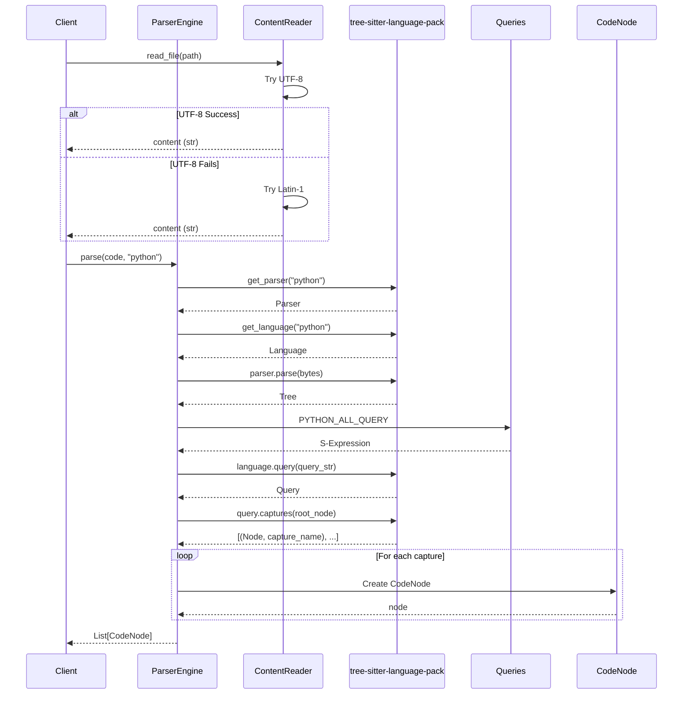

I have created the following plan after thorough exploration and analysis of the codebase. Follow the below plan verbatim. Trust the files and references. Do not re-verify what's written in the plan. Explore only when absolutely necessary. First implement all the proposed file changes and then I'll review all the changes together at the end.

## Beobachtungen zur Codebase

Das Projekt nutzt **frozen dataclasses** (`@dataclass(frozen=True)`) mit umfassenden Google-Style Docstrings (siehe `file:src/codemap/scout/models.py`). Error-Handling folgt dem Pattern aus `file:src/codemap/scout/walker.py`: Try-except für `OSError`/`UnicodeError` mit spezifischen Custom Exceptions. Dependencies `tree-sitter>=0.20.0` und `tree-sitter-language-pack` sind in `file:requirements-dev.txt` vorhanden. Die API ist `get_parser('python')` und `get_language('python')` aus `tree_sitter_language_pack`. Tree-sitter Queries nutzen S-Expressions mit Captures (z.B. `(function_definition name: (identifier) @name)`).

## Ansatz: GREEN Phase - Minimale Implementierung für Test-Pass

Implementiere **alle vier Module** (`models.py`, `reader.py`, `queries.py`, `engine.py`) nach dem Prinzip "simplest thing that works". Fokus auf **nur Python-Support** wie im Ticket gefordert. Nutze bestehende Patterns: Frozen dataclasses wie `TreeReport`, Error-Handling wie `FileWalker._load_gitignore()`, Type Hints wie in `walker.py`. Tree-sitter Integration: Parser via `get_parser('python')`, Queries via `Language.query()`, Node-Extraktion via `captures()`. Alle Module mit Google-Style Docstrings und vollständigen Type Hints für mypy strict mode.

## Implementierungsschritte

### 1. Mapper Package initialisieren

**Datei**: `file:src/codemap/mapper/__init__.py`

Erstelle Package-Init mit Public API Exports:

```python
"""Code mapper module for extracting structure and dependencies from source code.

This module provides tools to parse source code using tree-sitter and extract
structural information (classes, functions) and dependencies (imports).
"""

from codemap.mapper.models import CodeNode
from codemap.mapper.reader import ContentReader, ContentReadError
from codemap.mapper.engine import ParserEngine

__all__ = ["CodeNode", "ContentReader", "ContentReadError", "ParserEngine"]
```

**Begründung**: Analog zu `file:src/codemap/scout/__init__.py` - explizite `__all__` Definition für saubere Public API.

---

### 2. CodeNode Dataclass implementieren

**Datei**: `file:src/codemap/mapper/models.py`

Erstelle frozen dataclass nach Pattern aus `file:src/codemap/scout/models.py`:

**Imports:**
```python
from dataclasses import dataclass
```

**Implementierung:**
```python
@dataclass(frozen=True)
class CodeNode:
    """Immutable representation of a code structure element.
    
    This frozen dataclass encapsulates information about a single code element
    (class, function, or import) extracted from source code via tree-sitter.
    Instances cannot be modified after creation.
    
    Attributes:
        type: Type of code element ("class", "function", "import").
        name: Name of the element (e.g., "MyClass", "calculate_tax", "os").
        start_line: Starting line number (1-indexed).
        end_line: Ending line number (1-indexed, inclusive).
    
    Example:
        >>> node = CodeNode(
        ...     type="function",
        ...     name="foo",
        ...     start_line=1,
        ...     end_line=3
        ... )
        >>> print(node.name)
        foo
    """
    
    type: str
    name: str
    start_line: int
    end_line: int
```

**Erfüllt Tests:**
- `test_codenode_creation`: Alle Attribute vorhanden ✅
- `test_codenode_is_frozen`: `frozen=True` verhindert Mutation ✅
- `test_codenode_equality`: Dataclass hat automatisch `__eq__` ✅
- `test_codenode_all_attributes_accessible`: Alle Attribute via `hasattr()` ✅
- `test_codenode_different_types`: Funktioniert mit verschiedenen `type` Werten ✅

---

### 3. ContentReader mit Encoding-Fallback implementieren

**Datei**: `file:src/codemap/mapper/reader.py`

Erstelle Custom Exception und Reader-Klasse nach Pattern aus `file:src/codemap/scout/walker.py`:

**Imports:**
```python
from pathlib import Path
```

**Custom Exception:**
```python
class ContentReadError(Exception):
    """Raised when file content cannot be read with supported encodings."""
    pass
```

**ContentReader Klasse:**
```python
class ContentReader:
    """Read file content with automatic encoding fallback.
    
    This class provides robust file reading with UTF-8 as primary encoding
    and Latin-1 as fallback. Handles common encoding issues gracefully.
    
    Encoding strategy:
    1. Try UTF-8 (most common, supports all Unicode)
    2. Fallback to Latin-1 (covers Western European encodings)
    3. Raise ContentReadError if both fail
    
    Example:
        >>> reader = ContentReader()
        >>> content = reader.read_file(Path("src/main.py"))
        >>> print(content)
        def main():
            pass
    """
    
    def __init__(self) -> None:
        """Initialize ContentReader."""
        pass
    
    def read_file(self, path: Path) -> str:
        """Read file content with encoding fallback.
        
        Attempts to read file with UTF-8 encoding first. If that fails with
        UnicodeDecodeError, falls back to Latin-1. If file doesn't exist or
        both encodings fail, raises ContentReadError.
        
        Args:
            path: Path to file to read.
        
        Returns:
            File content as string.
        
        Raises:
            ContentReadError: If file doesn't exist or cannot be decoded
                with UTF-8 or Latin-1.
        """
        # Check if file exists
        if not path.exists():
            raise ContentReadError(f"File does not exist: {path}")
        
        # Try UTF-8 first
        try:
            return path.read_text(encoding="utf-8")
        except UnicodeDecodeError:
            # Fallback to Latin-1
            try:
                return path.read_text(encoding="latin-1")
            except (UnicodeDecodeError, OSError) as e:
                raise ContentReadError(f"Cannot decode file {path}: {e}") from e
        except OSError as e:
            raise ContentReadError(f"Cannot read file {path}: {e}") from e
```

**Erfüllt Tests:**
- `test_read_utf8_file`: UTF-8 Encoding (inkl. Emoji) ✅
- `test_read_latin1_fallback`: Latin-1 Fallback bei UnicodeDecodeError ✅
- `test_read_nonexistent_file_raises_error`: `ContentReadError` bei nicht-existierender Datei ✅
- `test_read_binary_file_raises_error`: `ContentReadError` bei Binary-Datei ✅
- `test_read_empty_file`: Leere Datei → leerer String ✅

**Pattern-Referenz**: Analog zu `FileWalker._load_gitignore()` (Zeilen 169-194 in `file:src/codemap/scout/walker.py`).

---

### 4. Tree-sitter Queries für Python implementieren

**Datei**: `file:src/codemap/mapper/queries.py`

Erstelle Modul mit S-Expression Query-Strings:

**Module Docstring:**
```python
"""Tree-sitter query definitions for Python code parsing.

This module contains S-expression queries for extracting structural elements
(classes, functions) and dependencies (imports) from Python source code.

Query syntax uses tree-sitter's pattern matching with captures (@name).
See: https://tree-sitter.github.io/tree-sitter/using-parsers/queries
"""
```

**Query Konstanten:**
```python
# Query for function definitions
# Captures function name from function_definition nodes
PYTHON_FUNCTION_QUERY = """
(function_definition
  name: (identifier) @function.name)
"""

# Query for class definitions
# Captures class name from class_definition nodes
PYTHON_CLASS_QUERY = """
(class_definition
  name: (identifier) @class.name)
"""

# Query for import statements
# Captures module name from both 'import x' and 'from x import y'
PYTHON_IMPORT_QUERY = """
(import_statement
  name: (dotted_name) @import.name)

(import_from_statement
  module_name: (dotted_name) @import.module)
"""

# Combined query for all Python structures
# Used by ParserEngine to extract all nodes in one pass
PYTHON_ALL_QUERY = """
(function_definition
  name: (identifier) @function.name)

(class_definition
  name: (identifier) @class.name)

(import_statement
  name: (dotted_name) @import.name)

(import_from_statement
  module_name: (dotted_name) @import.module)
"""
```

**Begründung**: 
- Queries als Module-Level Konstanten (einfach testbar, später in `.scm` Dateien auslagerbar)
- S-Expression Syntax basiert auf tree-sitter-python Grammar
- Captures mit beschreibenden Namen (`@function.name`, `@class.name`, `@import.name`)

---

### 5. ParserEngine mit tree-sitter Integration implementieren

**Datei**: `file:src/codemap/mapper/engine.py`

Erstelle Parser-Engine mit tree-sitter-language-pack Integration:

**Imports:**
```python
from pathlib import Path
from tree_sitter_language_pack import get_parser, get_language
from codemap.mapper.models import CodeNode
from codemap.mapper.queries import PYTHON_ALL_QUERY
```

**Language Mapping:**
```python
# Extension to language ID mapping
# Currently only Python supported, extensible for future languages
LANGUAGE_MAP: dict[str, str] = {
    ".py": "python",
}
```

**ParserEngine Klasse:**
```python
class ParserEngine:
    """Parse source code and extract structural elements using tree-sitter.
    
    This class uses tree-sitter to parse source code and extract information
    about classes, functions, and imports. Currently supports Python only.
    
    Architecture:
    1. get_language_id() maps file extension to language identifier
    2. get_parser() initializes tree-sitter parser for language
    3. parse() executes queries and extracts CodeNode objects
    
    Example:
        >>> engine = ParserEngine()
        >>> code = "def foo():\\n    pass\\n"
        >>> nodes = engine.parse(code, language="python")
        >>> print(nodes[0].name)
        foo
    """
    
    def __init__(self) -> None:
        """Initialize ParserEngine."""
        pass
    
    def get_language_id(self, path: Path) -> str:
        """Map file extension to tree-sitter language identifier.
        
        Args:
            path: File path to determine language from.
        
        Returns:
            Language identifier string (e.g., "python").
        
        Raises:
            ValueError: If file extension is not supported.
        """
        suffix = path.suffix.lower()
        if suffix not in LANGUAGE_MAP:
            raise ValueError(f"Unsupported file extension: {suffix}")
        return LANGUAGE_MAP[suffix]
    
    def parse(self, code: str, language: str = "python") -> list[CodeNode]:
        """Parse code and extract structural elements.
        
        Uses tree-sitter to parse source code and extract classes, functions,
        and imports as CodeNode objects. Line numbers are 1-indexed.
        
        Args:
            code: Source code string to parse.
            language: Language identifier (default: "python").
        
        Returns:
            List of CodeNode objects sorted by start_line.
            Empty list if code is empty or contains no extractable elements.
        
        Raises:
            ValueError: If language is not supported.
        """
        # Handle empty code
        if not code:
            return []
        
        # Validate language
        if language != "python":
            raise ValueError(f"Unsupported language: {language}")
        
        # Initialize parser and language
        parser = get_parser(language)
        lang = get_language(language)
        
        # Parse code (tree-sitter requires bytes)
        tree = parser.parse(bytes(code, "utf-8"))
        
        # Create query
        query = lang.query(PYTHON_ALL_QUERY)
        
        # Execute query and collect captures
        captures = query.captures(tree.root_node)
        
        # Extract CodeNode objects from captures
        nodes: list[CodeNode] = []
        
        for node, capture_name in captures:
            # Determine node type from capture name
            if capture_name == "function.name":
                node_type = "function"
            elif capture_name == "class.name":
                node_type = "class"
            elif capture_name in ("import.name", "import.module"):
                node_type = "import"
            else:
                continue  # Skip unknown captures
            
            # Extract node information
            name = node.text.decode("utf-8")
            # tree-sitter uses 0-indexed lines, convert to 1-indexed
            start_line = node.start_point[0] + 1
            end_line = node.end_point[0] + 1
            
            nodes.append(
                CodeNode(
                    type=node_type,
                    name=name,
                    start_line=start_line,
                    end_line=end_line,
                )
            )
        
        # Sort by start_line for consistent ordering
        nodes.sort(key=lambda n: n.start_line)
        
        return nodes
```

**Erfüllt Tests:**
- `test_get_language_id_python`: `.py` → `"python"` ✅
- `test_get_language_id_unknown_extension`: `.xyz` → `ValueError` ✅
- `test_extracts_function_definition`: `def foo()` → `CodeNode(type="function", name="foo")` ✅
- `test_extracts_class_definition`: `class MyClass` → `CodeNode(type="class", name="MyClass")` ✅
- `test_extracts_import_statement`: `import os` → `CodeNode(type="import", name="os")` ✅
- `test_extracts_import_from_statement`: `from pathlib import Path` → `CodeNode(type="import", name="pathlib")` ✅
- `test_extracts_multiple_definitions`: Multi-line Code → Liste mit mehreren Nodes ✅
- `test_empty_code_returns_empty_list`: `""` → `[]` ✅

**API-Referenzen:**
- `get_parser('python')`: Gibt `tree_sitter.Parser` Instanz zurück
- `get_language('python')`: Gibt `tree_sitter.Language` Instanz zurück
- `parser.parse(bytes)`: Gibt `tree_sitter.Tree` zurück
- `language.query(str)`: Gibt `tree_sitter.Query` zurück
- `query.captures(node)`: Gibt Liste von `(Node, str)` Tupeln zurück
- `node.text`: Bytes des Node-Texts
- `node.start_point`: Tupel `(row, column)` (0-indexed)
- `node.end_point`: Tupel `(row, column)` (0-indexed)

---

## Verifikation der GREEN Phase

Nach Implementierung aller Module:

### Test-Ausführung
```bash
pytest tests/unit/mapper/ -v
```

**Erwartetes Ergebnis:**
- ✅ Alle 18 Tests bestehen (GREEN Phase erfolgreich)
- ✅ Keine Fehler oder Warnungen

### Coverage-Check
```bash
pytest tests/unit/mapper/ --cov=src/codemap/mapper --cov-report=term-missing
```

**Erwartetes Ergebnis:**
- ✅ 100% Coverage für alle vier Module
- ✅ Keine fehlenden Zeilen (missing lines)

### Type-Check
```bash
mypy src/codemap/mapper/
```

**Erwartetes Ergebnis:**
- ✅ Keine mypy-Fehler
- ✅ Alle Type Hints korrekt

---

## Architektur-Übersicht



---

## Modul-Übersicht

| Modul | Klassen/Funktionen | Abhängigkeiten | Zeilen (ca.) |
|-------|-------------------|----------------|--------------|
| `models.py` | `CodeNode` (dataclass) | `dataclasses` | ~40 |
| `reader.py` | `ContentReader`, `ContentReadError` | `pathlib` | ~60 |
| `queries.py` | Konstanten (4 Queries) | - | ~50 |
| `engine.py` | `ParserEngine`, `LANGUAGE_MAP` | `tree_sitter_language_pack`, `models`, `queries` | ~120 |
| `__init__.py` | Exports | Alle Module | ~10 |
| **Gesamt** | **3 Klassen, 1 Exception, 4 Konstanten** | **4 Dependencies** | **~280 Zeilen** |

---

## Qualitätskriterien für GREEN Phase

✅ **Alle Tests bestehen** (18/18 GREEN)  
✅ **100% Coverage** für alle Module  
✅ **Type Hints vollständig** (mypy strict mode)  
✅ **Google-Style Docstrings** für alle Public APIs  
✅ **Pattern-Konsistenz** mit `file:src/codemap/scout/`  
✅ **Nur Python-Support** (wie im Ticket gefordert)  
✅ **Keine zusätzlichen Dependencies** (alle in `file:requirements-dev.txt`)