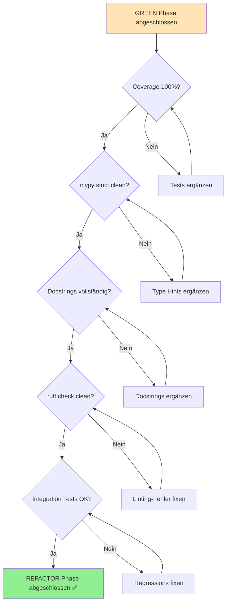

I have created the following plan after thorough exploration and analysis of the codebase. Follow the below plan verbatim. Trust the files and references. Do not re-verify what's written in the plan. Explore only when absolutely necessary. First implement all the proposed file changes and then I'll review all the changes together at the end.

## Beobachtungen zur Codebase

Die **RED Phase ist abgeschlossen** mit 18 Tests in `file:tests/unit/mapper/` (staged, nicht committed). Die **GREEN Phase Implementierung fehlt noch** - das Verzeichnis `src/codemap/mapper/` existiert nicht. Der Plan in `file:dev/phase-08/02-green-phase:-mapper-module-implementieren.md` beschreibt die Implementierung, aber die Dateien (`models.py`, `reader.py`, `queries.py`, `engine.py`, `__init__.py`) wurden noch nicht erstellt. Das Projekt nutzt strikte Qualitätsstandards: 100% Coverage (`fail_under = 100` in `file:pyproject.toml`), mypy strict mode, Google-Style Docstrings (siehe `file:src/codemap/scout/walker.py`), und ruff linting.

## Ansatz: REFACTOR Phase - Qualitätssicherung nach GREEN Phase

Die REFACTOR Phase **setzt voraus, dass die GREEN Phase abgeschlossen ist** (alle 18 Tests bestehen). Der Fokus liegt auf **Verifikation und Verbesserung** der Code-Qualität durch systematische Checks: Coverage-Analyse, Type-Hint-Validierung, Docstring-Vervollständigung, und Linting. Orientierung an bestehenden Patterns aus `file:src/codemap/scout/walker.py` und `file:src/codemap/scout/tree.py` für konsistente Code-Qualität im gesamten Projekt.

## Implementierungsschritte

### 1. Voraussetzung: GREEN Phase abschließen

**Aktion**: Erstelle alle fehlenden Implementierungsdateien gemäß Plan in `file:dev/phase-08/02-green-phase:-mapper-module-implementieren.md`

**Erforderliche Dateien**:
- `src/codemap/mapper/__init__.py` - Package-Init mit Public API Exports
- `src/codemap/mapper/models.py` - `CodeNode` frozen dataclass
- `src/codemap/mapper/reader.py` - `ContentReader` mit `ContentReadError`
- `src/codemap/mapper/queries.py` - Tree-sitter S-Expression Queries
- `src/codemap/mapper/engine.py` - `ParserEngine` mit tree-sitter Integration

**Verifikation**:
```bash
pytest tests/unit/mapper/ -v
```

**Erwartetes Ergebnis**: Alle 18 Tests bestehen (GREEN) ✅

---

### 2. Coverage-Analyse: 100% Abdeckung verifizieren

**Kommando**:
```bash
pytest tests/unit/mapper/ --cov=src/codemap/mapper --cov-report=term-missing --cov-report=html
```

**Zu prüfen**:
- **Gesamtcoverage**: Muss exakt 100% sein (Projekt-Standard: `fail_under = 100`)
- **Missing Lines**: Keine fehlenden Zeilen in Coverage-Report
- **Branch Coverage**: Alle if/else/try/except Zweige abgedeckt

**Typische Coverage-Lücken**:
| Modul | Potenzielle Lücken | Lösung |
|-------|-------------------|--------|
| `reader.py` | OSError-Branch in `read_file()` | Test mit unreadable file (Permissions) |
| `engine.py` | Unsupported language ValueError | Test mit `language="javascript"` |
| `engine.py` | Unknown capture names | Test mit modifizierter Query |

**Aktion bei <100%**: Ergänze fehlende Tests für ungetestete Branches/Lines

---

### 3. Type Hints: mypy strict mode validieren

**Kommando**:
```bash
mypy src/codemap/mapper/ --strict
```

**Zu prüfen**:
- **Keine Fehler**: mypy muss ohne Fehler durchlaufen
- **Vollständige Annotations**: Alle Funktionen/Methoden mit Return-Type
- **No implicit Any**: Keine `Any` ohne explizite Annotation

**Häufige mypy-Fehler**:

| Fehlertyp | Beispiel | Fix |
|-----------|----------|-----|
| Missing return type | `def parse(code: str)` | `def parse(code: str) -> list[CodeNode]` |
| Implicit Any | `captures = query.captures(node)` | `captures: list[tuple[Node, str]] = ...` |
| Untyped import | `from tree_sitter_language_pack import get_parser` | Add `# type: ignore` wenn Library keine Stubs hat |

**Referenz**: Vergleiche Type Hints mit `file:src/codemap/scout/walker.py` (Zeilen 166-289) für konsistenten Stil

**Aktion bei Fehlern**: Ergänze fehlende Type Hints, nutze `typing` Module für komplexe Types

---

### 4. Docstrings: Google-Style Vollständigkeit prüfen

**Zu prüfen für jede Public API** (Klassen, Methoden, Funktionen):

**Erforderliche Sections**:
1. **Summary**: Einzeilige Beschreibung (Imperativ: "Parse code...", nicht "Parses code...")
2. **Extended Description**: Mehrzeilige Erklärung (optional bei trivialen Funktionen)
3. **Args**: Alle Parameter mit Type und Beschreibung
4. **Returns**: Return-Type und Beschreibung
5. **Raises**: Alle Exceptions mit Bedingungen
6. **Example**: Doctest-Style Beispiel (optional, aber empfohlen)

**Checkliste pro Modul**:

| Modul | Zu dokumentieren | Referenz |
|-------|-----------------|----------|
| `models.py` | `CodeNode` Dataclass | `file:src/codemap/scout/models.py` (Zeilen 8-30) |
| `reader.py` | `ContentReader.__init__()`, `read_file()`, `ContentReadError` | `file:src/codemap/scout/walker.py` (Zeilen 166-194) |
| `queries.py` | Module-Level Docstring, Query-Konstanten (inline comments) | `file:src/codemap/scout/tree.py` (Zeilen 1-6) |
| `engine.py` | `ParserEngine.__init__()`, `get_language_id()`, `parse()` | `file:src/codemap/scout/walker.py` (Zeilen 196-289) |
| `__init__.py` | Module-Level Docstring | `file:src/codemap/scout/__init__.py` |

**Beispiel-Docstring** (aus `file:src/codemap/scout/walker.py`):
```python
def walk(self, root: Path, ignore_patterns: list[str] | None = None) -> list[FileEntry]:
    """Walk directory tree and collect file information.

    Traverses the directory tree starting from root, collecting FileEntry
    objects for each file found. Results are sorted alphabetically.

    Args:
        root: Root directory to walk (must exist and be a directory).
        ignore_patterns: Optional list of additional gitignore-style patterns.

    Returns:
        List of FileEntry objects sorted alphabetically by path.

    Raises:
        ValueError: If root does not exist or is not a directory.
    """
```

**Aktion**: Ergänze fehlende Docstrings nach Google-Style Pattern

---

### 5. Linting: ruff check ohne Fehler

**Kommando**:
```bash
ruff check src/codemap/mapper/
ruff format --check src/codemap/mapper/
```

**Zu prüfen**:
- **Keine Fehler**: ruff check muss clean sein
- **Formatting**: ruff format sollte keine Änderungen vorschlagen
- **Import Sorting**: Imports nach ruff-Standard sortiert

**Häufige ruff-Fehler**:

| Code | Fehler | Fix |
|------|--------|-----|
| `E501` | Line too long (>100 chars) | Zeile umbrechen oder String splitten |
| `F401` | Unused import | Import entfernen oder mit `# noqa: F401` markieren |
| `I001` | Import block unsorted | `ruff check --fix` für Auto-Sort |
| `N802` | Function name should be lowercase | `get_language_id` statt `getLanguageId` |

**Ruff-Konfiguration** (aus `file:pyproject.toml`):
- Line length: 100 Zeichen
- Target: Python 3.11
- Rules: E (pycodestyle errors), F (pyflakes), I (isort), N (pep8-naming), W (pycodestyle warnings)

**Aktion bei Fehlern**: 
```bash
ruff check --fix src/codemap/mapper/  # Auto-Fix für einfache Fehler
ruff format src/codemap/mapper/        # Auto-Format
```

---

### 6. Integration: Gesamtprojekt-Tests ausführen

**Kommando**:
```bash
pytest tests/ --cov=src/codemap --cov-report=term-missing
```

**Zu prüfen**:
- **Alle Tests bestehen**: Mapper-Tests + bestehende Scout-Tests
- **Gesamtcoverage**: Weiterhin 100% für gesamtes `src/codemap/`
- **Keine Regressions**: Bestehende Tests nicht beeinträchtigt

**Aktion bei Fehlern**: Isoliere Fehlerquelle (Mapper vs. Scout), fixe Imports/Dependencies

---

### 7. Finale Verifikation: Alle Quality Gates

**Checkliste**:

```bash
# 1. Tests (18/18 GREEN)
pytest tests/unit/mapper/ -v

# 2. Coverage (100%)
pytest tests/unit/mapper/ --cov=src/codemap/mapper --cov-report=term-missing

# 3. Type Hints (mypy strict)
mypy src/codemap/mapper/ --strict

# 4. Linting (ruff clean)
ruff check src/codemap/mapper/
ruff format --check src/codemap/mapper/

# 5. Integration (alle Tests)
pytest tests/ --cov=src/codemap
```

**Erwartetes Ergebnis**: Alle Kommandos ohne Fehler ✅

---

## Qualitätskriterien-Matrix

| Kriterium | Tool | Kommando | Erwartung |
|-----------|------|----------|-----------|
| **Tests** | pytest | `pytest tests/unit/mapper/ -v` | 18/18 passed |
| **Coverage** | pytest-cov | `pytest --cov=src/codemap/mapper` | 100% (fail_under=100) |
| **Type Hints** | mypy | `mypy src/codemap/mapper/ --strict` | Success: no issues |
| **Docstrings** | Manual | Review gegen Google-Style | Alle Public APIs dokumentiert |
| **Linting** | ruff | `ruff check src/codemap/mapper/` | All checks passed |
| **Formatting** | ruff | `ruff format --check` | Would reformat 0 files |
| **Integration** | pytest | `pytest tests/` | Alle Tests passed |

---

## Verbesserungsvorschläge (Optional)

Falls Zeit/Ressourcen vorhanden, erwäge folgende Verbesserungen:

### Performance-Optimierung
- **Caching**: Parser/Language-Objekte in `ParserEngine.__init__()` cachen (aktuell: Neuinitialisierung bei jedem `parse()`)
- **Batch-Processing**: `parse_files(paths: list[Path])` Methode für parallele Verarbeitung

### Erweiterbarkeit
- **Multi-Language Support**: `LANGUAGE_MAP` erweitern (JavaScript, TypeScript, Go, etc.)
- **Query-Externalisierung**: Queries in `.scm` Dateien auslagern (aktuell: Python-Strings)

### Error-Handling
- **Logging**: Strukturiertes Logging für Parsing-Fehler (aktuell: Silent Failures)
- **Partial Results**: Bei Parsing-Fehlern bereits extrahierte Nodes zurückgeben

**Hinweis**: Diese Optimierungen sind **nicht Teil der REFACTOR Phase** und sollten nur nach expliziter Anforderung implementiert werden.

---

## Architektur-Übersicht: Quality Gates



---

## Zusammenfassung

**REFACTOR Phase Deliverables**:
- ✅ 100% Test Coverage für alle Mapper-Module
- ✅ Mypy strict mode ohne Fehler
- ✅ Google-Style Docstrings für alle Public APIs
- ✅ Ruff linting ohne Fehler
- ✅ Integration mit bestehendem Scout-Modul ohne Regressions

**Zeitaufwand** (geschätzt):
- Coverage-Fixes: 30-60 Min (falls Lücken vorhanden)
- Type Hints: 15-30 Min (meist bereits in GREEN Phase erledigt)
- Docstrings: 45-90 Min (detaillierte Dokumentation)
- Linting: 15-30 Min (meist Auto-Fix)
- **Gesamt**: 2-3 Stunden

**Nächster Schritt**: Erstelle zunächst die fehlenden Implementierungsdateien (GREEN Phase), dann führe diese REFACTOR-Schritte aus.