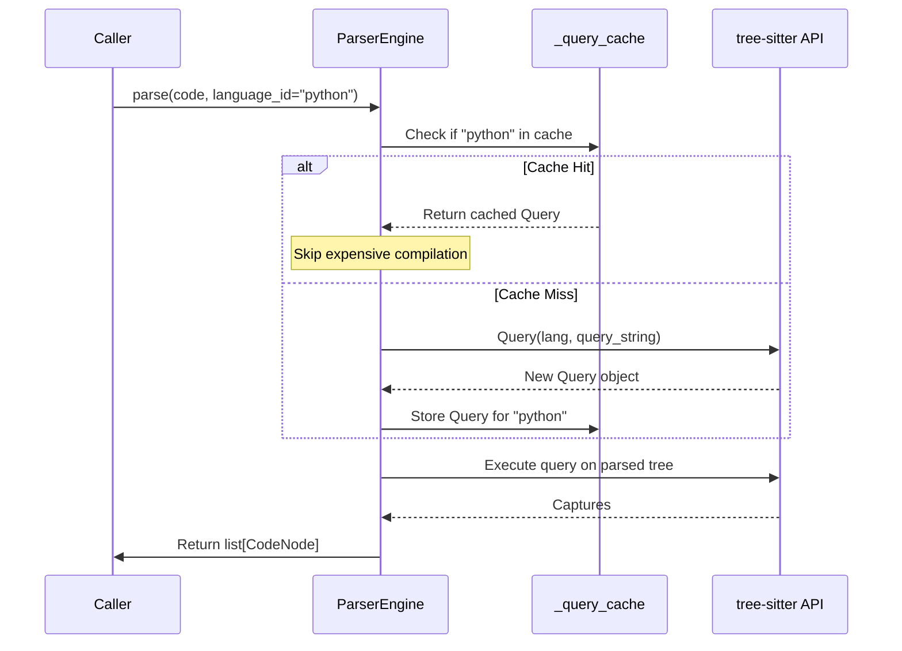

I have created the following plan after thorough exploration and analysis of the codebase. Follow the below plan verbatim. Trust the files and references. Do not re-verify what's written in the plan. Explore only when absolutely necessary. First implement all the proposed file changes and then I'll review all the changes together at the end.

## Observations

The `ParserEngine` class in `file:src/codemap/mapper/engine.py` currently creates a new `Query` object on every `parse()` call (line 161). This is expensive since tree-sitter query compilation is a costly operation. The `__init__` method is currently empty (lines 68-70). The existing test suite in `file:tests/unit/mapper/test_engine.py` is comprehensive and should remain green after the optimization since this is purely an internal performance improvement.

## Approach

Implement query caching by adding a private `_query_cache` dictionary to store compiled `Query` objects keyed by `language_id`. Refactor the `parse()` method to check the cache before creating a new query, ensuring each language's query is compiled only once per `ParserEngine` instance. This optimization is transparent to callers and requires no test modifications.

## Implementation Steps

### 1. Initialize Query Cache in `__init__`

In `file:src/codemap/mapper/engine.py`, modify the `ParserEngine.__init__` method (lines 68-70):

- Replace the empty `pass` statement with initialization of `_query_cache`
- Add: `self._query_cache: dict[str, Query] = {}`
- This creates an empty dictionary to store compiled queries keyed by language identifier

### 2. Refactor Query Creation with Caching Logic

In `file:src/codemap/mapper/engine.py`, modify the `parse()` method around lines 148-162:

- After retrieving `query_string` from `LANGUAGE_QUERIES` (line 149) and initializing `parser` and `lang` (lines 154-155)
- Before creating the `Query` object (line 161), add cache lookup logic:
  - Check if `language_id` exists in `self._query_cache`
  - If cache hit: retrieve the cached `Query` object
  - If cache miss: create new `Query(lang, query_string)`, store it in `self._query_cache[language_id]`, then use it
- The rest of the method (lines 162-210) remains unchanged

**Implementation pattern:**

```
# After line 155 (after lang = get_language(...))
# Before line 158 (before tree = parser.parse(...))

Check cache: if language_id in self._query_cache
  Use cached query: query = self._query_cache[language_id]
Else:
  Create new query: query = Query(lang, query_string)
  Store in cache: self._query_cache[language_id] = query

# Continue with existing logic (line 158 onwards)
```

### 3. Verify Test Suite Remains Green

- Run the existing test suite: `pytest tests/unit/mapper/test_engine.py -v`
- All tests should pass without modification since caching is an internal optimization
- The behavior of `parse()` and `parse_file()` remains identical from the caller's perspective
- Each test creates a new `ParserEngine` instance, so cache state doesn't leak between tests

## Architecture Diagram



## Performance Impact

| Scenario | Before | After |
|----------|--------|-------|
| First parse call | Query compiled | Query compiled + cached |
| Subsequent calls (same language) | Query compiled every time | Cache hit (no compilation) |
| Multiple languages | Each compiled every time | Each compiled once, then cached |