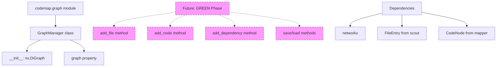

I have created the following plan after thorough exploration and analysis of the codebase. Follow the below plan verbatim. Trust the files and references. Do not re-verify what's written in the plan. Explore only when absolutely necessary. First implement all the proposed file changes and then I'll review all the changes together at the end.

## Observations

The codebase follows strict TDD principles with 100% coverage requirements and mypy strict mode. All modules use frozen dataclasses (`FileEntry`, `CodeNode`) for immutability, comprehensive docstrings with Examples/Architecture sections, and modern Python 3.11+ type hints. The project structure separates concerns into `scout` (file exploration), `mapper` (code parsing), and `core` (LLM providers). Each module has explicit `__all__` exports and follows consistent patterns for class initialization, properties, and error handling.

## Approach

Create the `file:src/codemap/graph/` module following existing patterns from `file:src/codemap/mapper/engine.py` and `file:src/codemap/scout/models.py`. The `GraphManager` class will initialize with an empty `networkx.DiGraph` and provide a foundation for subsequent phases to add methods for file/node management and persistence. Focus on strict typing, comprehensive docstrings, and module structure consistency. This phase establishes the skeleton without implementing business logic (which belongs to GREEN phase).

## Implementation Steps

### 1. Create Directory Structure

Create the directory `file:src/codemap/graph/` in the workspace root.

### 2. Create Module `__init__.py`

Create `file:src/codemap/graph/__init__.py` with:
- Module-level docstring explaining the graph module's purpose (knowledge graph for code relationships using NetworkX)
- Import `GraphManager` from `file:src/codemap/graph/manager.py`
- Define `__all__ = ["GraphManager"]` for explicit exports
- Follow the pattern from `file:src/codemap/mapper/__init__.py`

### 3. Create `manager.py` with `GraphManager` Class

Create `file:src/codemap/graph/manager.py` with the following structure:

**Module-level docstring:**
- Describe the module's purpose: "Graph manager for building and persisting code relationship graphs using NetworkX"
- Mention it uses `networkx.DiGraph` for directed graph representation

**Imports:**
- `from pathlib import Path`
- `import networkx as nx`
- Import `FileEntry` from `file:src/codemap/scout/models.py`
- Import `CodeNode` from `file:src/codemap/mapper/models.py`

**`GraphManager` class:**

**Class docstring:**
- Purpose: "Manages a directed graph of code relationships using NetworkX"
- Architecture section explaining:
  - Uses `networkx.DiGraph` for directed relationships
  - Nodes represent files and code elements (classes/functions)
  - Edges represent relationships (CONTAINS, IMPORTS)
  - Persistence via `networkx.node_link_data` and `orjson`
- Example section showing basic initialization
- Thread Safety note: "GraphManager instances are NOT thread-safe. Create separate instances per thread for parallel processing."

**`__init__` method:**
- Signature: `def __init__(self) -> None:`
- Docstring: "Initialize GraphManager with an empty directed graph."
- Implementation: `self._graph: nx.DiGraph = nx.DiGraph()`
- Use private attribute `_graph` following the pattern from `file:src/codemap/mapper/engine.py`

**Property for graph access (optional but recommended):**
- Add a read-only property `graph` that returns `nx.DiGraph`
- Docstring: "Return the underlying NetworkX directed graph (read-only access)."
- Return type: `nx.DiGraph`
- Implementation: `return self._graph`
- This allows tests to inspect the graph without exposing mutation

### 4. Type Hints and Strict Mypy Compliance

Ensure all elements follow strict typing:
- All method signatures have parameter types and return types
- Use modern Python 3.11+ syntax: `dict[str, str]`, `list[CodeNode]`
- Private attributes typed: `self._graph: nx.DiGraph`
- No `Any` types unless absolutely necessary
- Import `TYPE_CHECKING` if needed for forward references

### 5. Verification Checklist

Before considering this phase complete:
- [ ] Directory `file:src/codemap/graph/` exists
- [ ] `file:src/codemap/graph/__init__.py` has module docstring and exports `GraphManager`
- [ ] `file:src/codemap/graph/manager.py` exists with complete docstrings
- [ ] `GraphManager.__init__` initializes `self._graph: nx.DiGraph`
- [ ] All type hints are present (parameters, returns, attributes)
- [ ] Docstrings follow the pattern: module-level, class-level with sections, method-level with Args/Returns
- [ ] No implementation of `add_file`, `add_node`, `add_dependency`, `save`, `load` (GREEN phase responsibility)
- [ ] Code follows ruff formatting (line length 100, double quotes)

## Architecture Diagram

## File Reference Summary

| File | Purpose |
|------|---------|
| `file:src/codemap/graph/__init__.py` | Module exports and docstring |
| `file:src/codemap/graph/manager.py` | `GraphManager` class with `__init__` |
| `file:src/codemap/scout/models.py` | Import `FileEntry` dataclass |
| `file:src/codemap/mapper/models.py` | Import `CodeNode` dataclass |
| `file:pyproject.toml` | Reference for mypy/ruff configuration |