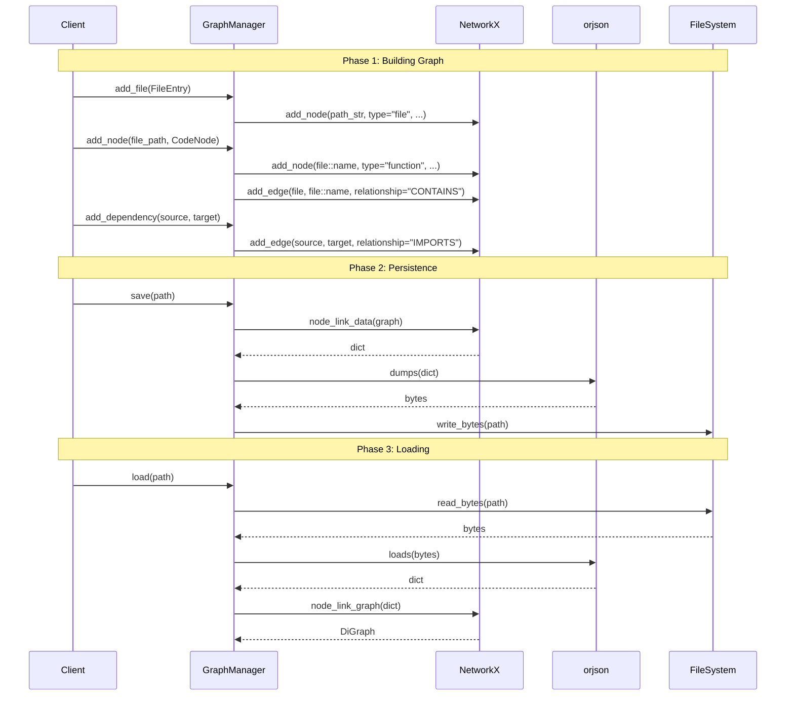

I have created the following plan after thorough exploration and analysis of the codebase. Follow the below plan verbatim. Trust the files and references. Do not re-verify what's written in the plan. Explore only when absolutely necessary. First implement all the proposed file changes and then I'll review all the changes together at the end.

## Observations

The `GraphManager` skeleton exists with only `__init__` and a read-only `graph` property. The test file (`file:tests/unit/graph/test_manager.py`) is empty—tests need to be created first (RED phase). Dependencies (`networkx>=3.0.0`, `orjson>=3.9.0`) are already available in `file:requirements-dev.txt`. The codebase enforces strict TDD with 100% coverage, frozen dataclasses (`FileEntry`, `CodeNode`), class-based test organization, AAA patterns, and comprehensive error handling. The graph will use `networkx.DiGraph` with node IDs (file: relative path string, code: `file_path::node_name`) and edge types (CONTAINS, IMPORTS).

## Approach

Following strict TDD: **RED phase** creates comprehensive tests defining the `GraphManager` contract (add_file, add_node, add_dependency, save/load, graph_stats), then **GREEN phase** implements all methods to pass tests. Tests will cover basic operations, hierarchy (CONTAINS edges), persistence (orjson roundtrip), stats property, and error cases (duplicates, missing files, invalid JSON). Implementation uses `networkx.node_link_data`/`node_link_graph` for serialization, `orjson.dumps`/`orjson.loads` for fast I/O, and stores node attributes (type, size, token_est for files; type, start_line, end_line for code nodes) and edge attributes (relationship type).

---

## Implementation Steps

### Phase 1: RED Phase - Create Comprehensive Test Suite

#### 1.1 Create Test Directory Structure
- Create directory `tests/unit/graph/`
- Create `tests/unit/graph/__init__.py` (empty file for package recognition)

#### 1.2 Create Test File with All Required Tests
Create `file:tests/unit/graph/test_manager.py` with the following test classes and methods:

**Import Section:**
```python
"""Unit tests for graph.manager module."""

import pytest
from pathlib import Path
from codemap.graph.manager import GraphManager
from codemap.scout.models import FileEntry
from codemap.mapper.models import CodeNode
```

**Test Class 1: `TestGraphManagerBasic`**
- `test_initialization_creates_empty_graph()`: Verify `GraphManager()` creates empty DiGraph with 0 nodes/edges
- `test_graph_property_returns_digraph()`: Verify `manager.graph` returns `networkx.DiGraph` instance

**Test Class 2: `TestAddFile`**
- `test_add_file_creates_node()`: Create `FileEntry(path=Path("src/main.py"), size=1024, token_est=256)`, call `add_file()`, verify node exists with ID `"src/main.py"` and attributes `type="file"`, `size=1024`, `token_est=256`
- `test_add_file_with_relative_path()`: Test with `Path("utils/helper.py")`, verify node ID is `"utils/helper.py"` (string conversion)
- `test_add_file_duplicate_updates_attributes()`: Add same file twice with different sizes, verify node attributes are updated (no duplicate nodes)

**Test Class 3: `TestAddNode`**
- `test_add_code_node_creates_hierarchy()`: Add file `"src/main.py"`, then add `CodeNode(type="function", name="foo", start_line=1, end_line=3)` with `add_node("src/main.py", node)`, verify:
  - Code node exists with ID `"src/main.py::foo"`
  - Code node has attributes: `type="function"`, `name="foo"`, `start_line=1`, `end_line=3`
  - Edge exists from `"src/main.py"` to `"src/main.py::foo"` with attribute `relationship="CONTAINS"`
- `test_add_node_class()`: Test with `CodeNode(type="class", name="MyClass", start_line=5, end_line=15)`, verify node ID `"file::MyClass"` and CONTAINS edge
- `test_add_node_without_parent_file()`: Call `add_node("nonexistent.py", node)` without adding file first, verify it raises `ValueError` with message about missing parent file
- `test_add_node_duplicate_updates_attributes()`: Add same code node twice with different line numbers, verify attributes are updated

**Test Class 4: `TestAddDependency`**
- `test_add_dependency_creates_import_edge()`: Add two files, call `add_dependency("src/main.py", "src/utils.py")`, verify edge exists with attribute `relationship="IMPORTS"`
- `test_add_dependency_duplicate_ignored()`: Add same dependency twice, verify only one edge exists (no duplicate edges)
- `test_add_dependency_without_source_node()`: Call `add_dependency("nonexistent.py", "target.py")` without adding source file, verify raises `ValueError`
- `test_add_dependency_without_target_node()`: Call `add_dependency("source.py", "nonexistent.py")` without adding target file, verify raises `ValueError`

**Test Class 5: `TestPersistence`**
- `test_save_creates_file(tmp_path)`: Build graph with 2 files and 1 code node, call `save(tmp_path / "graph.json")`, verify file exists and is valid JSON
- `test_load_restores_graph(tmp_path)`: Build graph, save it, create new `GraphManager`, call `load(path)`, verify all nodes and edges are restored with correct attributes
- `test_save_and_load_roundtrip(tmp_path)`: Build complex graph (3 files, 2 code nodes, 2 dependencies), save, load into new manager, verify:
  - Node count matches
  - Edge count matches
  - All node IDs present
  - All node attributes match
  - All edge attributes match
- `test_load_nonexistent_file(tmp_path)`: Call `load(tmp_path / "missing.json")`, verify raises `FileNotFoundError`
- `test_load_invalid_json(tmp_path)`: Write invalid JSON to file, call `load()`, verify raises `ValueError` or `orjson.JSONDecodeError`
- `test_save_creates_parent_directories(tmp_path)`: Call `save(tmp_path / "nested/dir/graph.json")` where nested dirs don't exist, verify parent directories are created

**Test Class 6: `TestGraphStats`**
- `test_graph_stats_empty_graph()`: Create empty manager, access `graph_stats` property, verify returns dict with `{"nodes": 0, "edges": 0}`
- `test_graph_stats_with_nodes_and_edges()`: Build graph with 3 nodes and 2 edges, verify `graph_stats` returns `{"nodes": 3, "edges": 2}`
- `test_graph_stats_is_property()`: Verify `graph_stats` is a property (not a method), can be accessed without parentheses

**Expected Test Outcome:**
All tests should **FAIL** initially with `AttributeError` (methods not implemented) or assertion errors, confirming RED phase.

---

### Phase 2: GREEN Phase - Implement GraphManager Methods

#### 2.1 Add Required Imports to `file:src/codemap/graph/manager.py`
Add imports at the top of the file:
```python
import orjson
from pathlib import Path
from typing import Dict, Any
from codemap.scout.models import FileEntry
from codemap.mapper.models import CodeNode
```

#### 2.2 Implement `add_file` Method
Add method to `GraphManager` class:
- **Signature:** `def add_file(self, entry: FileEntry) -> None:`
- **Logic:**
  - Convert `entry.path` to string: `node_id = str(entry.path)`
  - Add node to graph: `self._graph.add_node(node_id, type="file", size=entry.size, token_est=entry.token_est)`
  - If node already exists, attributes are updated automatically by NetworkX
- **Docstring:** Explain it adds file node with ID=relative path string, attributes type/size/token_est

#### 2.3 Implement `add_node` Method
Add method to `GraphManager` class:
- **Signature:** `def add_node(self, file_path: str, node: CodeNode) -> None:`
- **Logic:**
  - Check if parent file exists: `if file_path not in self._graph: raise ValueError(f"Parent file '{file_path}' not found in graph")`
  - Create node ID: `node_id = f"{file_path}::{node.name}"`
  - Add code node: `self._graph.add_node(node_id, type=node.type, name=node.name, start_line=node.start_line, end_line=node.end_line)`
  - Add CONTAINS edge: `self._graph.add_edge(file_path, node_id, relationship="CONTAINS")`
- **Docstring:** Explain node ID format, CONTAINS edge, and ValueError for missing parent

#### 2.4 Implement `add_dependency` Method
Add method to `GraphManager` class:
- **Signature:** `def add_dependency(self, source: str, target: str) -> None:`
- **Logic:**
  - Validate source exists: `if source not in self._graph: raise ValueError(f"Source node '{source}' not found")`
  - Validate target exists: `if target not in self._graph: raise ValueError(f"Target node '{target}' not found")`
  - Add IMPORTS edge: `self._graph.add_edge(source, target, relationship="IMPORTS")`
  - NetworkX automatically handles duplicate edges (updates attributes)
- **Docstring:** Explain IMPORTS edge and validation

#### 2.5 Implement `save` Method
Add method to `GraphManager` class:
- **Signature:** `def save(self, path: Path) -> None:`
- **Logic:**
  - Create parent directories: `path.parent.mkdir(parents=True, exist_ok=True)`
  - Convert graph to dict: `data = nx.node_link_data(self._graph)`
  - Serialize with orjson: `json_bytes = orjson.dumps(data, option=orjson.OPT_INDENT_2)`
  - Write to file: `path.write_bytes(json_bytes)`
- **Docstring:** Explain networkx.node_link_data format and orjson serialization

#### 2.6 Implement `load` Method
Add method to `GraphManager` class:
- **Signature:** `def load(self, path: Path) -> None:`
- **Logic:**
  - Check file exists: `if not path.exists(): raise FileNotFoundError(f"Graph file not found: {path}")`
  - Read file: `json_bytes = path.read_bytes()`
  - Parse JSON: `try: data = orjson.loads(json_bytes) except orjson.JSONDecodeError as e: raise ValueError(f"Invalid JSON in graph file: {e}")`
  - Reconstruct graph: `self._graph = nx.node_link_graph(data, directed=True)`
- **Docstring:** Explain networkx.node_link_graph reconstruction and error handling

#### 2.7 Implement `graph_stats` Property
Add property to `GraphManager` class:
- **Signature:** `@property def graph_stats(self) -> Dict[str, int]:`
- **Logic:**
  - Return dict: `return {"nodes": self._graph.number_of_nodes(), "edges": self._graph.number_of_edges()}`
- **Docstring:** Explain returns dict with node/edge counts

#### 2.8 Verify All Tests Pass
Run tests: `pytest tests/unit/graph/test_manager.py -v`
- All tests should now **PASS** (GREEN phase achieved)
- If any test fails, debug and fix implementation until all pass

---

## Visual Overview



---

## Key Implementation Details

| Component | Details |
|-----------|---------|
| **Node IDs** | Files: `str(path)` (e.g., `"src/main.py"`)<br>Code: `f"{file_path}::{node.name}"` (e.g., `"src/main.py::foo"`) |
| **File Node Attributes** | `type="file"`, `size=int`, `token_est=int` |
| **Code Node Attributes** | `type=str`, `name=str`, `start_line=int`, `end_line=int` |
| **Edge Types** | CONTAINS: file → code node<br>IMPORTS: file → file |
| **Serialization** | `networkx.node_link_data()` → `orjson.dumps()` |
| **Deserialization** | `orjson.loads()` → `networkx.node_link_graph(directed=True)` |
| **Error Handling** | `ValueError` for missing parent/nodes<br>`FileNotFoundError` for missing files<br>`ValueError` for invalid JSON |

---

## Success Criteria

✅ All tests in `file:tests/unit/graph/test_manager.py` pass  
✅ `GraphManager` implements all 6 methods/properties  
✅ Graph correctly stores file and code nodes with proper attributes  
✅ CONTAINS and IMPORTS edges are created correctly  
✅ Save/load roundtrip preserves all graph data  
✅ Error handling works for missing files/nodes and invalid JSON  
✅ Type hints are complete and strict mypy compliant