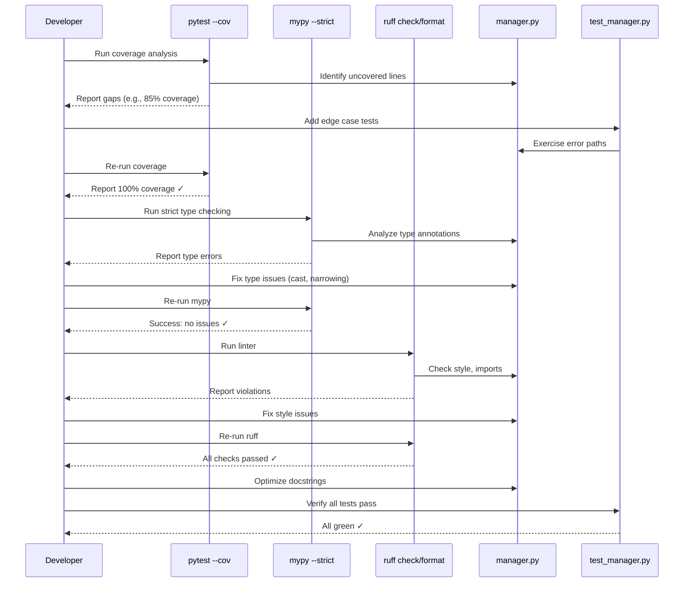

I have created the following plan after thorough exploration and analysis of the codebase. Follow the below plan verbatim. Trust the files and references. Do not re-verify what's written in the plan. Explore only when absolutely necessary. First implement all the proposed file changes and then I'll review all the changes together at the end.

## Observations

The `codemap.graph` module implements `GraphManager` for building directed code relationship graphs using NetworkX. The GREEN phase has completed core functionality: `add_file()`, `add_node()`, `add_dependency()`, `save()`/`load()` with orjson persistence, and `graph_stats` property. The codebase enforces strict TDD (100% coverage via `file:pyproject.toml`), mypy strict mode, and ruff linting. Existing modules (`file:src/codemap/scout/`, `file:src/codemap/mapper/`) demonstrate comprehensive edge case testing, frozen dataclasses, detailed docstrings with Architecture/Examples sections, and consistent error handling patterns.

## Approach

Execute systematic REFACTOR phase verification: run pytest with coverage analysis to identify untested branches, run mypy strict mode to catch type inconsistencies, run ruff to enforce code style. Add missing edge case tests for error conditions (invalid inputs, file I/O failures, graph state violations), boundary conditions (empty graphs, large graphs, circular dependencies), and data integrity (attribute preservation, duplicate handling). Optimize docstrings for clarity, add type narrowing where needed, and ensure all public APIs have comprehensive examples. Follow patterns from `file:tests/unit/mapper/test_engine.py` for mock-based testing and `file:tests/unit/scout/test_models.py` for immutability verification.

## Implementation Steps

### 1. Run Coverage Analysis and Identify Gaps

Execute pytest with coverage reporting:
```bash
pytest tests/unit/graph/test_manager.py --cov=src/codemap/graph --cov-report=term-missing --cov-report=html -v
```

**Actions:**
- Review terminal output for uncovered lines (marked with `!!!!`)
- Open `htmlcov/index.html` in browser for detailed coverage visualization
- Identify missing branches: error handling paths, edge conditions, early returns
- Document uncovered lines in each method (`add_file`, `add_node`, `add_dependency`, `save`, `load`, `graph_stats`)

**Expected gaps to address:**
- Error paths in `save()`: directory creation failures, write permission errors
- Error paths in `load()`: malformed JSON, missing required keys, invalid graph structure
- Edge cases in `add_node()`: missing parent file, invalid node ID format
- Edge cases in `add_dependency()`: self-loops, missing source/target nodes

### 2. Run Mypy Strict Mode and Fix Type Errors

Execute mypy with strict configuration from `file:pyproject.toml`:
```bash
mypy src/codemap/graph --strict
```

**Common issues to fix:**

**Type narrowing in `save()` method:**
- If using `Path.mkdir(parents=True, exist_ok=True)`, ensure return type is `None`
- Ensure `orjson.dumps()` return type (`bytes`) is handled correctly when writing to file
- Add explicit type annotation for `node_link_data` result: `dict[str, Any]` (requires `from typing import Any`)

**Type narrowing in `load()` method:**
- `orjson.loads()` returns `Any`—cast to expected structure: `data: dict[str, Any] = orjson.loads(content)`
- `node_link_graph()` accepts `dict[str, Any]`—ensure compatibility
- Add type guard for `self._graph` reassignment: `self._graph = cast(nx.DiGraph[str], nx.node_link_graph(data))`

**Property return types:**
- Ensure `graph_stats` returns `dict[str, int]` explicitly
- Ensure `graph` property return type matches `nx.DiGraph[str]`

**Method parameter types:**
- Verify `FileEntry` and `CodeNode` imports have type stubs (should be available from dataclasses)
- Ensure `Path` parameters accept `Path` objects, not `str | Path` (be strict)

**Actions:**
- Fix all reported errors line-by-line
- Add missing type annotations for local variables if mypy cannot infer
- Use `from typing import Any, cast` only where necessary
- Re-run mypy until zero errors

### 3. Run Ruff Linter and Fix Style Issues

Execute ruff with configuration from `file:pyproject.toml`:
```bash
ruff check src/codemap/graph --fix
ruff format src/codemap/graph
```

**Common issues to fix:**

**Import ordering (I001):**
- Standard library imports first (`pathlib`, `typing`)
- Third-party imports second (`networkx`, `orjson`)
- Local imports last (`codemap.scout.models`, `codemap.mapper.models`)
- Alphabetical within each group

**Line length (E501):**
- Ensure lines ≤100 characters (configured in `file:pyproject.toml`)
- Break long docstrings, method signatures, and assertions

**Naming conventions (N802, N803):**
- Ensure method names are `snake_case`
- Ensure variable names are `snake_case`
- Ensure constants are `UPPER_CASE` (if any)

**Unused imports (F401):**
- Remove any imports not used in implementation
- Ensure `__all__` in `file:src/codemap/graph/__init__.py` matches actual exports

**Actions:**
- Run `ruff check` first to see all issues
- Run `ruff format` to auto-fix formatting
- Manually fix remaining issues (imports, naming)
- Re-run until zero errors

### 4. Add Missing Edge Case Tests

Extend `file:tests/unit/graph/test_manager.py` with additional test classes and methods:

#### TestGraphManagerErrorHandling Class

**`test_add_node_missing_parent_file_raises_error`**
- Attempt `manager.add_node("nonexistent.py", CodeNode(...))`
- Assert raises `ValueError` with message containing "parent file"
- Verify graph remains unchanged (no orphan nodes)

**`test_add_dependency_missing_source_raises_error`**
- Add target file only
- Attempt `manager.add_dependency("missing.py", "target.py")`
- Assert raises `ValueError` with message containing "source"

**`test_add_dependency_missing_target_raises_error`**
- Add source file only
- Attempt `manager.add_dependency("source.py", "missing.py")`
- Assert raises `ValueError` with message containing "target"

**`test_save_to_nonexistent_directory_creates_parents`**
- Call `manager.save(tmp_path / "nested" / "dir" / "graph.json")`
- Assert file exists (parents created automatically)
- Verify content is valid JSON

**`test_save_to_readonly_file_raises_error`** (platform-dependent)
- Create file, make readonly: `path.chmod(0o444)`
- Attempt `manager.save(path)`
- Assert raises `PermissionError` or `OSError`

**`test_load_invalid_json_raises_error`**
- Write invalid JSON: `path.write_text("{invalid")`
- Assert `manager.load(path)` raises `ValueError` or `orjson.JSONDecodeError`

**`test_load_missing_required_keys_raises_error`**
- Write valid JSON but missing `"nodes"` or `"links"` keys
- Assert `manager.load(path)` raises `ValueError` or `KeyError`

#### TestGraphManagerBoundaryConditions Class

**`test_empty_graph_save_and_load`**
- Save empty graph
- Load into new manager
- Assert `graph_stats == {"nodes": 0, "edges": 0}`

**`test_large_graph_performance`** (optional, for documentation)
- Add 1000 file nodes, 5000 code nodes, 2000 dependencies
- Measure save/load time (use `time.perf_counter()`)
- Assert operations complete within reasonable time (e.g., <5 seconds)
- Document performance characteristics in docstring

**`test_add_file_duplicate_updates_attributes`**
- Add file with `size=100`
- Add same file with `size=200`
- Assert node exists with `size=200` (latest wins)
- Assert node count is 1 (no duplicates)

**`test_add_node_duplicate_updates_attributes`**
- Add code node with `start_line=10`
- Add same code node (same file + name) with `start_line=20`
- Assert node exists with `start_line=20`
- Assert node count unchanged

**`test_add_dependency_duplicate_is_idempotent`**
- Add dependency `A -> B`
- Add same dependency again
- Assert edge count is 1 (no duplicate edges)
- Assert edge label preserved

**`test_add_dependency_self_loop`** (decide behavior)
- Attempt `manager.add_dependency("file.py", "file.py")`
- Either: (a) allow self-loop, or (b) raise `ValueError`
- Document decision in docstring

#### TestGraphManagerDataIntegrity Class

**`test_save_preserves_all_node_attributes`**
- Add file with all attributes: `type`, `size`, `token_est`
- Add code node with all attributes: `type`, `name`, `start_line`, `end_line`
- Save and load
- Assert all attributes match exactly (use `==` comparison)

**`test_save_preserves_all_edge_attributes`**
- Add CONTAINS edge, IMPORTS edge
- Save and load
- Assert edge labels preserved: `graph.edges[u, v]["label"]`

**`test_graph_stats_accuracy_after_modifications`**
- Add 5 nodes, check stats
- Add 3 edges, check stats
- Remove 2 nodes (if removal method exists), check stats
- Assert stats always accurate

**`test_node_id_format_consistency`**
- Add file `"src/main.py"`
- Add code node `"calculate"`
- Assert node ID is `"src/main.py::calculate"` (exact format)
- Verify no trailing/leading whitespace

### 5. Optimize Code Structure

Review `file:src/codemap/graph/manager.py` for improvements:

**Extract validation logic:**
- If `add_node()` validates parent file existence, extract to private method `_validate_parent_exists(file_path: str) -> None`
- If `add_dependency()` validates source/target existence, extract to `_validate_node_exists(node_id: str) -> None`
- Reduces duplication, improves testability

**Add helper methods for node ID generation:**
- Extract `f"{file_path}::{node.name}"` to private method `_make_code_node_id(file_path: str, node_name: str) -> str`
- Ensures consistent ID format across methods
- Easier to change format in future

**Improve error messages:**
- Use f-strings with context: `f"Parent file '{file_path}' not found in graph"`
- Include suggestions: `"Add file with add_file() before adding code nodes"`

**Add type aliases for clarity:**
```python
from typing import TypeAlias

NodeID: TypeAlias = str
EdgeLabel: TypeAlias = str
```
- Use in method signatures: `def add_dependency(self, source: NodeID, target: NodeID) -> None:`

### 6. Optimize Docstrings

Enhance docstrings in `file:src/codemap/graph/manager.py`:

**Class docstring:**
- Add "Raises" section documenting common errors across methods
- Add "Performance" section noting graph size limits (if any)
- Expand "Example" section with complete workflow:
  ```python
  >>> manager = GraphManager()
  >>> manager.add_file(FileEntry(Path("main.py"), 1024, 256))
  >>> manager.add_node("main.py", CodeNode("function", "foo", 1, 5))
  >>> manager.add_dependency("main.py", "utils.py")
  >>> manager.save(Path("graph.json"))
  >>> manager.graph_stats
  {"nodes": 2, "edges": 2}
  ```

**Method docstrings:**

`add_file()`:
- Args: `entry: FileEntry to add as graph node`
- Returns: `None`
- Raises: `None` (or document if validation added)
- Example: Show adding file and verifying node exists

`add_node()`:
- Args: `file_path: Parent file path (must exist)`, `node: CodeNode to add`
- Returns: `None`
- Raises: `ValueError: If parent file not in graph`
- Example: Show adding function and class nodes

`add_dependency()`:
- Args: `source: Source file path`, `target: Target file path`
- Returns: `None`
- Raises: `ValueError: If source or target not in graph`
- Example: Show adding import relationship

`save()`:
- Args: `path: Destination file path (parents created automatically)`
- Returns: `None`
- Raises: `OSError: If write fails`, `PermissionError: If path not writable`
- Example: Show save with nested directory

`load()`:
- Args: `path: Source file path (must exist)`
- Returns: `None`
- Raises: `FileNotFoundError: If path not found`, `ValueError: If JSON invalid`
- Example: Show load and verify graph restored

`graph_stats` property:
- Returns: `dict[str, int] with keys "nodes" and "edges"`
- Example: Show stats for empty and populated graphs

### 7. Verify 100% Coverage

Re-run coverage after adding tests:
```bash
pytest tests/unit/graph/test_manager.py --cov=src/codemap/graph --cov-report=term-missing --cov-fail-under=100 -v
```

**Actions:**
- Ensure terminal shows `100%` coverage for all files
- Ensure no lines marked with `!!!!` in term-missing report
- Ensure `htmlcov/index.html` shows green (100%) for `manager.py`
- If coverage <100%, add tests for missing branches

**Common missed branches:**
- `except` blocks in try/except (add tests that trigger exceptions)
- `else` clauses in if/else (add tests for both paths)
- Early returns (add tests that trigger early exit)

### 8. Final Verification Checklist

Run all quality checks in sequence:

```bash
# 1. Coverage (must be 100%)
pytest tests/unit/graph/ --cov=src/codemap/graph --cov-report=term-missing --cov-fail-under=100 -v

# 2. Mypy (must have zero errors)
mypy src/codemap/graph --strict

# 3. Ruff (must have zero errors)
ruff check src/codemap/graph
ruff format src/codemap/graph --check

# 4. All tests pass
pytest tests/unit/graph/ -v
```

**Checklist:**
- [ ] Coverage report shows 100% for `file:src/codemap/graph/manager.py`
- [ ] Mypy reports `Success: no issues found in 2 source files`
- [ ] Ruff reports `All checks passed!`
- [ ] All tests pass (green output)
- [ ] No `pytest.skip` or `pytest.xfail` markers used
- [ ] All docstrings complete with Args/Returns/Raises/Examples
- [ ] All edge cases tested (errors, boundaries, data integrity)
- [ ] Code follows patterns from `file:src/codemap/mapper/engine.py` and `file:src/codemap/scout/models.py`

## Test Organization Summary

| Test Class | Purpose | Test Count |
|------------|---------|------------|
| `TestGraphManagerBasic` | Node creation, file operations | ~5 tests |
| `TestGraphManagerHierarchy` | Code nodes, CONTAINS edges | ~4 tests |
| `TestGraphManagerPersistence` | Save/load roundtrip, file I/O | ~6 tests |
| `TestGraphManagerStats` | Graph statistics property | ~4 tests |
| `TestGraphManagerErrorHandling` | Error conditions, validation | ~7 tests |
| `TestGraphManagerBoundaryConditions` | Edge cases, duplicates, limits | ~6 tests |
| `TestGraphManagerDataIntegrity` | Attribute preservation, consistency | ~4 tests |
| **Total** | **Comprehensive coverage** | **~36 tests** |

## Architecture: REFACTOR Phase Flow



## File Reference Summary

| File | Purpose | Changes |
|------|---------|---------|
| `file:src/codemap/graph/manager.py` | GraphManager implementation | Fix types, optimize structure, enhance docstrings |
| `file:tests/unit/graph/test_manager.py` | Comprehensive test suite | Add ~15 edge case tests |
| `file:pyproject.toml` | Tool configuration | Reference for mypy/ruff/coverage settings |
| `file:src/codemap/scout/models.py` | FileEntry dataclass | Import for type hints |
| `file:src/codemap/mapper/models.py` | CodeNode dataclass | Import for type hints |