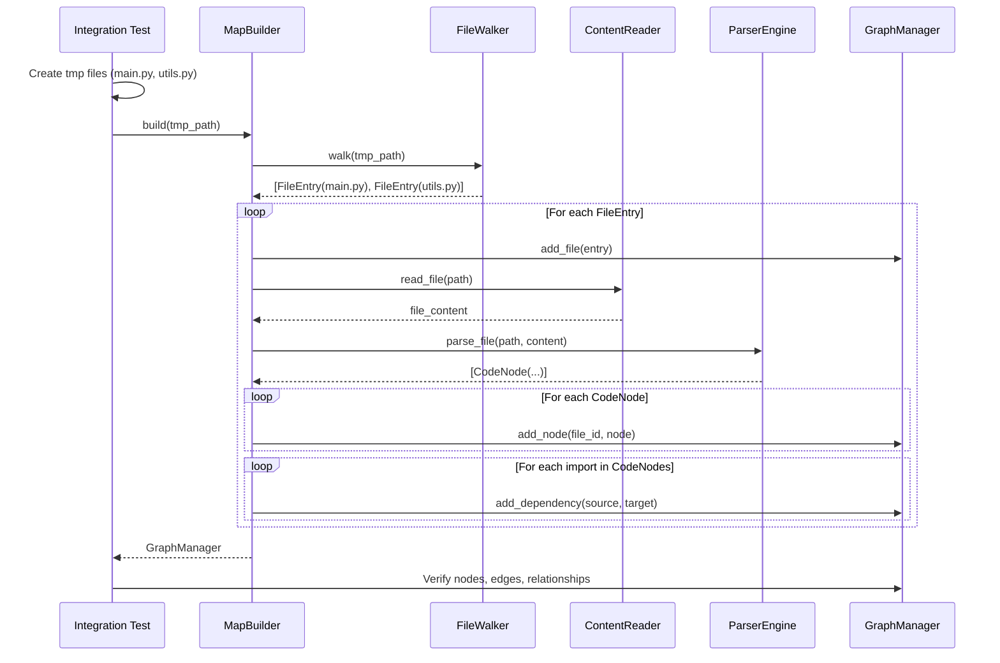

I have created the following plan after thorough exploration and analysis of the codebase. Follow the below plan verbatim. Trust the files and references. Do not re-verify what's written in the plan. Explore only when absolutely necessary. First implement all the proposed file changes and then I'll review all the changes together at the end.

## Observations

The codebase follows strict TDD patterns with comprehensive test coverage. The existing test files (`file:tests/unit/scout/test_walker.py`, `file:tests/unit/mapper/test_engine.py`, `file:tests/unit/graph/test_manager.py`) demonstrate consistent AAA (Arrange-Act-Assert) structure with clear docstrings. The components to be integrated are well-defined: `FileWalker` returns `list[FileEntry]`, `ContentReader` reads file content, `ParserEngine` extracts `list[CodeNode]`, and `GraphManager` builds the graph with nodes and edges. The models (`FileEntry`, `CodeNode`) are frozen dataclasses with clear attributes.

## Approach

Create an integration test in `file:tests/unit/engine/test_builder.py` that validates the complete MapBuilder workflow by setting up a realistic temporary file structure with Python files that have import relationships. The test will verify that MapBuilder correctly orchestrates all components (FileWalker, ContentReader, ParserEngine, GraphManager) to produce a complete graph with file nodes, code nodes (functions/classes), and import dependencies. Follow the established patterns from `file:tests/unit/scout/test_walker.py` and `file:tests/unit/graph/test_manager.py` for test structure, using `tmp_path` fixture and AAA pattern with comprehensive assertions.

## Implementation Steps

### 1. Create Directory Structure

Create the `tests/unit/engine/` directory with `__init__.py`:
- Create directory: `tests/unit/engine/`
- Create empty file: `tests/unit/engine/__init__.py`

### 2. Create Integration Test File

Create `file:tests/unit/engine/test_builder.py` with the following structure:

**Module Docstring**:
- Document that this contains integration tests for MapBuilder
- Explain that tests verify the complete orchestration of FileWalker, ContentReader, ParserEngine, and GraphManager
- Follow docstring pattern from `file:tests/unit/graph/test_manager.py`

**Imports**:
```python
from pathlib import Path
import pytest
from codemap.engine.builder import MapBuilder
```

### 3. Create Test Class: TestMapBuilderIntegration

**Test Method: `test_build_creates_complete_graph`**

This is the main integration test that validates the entire MapBuilder workflow.

**Arrange Phase**:
- Use `tmp_path` fixture (pytest built-in)
- Create temporary file structure:
  - `utils.py`: Contains a function definition
    ```python
    def helper_function():
        return "helper"
    ```
  - `main.py`: Imports utils and contains a function
    ```python
    from utils import helper_function
    
    def main():
        result = helper_function()
        return result
    ```
- Pattern: Use `(tmp_path / "filename.py").write_text(content)` as seen in `file:tests/unit/scout/test_walker.py`
- Instantiate MapBuilder: `builder = MapBuilder()`

**Act Phase**:
- Call `graph_manager = builder.build(tmp_path)`
- Store reference to the returned GraphManager instance

**Assert Phase - File Nodes**:
- Verify graph has exactly 2 file nodes: `"main.py"` and `"utils.py"`
- Check node existence: `assert "main.py" in graph_manager.graph.nodes`
- Check node attributes: `assert graph_manager.graph.nodes["main.py"]["type"] == "file"`
- Verify both files have `size` and `token_est` attributes

**Assert Phase - Code Nodes**:
- Verify `utils.py::helper_function` exists in graph
- Verify `main.py::main` exists in graph
- Check code node attributes:
  - `type == "function"`
  - `name` matches function name
  - `start_line` and `end_line` are present and valid (> 0)

**Assert Phase - CONTAINS Edges**:
- Verify CONTAINS edge from `"utils.py"` to `"utils.py::helper_function"`
- Verify CONTAINS edge from `"main.py"` to `"main.py::main"`
- Check edge attributes: `assert graph_manager.graph.edges["utils.py", "utils.py::helper_function"]["relationship"] == "CONTAINS"`

**Assert Phase - IMPORTS Edge**:
- Verify IMPORTS edge from `"main.py"` to `"utils.py"`
- Check edge attribute: `assert graph_manager.graph.edges["main.py", "utils.py"]["relationship"] == "IMPORTS"`
- This validates that the import statement in main.py was correctly parsed and added as a dependency

**Assert Phase - Graph Statistics**:
- Use `graph_manager.graph_stats` property (from `file:src/codemap/graph/manager.py`)
- Verify node count: 4 nodes total (2 files + 2 code nodes)
- Verify edge count: 3 edges total (2 CONTAINS + 1 IMPORTS)

### 4. Test Documentation

Each test method should have a comprehensive docstring following the pattern from `file:tests/unit/graph/test_manager.py`:
- One-line summary
- Detailed explanation of what is being tested
- Expected behavior
- Any important implementation notes

### 5. Visual Representation



### 6. Expected Test Structure

The test file should follow this organization pattern (from `file:tests/unit/graph/test_manager.py`):

| Section | Content |
|---------|---------|
| Module Docstring | Purpose and scope of integration tests |
| Imports | Standard library, pytest, codemap modules |
| TestMapBuilderIntegration | Main test class with integration test |
| Test Methods | Each with AAA structure and comprehensive docstrings |

### 7. Key Assertions Summary

| Assertion Type | Count | Details |
|----------------|-------|---------|
| File Nodes | 2 | main.py, utils.py with type="file" |
| Code Nodes | 2 | helper_function, main with type="function" |
| CONTAINS Edges | 2 | File → Code Node relationships |
| IMPORTS Edges | 1 | main.py → utils.py dependency |
| Graph Stats | 1 | Verify total counts (4 nodes, 3 edges) |

### 8. File References

When implementing, reference these existing patterns:
- Test structure: `file:tests/unit/graph/test_manager.py` (lines 293-318 for save/load roundtrip pattern)
- Temporary file creation: `file:tests/unit/scout/test_walker.py` (lines 89-106 for nested structure)
- AAA pattern: `file:tests/unit/mapper/test_engine.py` (lines 63-74 for clear separation)
- Graph assertions: `file:tests/unit/graph/test_manager.py` (lines 146-166 for node/edge verification)