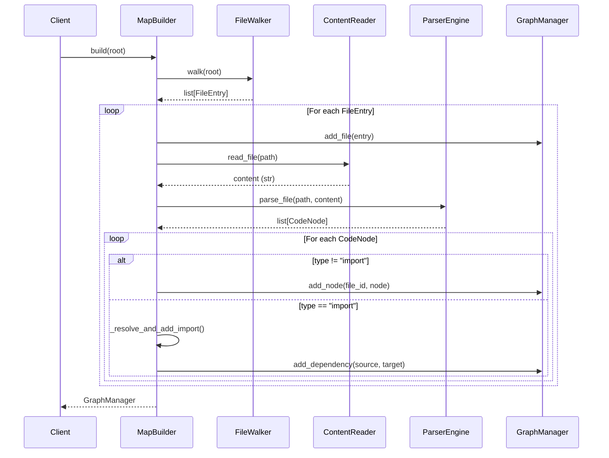

I have created the following plan after thorough exploration and analysis of the codebase. Follow the below plan verbatim. Trust the files and references. Do not re-verify what's written in the plan. Explore only when absolutely necessary. First implement all the proposed file changes and then I'll review all the changes together at the end.

## Observations

The codebase follows strict TDD with 100% coverage requirements, uses comprehensive docstrings with Architecture/Example sections (see `file:src/codemap/graph/manager.py`), and employs standard Python logging (`logger = logging.getLogger(__name__)`). All components are already implemented: `FileWalker` discovers files, `ContentReader` handles encoding, `ParserEngine` extracts code nodes (including imports as `CodeNode` with `type="import"`), and `GraphManager` builds the dependency graph. Import resolution needs to map module names (e.g., "utils", "codemap.scout.walker") to actual file paths within the scanned project.

## Approach

Create `MapBuilder` as an orchestrator class that chains the four components in sequence: scan files → add to graph → parse each file → add nodes/dependencies. Implement simple import resolution by converting module names to potential file paths (e.g., "utils" → "utils.py", "codemap.scout.walker" → "codemap/scout/walker.py") and checking existence in the scanned file set. Use try/except with `logger.warning()` per file to ensure parsing errors don't abort the entire build process. Follow existing patterns: comprehensive docstrings with Architecture/Example sections, strict typing, and frozen dataclasses where applicable.

## Teststrategie

### Coverage-Ziel

**100% Coverage** ist Projektrichtlinie (siehe `pyproject.toml` fail_under=100). Alle Branches und Statements müssen abgedeckt sein.

### Unit Tests für `build()`

| Test Case | Beschreibung | Erwartetes Verhalten |
|-----------|--------------|----------------------|
| `test_build_with_valid_path` | Valider Verzeichnispfad übergeben | Gibt `GraphManager` mit korrekten Nodes zurück |
| `test_build_with_nonexistent_path` | Nicht-existierender Pfad | Wirft `ValueError` mit "Path does not exist" |
| `test_build_with_file_instead_of_directory` | Datei statt Verzeichnis | Wirft `ValueError` mit "Path is not a directory" |
| `test_build_catches_parsing_errors` | ParserEngine wirft Exception | Loggt Warning, fährt mit nächster Datei fort |
| `test_build_catches_content_read_errors` | ContentReader wirft `ContentReadError` | Loggt Warning, fährt mit nächster Datei fort |
| `test_build_empty_directory` | Leeres Verzeichnis | Gibt `GraphManager` mit leerem Graph zurück |

**Mocking-Strategie:**
- Mock `FileWalker.walk()` um deterministische `FileEntry`-Listen zu liefern
- Mock `ContentReader.read_file()` um definierte Inhalte oder Exceptions zu liefern
- Mock `ParserEngine.parse_file()` um definierte `CodeNode`-Listen oder Exceptions zu liefern
- Verwende `@patch` oder `MagicMock` aus `unittest.mock`

### Unit Tests für `_resolve_and_add_import()`

| Test Case | Beschreibung | Erwartetes Verhalten |
|-----------|--------------|----------------------|
| `test_resolve_simple_module_name` | "utils" im selben Verzeichnis | Fügt Dependency zu "utils.py" hinzu |
| `test_resolve_dotted_module_name` | "codemap.scout.walker" | Fügt Dependency zu "codemap/scout/walker.py" hinzu |
| `test_resolve_relative_import_same_dir` | Import aus gleichem Ordner | Korrekte Auflösung relativ zu `source_file.parent` |
| `test_resolve_package_import` | Package mit `__init__.py` | Fügt Dependency zum Package-Verzeichnis hinzu |
| `test_resolve_unresolved_import_silent` | Import zu nicht-existierender Datei | Kein Fehler, keine Dependency hinzugefügt |
| `test_resolve_external_import` | "os", "pathlib" etc. | Kein Fehler, keine Dependency (externes Modul) |

**Mocking-Strategie:**
- Mocke `self._graph.graph.nodes` um kontrollierte Node-Sets zu simulieren
- Mocke `self._graph.add_dependency()` um Aufrufe zu verifizieren
- Verwende `pytest.fixture` für wiederverwendbare Graph-Zustände

### Integration Tests (E2E)

**Fixture-Projekt-Struktur:**
```
tmp_path/
├── main.py          # from utils import helper; from pkg import func
├── utils.py         # def helper(): pass
└── pkg/
    ├── __init__.py  # from .module import func
    └── module.py    # def func(): pass
```

| Test Case | Beschreibung | Assertions |
|-----------|--------------|------------|
| `test_integration_full_workflow` | Vollständige Orchestrierung | File Nodes, Code Nodes, CONTAINS Edges, IMPORTS Edges korrekt |
| `test_integration_graph_statistics` | Graph-Statistiken | Mindestens erwartete Node/Edge-Counts |
| `test_integration_import_chain` | Import-Kette über mehrere Dateien | Transitive Dependencies korrekt erfasst |

**Fixture-Strategie:**
- Verwende `tmp_path` pytest-Fixture für temporäres Dateisystem
- Erstelle Python-Dateien mit `(tmp_path / "file.py").write_text(content)`
- Pattern aus `file:tests/unit/scout/test_walker.py` (Zeilen 89-106)

### Failure-Mode Integration Tests

| Test Case | Beschreibung | Erwartetes Verhalten |
|-----------|--------------|----------------------|
| `test_integration_corrupt_file_continues` | Binärdatei mit .py Extension | Loggt Warning, verarbeitet restliche Dateien |
| `test_integration_parser_exception_continues` | Datei mit ungültiger Syntax | Loggt Warning, verarbeitet restliche Dateien |
| `test_integration_permission_error_continues` | Datei ohne Leserechte | Loggt Warning, verarbeitet restliche Dateien |
| `test_integration_mixed_success_failure` | Mix aus validen und invaliden Dateien | Alle validen Dateien im Graph, Fehler geloggt |

**Verifikation:**
- `caplog` pytest-Fixture zum Prüfen von Log-Nachrichten
- Assert auf `WARNING` Level mit spezifischen Fehlermeldungen
- Assert dass Graph trotz Fehlern korrekte Einträge enthält

### Pytest Fixtures

```python
# conftest.py oder test_builder.py

@pytest.fixture
def sample_project(tmp_path: Path) -> Path:
    """Create a sample Python project for integration tests."""
    (tmp_path / "main.py").write_text('from utils import helper\n\ndef main(): pass')
    (tmp_path / "utils.py").write_text('def helper(): return "help"')
    return tmp_path

@pytest.fixture
def mock_walker() -> MagicMock:
    """Mock FileWalker for unit tests."""
    walker = MagicMock(spec=FileWalker)
    walker.walk.return_value = [
        FileEntry(path=Path("main.py"), size=100, token_est=25),
        FileEntry(path=Path("utils.py"), size=50, token_est=12),
    ]
    return walker

@pytest.fixture
def mock_parser() -> MagicMock:
    """Mock ParserEngine for unit tests."""
    parser = MagicMock(spec=ParserEngine)
    parser.parse_file.return_value = [
        CodeNode(type="function", name="main", start_line=3, end_line=3),
    ]
    return parser
```

### Test-Datei-Struktur

```
tests/unit/engine/
├── __init__.py
├── test_builder.py           # Unit + Integration Tests für MapBuilder
└── conftest.py               # Shared Fixtures (optional)
```

### Referenz-Patterns

- **AAA-Pattern**: Arrange-Act-Assert aus `file:tests/unit/graph/test_manager.py`
- **Temporary Files**: `file:tests/unit/scout/test_walker.py` (Zeilen 89-106)
- **Mocking**: `file:tests/unit/core/test_llm.py` (CerebrasProvider Tests mit `@patch`)
- **caplog Usage**: `file:tests/unit/scout/test_advisor.py` für Log-Verifikation

## Implementation Steps

### 1. Create Directory Structure

Create `src/codemap/engine/` directory to house the builder module.

### 2. Implement MapBuilder Class in `file:src/codemap/engine/builder.py`

**Imports and Logger Setup:**
```python
import logging
from pathlib import Path
from codemap.scout.walker import FileWalker
from codemap.mapper.reader import ContentReader, ContentReadError
from codemap.mapper.engine import ParserEngine
from codemap.graph.manager import GraphManager
from codemap.mapper.models import CodeNode

logger = logging.getLogger(__name__)
```

**Class Structure:**

Create `MapBuilder` class with comprehensive module docstring following pattern from `file:src/codemap/graph/manager.py`:
- Architecture section explaining orchestration flow
- Example section showing complete workflow
- Thread safety note (NOT thread-safe, create separate instances per thread)

**`__init__` Method:**

Initialize all four components as private attributes:
- `self._walker = FileWalker()`
- `self._reader = ContentReader()`
- `self._parser = ParserEngine()`
- `self._graph = GraphManager()`

No parameters needed; components use default configurations.

**`build` Method Signature:**

```python
def build(self, root: Path) -> GraphManager:
```

**`build` Method Implementation Flow:**

1. **Scan Phase**: Call `self._walker.walk(root)` to get `list[FileEntry]`
2. **Add Files Phase**: Loop through entries, call `self._graph.add_file(entry)` for each
3. **Parse & Map Phase**: For each `FileEntry`:
   - Try/except block with `logger.warning()` for error handling
   - Read content: `content = self._reader.read_file(root / entry.path)`
   - Parse structure: `nodes = self._parser.parse_file(entry.path, content)`
   - Add code nodes: For each `CodeNode` where `type != "import"`, call `self._graph.add_node(str(entry.path), node)`
   - Add dependencies: For each `CodeNode` where `type == "import"`, call `self._resolve_and_add_import(root, entry.path, node.name)`
4. **Return**: Return `self._graph`

**Error Handling Pattern:**

Wrap per-file processing in try/except:
```python
try:
    content = self._reader.read_file(root / entry.path)
    nodes = self._parser.parse_file(entry.path, content)
    # ... process nodes
except (ContentReadError, ValueError) as e:
    logger.warning("Failed to process file %s: %s", entry.path, e)
    continue
```

### 3. Implement Import Resolution Helper Method

**`_resolve_and_add_import` Method:**

Private helper method to map import names to file paths and add dependencies:

```python
def _resolve_and_add_import(
    self, root: Path, source_file: Path, import_name: str
) -> None:
```

**Resolution Logic:**

1. Convert import name to potential file paths:
   - Simple name (e.g., "utils") → check same directory: `source_file.parent / f"{import_name}.py"`
   - Dotted name (e.g., "codemap.scout.walker") → convert to path: `import_name.replace(".", "/") + ".py"`
2. Check if resolved path exists in graph nodes (use `self._graph.graph.nodes`)
3. If exists, call `self._graph.add_dependency(str(source_file), str(resolved_path))`
4. If not exists, skip silently (external import or unresolved)

**Implementation Details:**

- Use `Path` operations for cross-platform compatibility
- Normalize paths to strings for graph node IDs (consistent with `GraphManager` API)
- Handle both relative imports (same directory) and absolute imports (from root)
- No error raising; silently skip unresolved imports (they're external dependencies)

### 4. Add Comprehensive Docstrings

**Module Docstring:**

Follow pattern from `file:src/codemap/graph/manager.py`:
- Brief description of orchestration purpose
- Architecture section explaining component integration
- Performance notes (suitable for small-medium codebases)
- Thread safety warning

**Class Docstring:**

Include:
- Architecture section: FileWalker → ContentReader → ParserEngine → GraphManager flow
- Example section: Complete workflow from `build(root)` to graph statistics
- Thread safety note

**Method Docstrings:**

For `build()`:
- Args: `root` (Path to scan, must exist and be directory)
- Returns: `GraphManager` with populated graph
- Raises: `ValueError` if root invalid
- Example: Show typical usage with assertions on graph stats

For `_resolve_and_add_import()`:
- Brief description of import resolution logic
- Args: `root`, `source_file`, `import_name`
- Returns: None
- Note: Silently skips unresolved imports

### 5. Type Hints and Validation

- Use strict type hints for all parameters and return values
- Add input validation in `build()`: check `root.exists()` and `root.is_dir()`, raise `ValueError` if invalid
- Follow mypy strict mode requirements (no `Any`, explicit return types)

## Architecture Diagram



## Key Implementation Details

| Aspect | Implementation |
|--------|----------------|
| **Import Resolution** | Convert module names to paths: "utils" → "utils.py", "codemap.scout.walker" → "codemap/scout/walker.py" |
| **Error Handling** | Try/except per file with `logger.warning()`, continue processing remaining files |
| **Graph Node IDs** | Use `str(entry.path)` for file nodes, `f"{file_id}::{node.name}"` for code nodes (consistent with `GraphManager`) |
| **Dependency Edges** | Only add IMPORTS edges for imports that resolve to files in the scanned project |
| **Validation** | Check `root.exists()` and `root.is_dir()` in `build()`, raise `ValueError` if invalid |
| **Logging** | Use `logger = logging.getLogger(__name__)` pattern from `file:src/codemap/scout/advisor.py` |

## Files to Create

- `file:src/codemap/engine/builder.py` - Main MapBuilder implementation with comprehensive docstrings