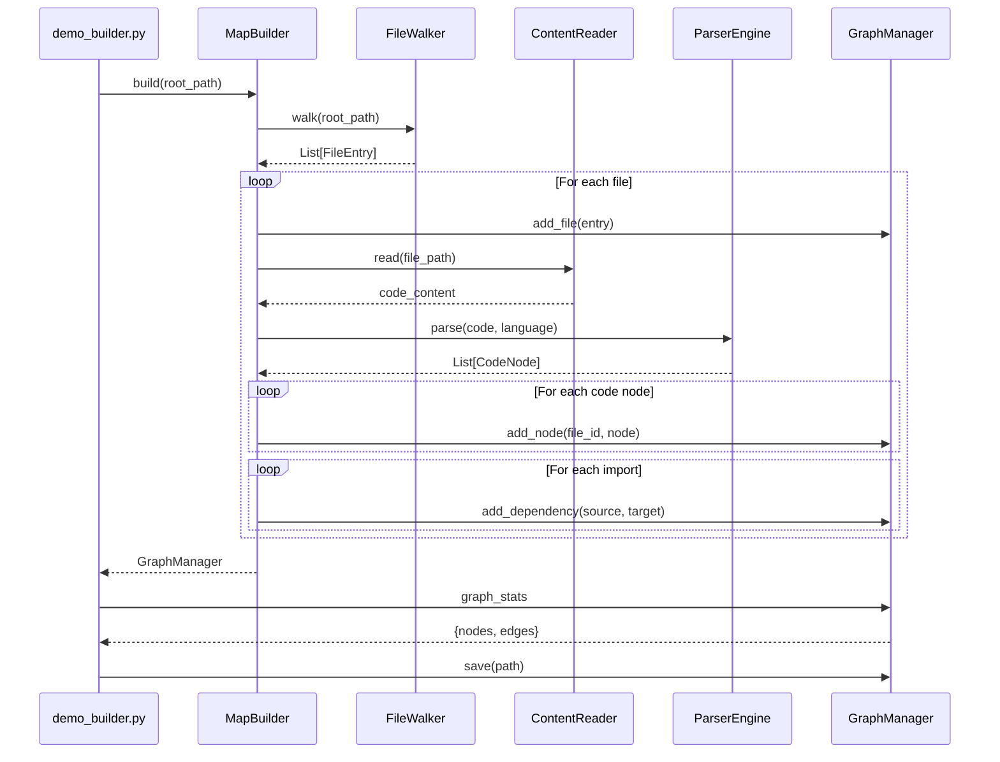

I have created the following plan after thorough exploration and analysis of the codebase. Follow the below plan verbatim. Trust the files and references. Do not re-verify what's written in the plan. Explore only when absolutely necessary. First implement all the proposed file changes and then I'll review all the changes together at the end.

## Observations

The codebase follows consistent patterns across modules: each package exports its public API via `__init__.py` with a descriptive docstring and `__all__` list (see `file:src/codemap/mapper/__init__.py`, `file:src/codemap/graph/__init__.py`, `file:src/codemap/scout/__init__.py`). Demo scripts follow a structured format with sys.path setup, emoji-marked sections, time tracking, and comprehensive error handling (see `file:demo_advisor.py`, `file:demo_full_scan.py`). The `MapBuilder` class orchestrates `FileWalker`, `ContentReader`, `ParserEngine`, and `GraphManager` to build a complete code relationship graph.

## Approach

Create `src/codemap/engine/__init__.py` following the established module export pattern with a concise docstring describing the engine's orchestration role. Export `MapBuilder` in `__all__` for public API access. Create `demo_builder.py` in the project root following the demo script pattern: scan a directory, build the graph, display statistics (files, nodes, edges, timing), and optionally save the graph to JSON. The demo will showcase the complete integration workflow from directory scanning to graph persistence.

## Implementation Steps

### 1. Create Engine Module Exports

**File**: `file:src/codemap/engine/__init__.py`

Create the module initialization file with:
- Module docstring describing the engine's orchestration purpose (pattern from `file:src/codemap/mapper/__init__.py`)
- Import `MapBuilder` from `file:src/codemap/engine/builder.py`
- Define `__all__` list containing `["MapBuilder"]`
- Keep it concise (similar to `file:src/codemap/graph/__init__.py` which only exports `GraphManager`)

Example structure:
```python
"""Engine module for orchestrating code map building.

This module provides the MapBuilder class that orchestrates the complete
code mapping workflow: scanning files, parsing structure, and building graphs.
"""

from codemap.engine.builder import MapBuilder

__all__ = ["MapBuilder"]
```

### 2. Verify Module Import

Test the import path to ensure the module is properly exposed:
- From project root, verify: `from codemap.engine import MapBuilder` works
- Ensure `MapBuilder` is accessible via the public API
- Check that the import doesn't raise `ImportError` or `AttributeError`

### 3. Create Demo Script

**File**: `file:demo_builder.py` (in project root)

Create a demonstration script following the pattern from `file:demo_advisor.py` and `file:demo_full_scan.py`:

**Structure**:
- **Imports Section**: sys.path setup, import `MapBuilder` from `codemap.engine`, import `Path` and `time`
- **Error Handling**: Try/except block for imports with helpful error message
- **Main Function**:
  - Section 1 (🚀): Initialize and display starting directory
  - Section 2 (📂): Call `builder.build(root_path)` with timing
  - Section 3 (📊): Display graph statistics using `manager.graph_stats`
  - Section 4 (💾): Optional - save graph to `output/graph.json` using `manager.save()`
  - Section 5 (📋): Display sample nodes/edges from the graph
  - Summary: Total time, node count, edge count, file count

**Key Elements**:
- Use emoji indicators for visual clarity (🚀, 📂, 📊, 💾, 📋, ✅, ❌)
- Time tracking with `time.time()` for performance measurement
- Error handling with `try/except` and `sys.exit(1)` on failures
- Print graph statistics: `manager.graph_stats` (nodes, edges)
- Demonstrate graph access: iterate over file nodes, show CONTAINS/IMPORTS edges
- Optional: save graph to JSON file for persistence demonstration

**Example Flow**:
```python
# 1. Initialize
root_path = Path.cwd()
print(f"🚀 Building code map for: {root_path.name}")

# 2. Build graph
builder = MapBuilder()
start_time = time.time()
manager = builder.build(root_path)
duration = time.time() - start_time

# 3. Display statistics
stats = manager.graph_stats
print(f"✅ Graph built in {duration:.4f} seconds")
print(f"   Nodes: {stats['nodes']}, Edges: {stats['edges']}")

# 4. Optional: Save graph
manager.save(Path("output/graph.json"))

# 5. Display sample data
# Show file nodes, code nodes, relationships
```

### 4. Documentation and Testing

**Verification Steps**:
- Run `demo_builder.py` from project root to verify end-to-end workflow
- Confirm output shows timing, statistics, and sample graph data
- Verify graph JSON file is created if save functionality is included
- Test with different directory sizes (small project vs. current codebase)
- Ensure error messages are helpful if `MapBuilder` fails

**Integration Points**:
- `MapBuilder.build()` returns `GraphManager` instance
- `GraphManager.graph_stats` provides node/edge counts
- `GraphManager.save()` persists graph to JSON
- `GraphManager.graph` provides access to NetworkX DiGraph for inspection

### Visual Overview

