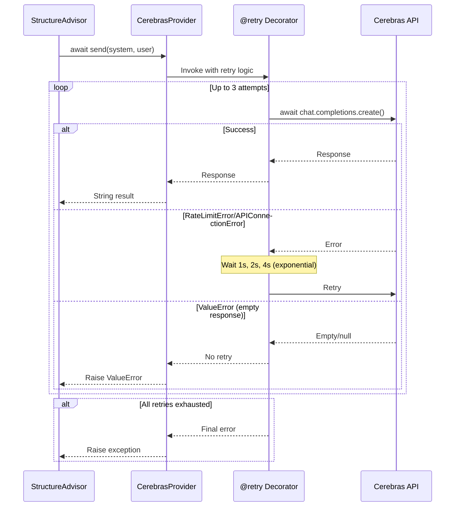

I have created the following plan after thorough exploration and analysis of the codebase. Follow the below plan verbatim. Trust the files and references. Do not re-verify what's written in the plan. Explore only when absolutely necessary. First implement all the proposed file changes and then I'll review all the changes together at the end.

## Observations

The `file:src/codemap/core/llm.py` module currently uses synchronous `OpenAI` client (line 10) and `CerebrasProvider.send()` is synchronous (line 104). The provider is used by `StructureAdvisor` via dependency injection and has comprehensive tests mocking the OpenAI client. The codebase has no existing async patterns or tenacity usage, making this a greenfield async implementation. The `CerebrasProvider` already has proper error handling for empty/null responses (lines 137-142).

## Approach

Convert `CerebrasProvider` to async using `AsyncOpenAI` and add resilience with tenacity retry decorator. This follows the TDD RED-phase strategy where implementation changes precede test updates (handled by other engineers). The retry decorator will catch `openai.RateLimitError` and `openai.APIConnectionError` with exponential backoff (3 attempts, 1-10 second delays) to handle API instability. Docstrings will be updated to reflect async behavior and retry semantics, maintaining the existing error handling for empty responses.

## Implementation Steps

### 1. Update Imports in `file:src/codemap/core/llm.py`

Replace the synchronous OpenAI import with AsyncOpenAI and add tenacity imports:

- Change line 10 from `from openai import OpenAI` to `from openai import AsyncOpenAI`
- Add new import after line 10: `from tenacity import retry, stop_after_attempt, wait_exponential, retry_if_exception_type`
- Add new import for exception handling: `import openai` (to access `openai.RateLimitError` and `openai.APIConnectionError`)

### 2. Update `CerebrasProvider.__init__()` Method

Modify the client initialization to use `AsyncOpenAI`:

- Line 101: Change `self.client = OpenAI(api_key=api_key, base_url="https://api.cerebras.ai/v1")` to `self.client = AsyncOpenAI(api_key=api_key, base_url="https://api.cerebras.ai/v1")`
- Update the docstring (lines 91-97) to mention "AsyncOpenAI-Client" instead of "OpenAI-Client"
- Update the class-level docstring (lines 82-83) to mention "AsyncOpenAI-kompatibles Interface"

### 3. Add Retry Decorator to `CerebrasProvider.send()` Method

Add the `@retry` decorator before the method definition (line 104):

```python
@retry(
    retry=retry_if_exception_type((openai.RateLimitError, openai.APIConnectionError)),
    stop=stop_after_attempt(3),
    wait=wait_exponential(multiplier=1, min=1, max=10)
)
```

This configuration:
- Retries only on rate limit errors (429) and connection errors
- Attempts up to 3 times total (initial + 2 retries)
- Uses exponential backoff: 1s, 2s, 4s (capped at 10s)
- Does not retry on `ValueError` (empty/null responses) to preserve existing error handling

### 4. Convert `CerebrasProvider.send()` to Async Method

Transform the method signature and API call:

- Line 104: Change `def send(self, system: str, user: str) -> str:` to `async def send(self, system: str, user: str) -> str:`
- Line 129: Change `response = self.client.chat.completions.create(` to `response = await self.client.chat.completions.create(`
- Keep all other logic unchanged (lines 130-142: messages, temperature, error handling)

### 5. Update `CerebrasProvider.send()` Docstring

Enhance the docstring (lines 105-128) to document async behavior and retry semantics:

- Line 105: Change "Sendet Prompts an Cerebras-API" to "Sendet Prompts asynchron an Cerebras-API"
- Add new section after line 117 (before "Raises:"):
  ```
  Retry-Verhalten:
      Automatische Wiederholungsversuche bei temporären Fehlern:
      - Maximal 3 Versuche (initial + 2 Retries)
      - Exponentielles Backoff: 1s, 2s, 4s (max 10s)
      - Retry bei: RateLimitError (429), APIConnectionError
      - Kein Retry bei: ValueError (leere/null Antworten)
  ```
- Update line 124 in Raises section: Add `openai.RateLimitError` and `openai.APIConnectionError` to the list of exceptions that can be raised (after retries exhausted)
- Update line 126 note: Change "Call-Sites sollten ValueError abfangen" to "Call-Sites sollten await verwenden und ValueError abfangen"

### 6. Update Class-Level Docstring for `CerebrasProvider`

Enhance the class docstring (lines 71-87) to document async and retry features:

- Line 76: Add sentence after "qualitativ hochwertige Inferenz.": "Die Implementierung ist vollständig asynchron und nutzt automatische Retry-Mechanismen für Resilienz."
- Line 82: Update Attributes section to include:
  ```
  client: AsyncOpenAI-Client konfiguriert für Cerebras-API.
  model: Name des verwendeten Modells (llama-3.3-70b).
  ```
- Add new section after line 84 (before "Raises:"):
  ```
  Resilienz:
      Automatische Wiederholungsversuche bei temporären API-Fehlern
      (Rate Limits, Verbindungsprobleme) mit exponentiellem Backoff.
  ```

### 7. Verify Protocol Conformance

Ensure `LLMProvider` protocol is still satisfied:

- The protocol's `send()` method signature (line 23) should remain `def send(self, system: str, user: str) -> str:` (protocols use `def`, not `async def`)
- `CerebrasProvider` and `MockProvider` will both implement `async def send()`, which satisfies the protocol structurally
- Python's structural typing allows async implementations to satisfy sync protocol definitions

## Visual Overview



## Key Implementation Details

| Aspect | Current State | Target State |
|--------|--------------|--------------|
| Import | `from openai import OpenAI` | `from openai import AsyncOpenAI` + tenacity imports |
| Client | `OpenAI(...)` | `AsyncOpenAI(...)` |
| Method | `def send(...)` | `async def send(...)` |
| API Call | `client.chat.completions.create(...)` | `await client.chat.completions.create(...)` |
| Retry | None | `@retry(...)` with 3 attempts, exponential backoff |
| Exceptions | `ValueError` only | `ValueError`, `RateLimitError`, `APIConnectionError` |

## Dependencies

- Ensure `tenacity` is installed (should be in `requirements-dev.txt`)
- Ensure `pytest-asyncio` is installed for test compatibility (handled by other engineers)
- OpenAI library version `>=1.0.0` already supports `AsyncOpenAI`

## Notes

- The `MockProvider` remains unchanged in this phase (already converted to async in previous phase per user confirmation)
- The `LLMProvider` protocol definition remains synchronous (`def send`) but accepts async implementations
- Tests will be updated by other engineers in subsequent phases to use `@pytest.mark.asyncio` and `await`
- The `get_provider()` factory function requires no changes (returns instances that satisfy the protocol)
- Existing error handling for empty/null responses (lines 137-142) is preserved and not retried