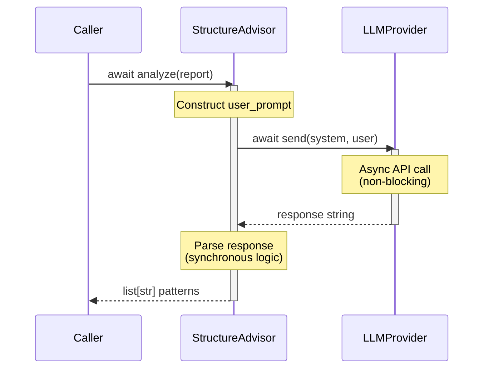

I have created the following plan after thorough exploration and analysis of the codebase. Follow the below plan verbatim. Trust the files and references. Do not re-verify what's written in the plan. Explore only when absolutely necessary. First implement all the proposed file changes and then I'll review all the changes together at the end.

## Observations

The `StructureAdvisor` class in `file:src/codemap/scout/advisor.py` currently has a synchronous `analyze()` method (line 62) that calls `self._provider.send()` synchronously (line 108). The method includes comprehensive error handling for `ValueError` exceptions from the provider (lines 107-111), detailed docstrings with examples, and proper type hints. The LLM provider protocol has been updated to async in previous phases, requiring the consumer (`StructureAdvisor`) to adopt async patterns for compatibility.

## Approach

Convert the `analyze()` method to async by changing its signature to `async def` and awaiting the provider call. This maintains all existing functionality (error handling, parsing logic, return type) while enabling non-blocking LLM interactions. The approach preserves the method's contract (input/output types, exception behavior) and only modifies execution semantics. Docstring updates will clarify async usage patterns for callers without altering the method's purpose or behavior.

## Implementation Steps

### 1. Update Method Signature to Async

**File:** `file:src/codemap/scout/advisor.py`

- **Line 62:** Change method signature from `def analyze(self, report: TreeReport) -> list[str]:` to `async def analyze(self, report: TreeReport) -> list[str]:`
- Keep the return type hint `-> list[str]` unchanged (async functions return the unwrapped type)
- Ensure proper indentation and formatting consistency

### 2. Add Await to Provider Call

**File:** `file:src/codemap/scout/advisor.py`

- **Line 108:** Change `response = self._provider.send(SYSTEM_PROMPT, user_prompt)` to `response = await self._provider.send(SYSTEM_PROMPT, user_prompt)`
- Keep the try/except block structure intact (lines 107-111)
- Preserve the `ValueError` exception handling and logging logic
- No changes needed to the parsing logic (lines 113-139) or helper methods

### 3. Update Method Docstring

**File:** `file:src/codemap/scout/advisor.py`

- **Lines 62-102:** Update the `analyze()` method docstring to reflect async nature:
  - Add note in the opening paragraph: "This is an async method that must be awaited."
  - Update the "Returns" section to clarify: "Returns a coroutine that resolves to a list of valid gitignore-style patterns..."
  - Update the "Example" section (lines 91-101) to show async usage:
    ```python
    >>> import asyncio
    >>> advisor = StructureAdvisor(MockProvider())
    >>> report = TreeReport(...)
    >>> patterns = asyncio.run(advisor.analyze(report))
    >>> 'node_modules/' in patterns
    True
    ```
  - Add note in "Raises" section: "Callers must use `await` or run in an async context."

### 4. Update Class Docstring Example

**File:** `file:src/codemap/scout/advisor.py`

- **Lines 37-50:** Update the class-level docstring example to demonstrate async usage:
  - Add `import asyncio` to the example imports
  - Change `patterns = advisor.analyze(report)` to `patterns = asyncio.run(advisor.analyze(report))`
  - Add a note: "Note: In async contexts, use `await advisor.analyze(report)` instead of `asyncio.run()`"

### 5. Verify Type Hints Compatibility

**File:** `file:src/codemap/scout/advisor.py`

- Confirm that no additional imports are needed (async/await are built-in keywords)
- Verify that the `LLMProvider` protocol import (line 11) correctly references the async version
- Ensure the return type `list[str]` remains correct (async functions return unwrapped types in type hints)

## Summary

| **Aspect** | **Change** |
|------------|------------|
| Method signature | `def analyze()` → `async def analyze()` |
| Provider call | `self._provider.send()` → `await self._provider.send()` |
| Return type hint | No change (`-> list[str]`) |
| Error handling | No change (ValueError catch preserved) |
| Parsing logic | No change (lines 113-139 remain synchronous) |
| Docstrings | Updated to show async usage with `await` and `asyncio.run()` examples |
| Imports | No new imports needed |

