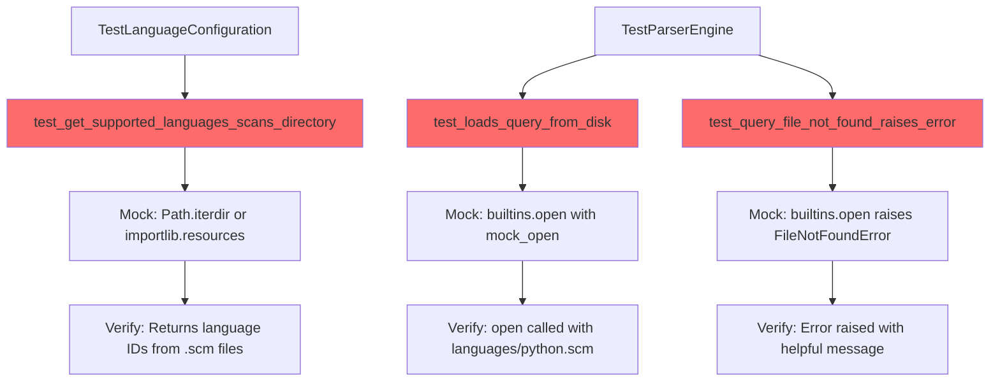

I have created the following plan after thorough exploration and analysis of the codebase. Follow the below plan verbatim. Trust the files and references. Do not re-verify what's written in the plan. Explore only when absolutely necessary. First implement all the proposed file changes and then I'll review all the changes together at the end.

## Observations

The codebase currently uses hardcoded `LANGUAGE_QUERIES` dictionary in `file:src/codemap/mapper/engine.py` (lines 25-27) to store Tree-sitter query strings. The `ParserEngine.parse()` method retrieves queries via dictionary lookup (line 167), and `get_supported_languages()` returns dictionary keys (line 35). Existing tests in `file:tests/unit/mapper/test_engine.py` directly import and validate `LANGUAGE_QUERIES` (lines 10, 24-28). The project uses both `unittest.mock.patch` (line 186 in test_engine.py) and pytest's `monkeypatch` fixture for mocking, with `tmp_path` fixture preferred for real file system operations.

## Approach

Following strict TDD RED phase principles, you'll add three failing tests to `file:tests/unit/mapper/test_engine.py` that expect dynamic query loading from `.scm` files. Use `unittest.mock.patch` to mock file system operations (consistent with existing cache test pattern). Tests will verify: (1) `ParserEngine.parse()` attempts to read from `languages/{language}.scm`, (2) appropriate error handling for missing files, and (3) `get_supported_languages()` scans the `languages/` directory. These tests will fail because the implementation still uses `LANGUAGE_QUERIES` dictionary and lacks the `_load_query_from_file()` method.

## Implementation Steps

### 1. Add Test: `test_loads_query_from_disk`

Add test method to `TestParserEngine` class in `file:tests/unit/mapper/test_engine.py`:

**Purpose**: Verify `ParserEngine.parse()` loads query from `languages/python.scm` file instead of `LANGUAGE_QUERIES` dictionary.

**Implementation**:
- Import `mock_open` from `unittest.mock` at top of file
- Use `patch("builtins.open", mock_open(read_data=PYTHON_ALL_QUERY))` to mock file reading
- Import `PYTHON_ALL_QUERY` from `codemap.mapper.queries` for test data
- Call `engine.parse(code, language_id="python")` with sample Python code
- Use `patch` context manager to verify `open()` was called with path containing `"languages/python.scm"`
- Assert parsing succeeds and returns expected `CodeNode` objects
- **Expected Result**: Test FAILS because `parse()` still uses `LANGUAGE_QUERIES[language_id]` instead of reading from file

**Code Structure**:
```python
def test_loads_query_from_disk(self) -> None:
    """Test parser loads query from .scm file on disk."""
    # Mock file system to return query content
    # Verify open() called with correct path
    # Assert parse() succeeds with mocked file content
```

### 2. Add Test: `test_query_file_not_found_raises_error`

Add test method to `TestParserEngine` class in `file:tests/unit/mapper/test_engine.py`:

**Purpose**: Verify appropriate error handling when `.scm` file is missing for a language.

**Implementation**:
- Use `patch("builtins.open", side_effect=FileNotFoundError)` to simulate missing file
- Call `engine.parse(code, language_id="python")`
- Use `pytest.raises()` to expect `FileNotFoundError` or custom exception
- Verify error message contains language name and expected file path
- **Expected Result**: Test FAILS because `parse()` doesn't attempt file reading, so no `FileNotFoundError` is raised

**Code Structure**:
```python
def test_query_file_not_found_raises_error(self) -> None:
    """Test parser raises error when .scm file is missing."""
    # Mock open() to raise FileNotFoundError
    # Expect parse() to propagate or wrap the error
```

### 3. Add Test: `test_get_supported_languages_scans_directory`

Add test method to `TestLanguageConfiguration` class in `file:tests/unit/mapper/test_engine.py`:

**Purpose**: Verify `get_supported_languages()` dynamically scans `languages/` directory for `.scm` files instead of returning `LANGUAGE_QUERIES.keys()`.

**Implementation**:
- Import `Path` from `pathlib` (already imported)
- Use `patch("pathlib.Path.iterdir")` or `patch("importlib.resources.files")` to mock directory listing
- Mock return value: list of `Path` objects with `.scm` suffix (e.g., `[Path("python.scm"), Path("javascript.scm")]`)
- Call `get_supported_languages()`
- Assert returned set contains `{"python", "javascript"}` (language IDs without `.scm` extension)
- Verify the mocked directory scanning method was called
- **Expected Result**: Test FAILS because `get_supported_languages()` returns `set(LANGUAGE_QUERIES.keys())` instead of scanning directory

**Code Structure**:
```python
def test_get_supported_languages_scans_directory(self) -> None:
    """Test get_supported_languages scans languages/ directory."""
    # Mock Path.iterdir() or importlib.resources.files()
    # Return mock .scm files
    # Assert function returns language IDs from filenames
```

### 4. Update Imports

Add required imports to top of `file:tests/unit/mapper/test_engine.py`:

- `from unittest.mock import patch, mock_open` (extend existing line 4)
- Ensure `PYTHON_ALL_QUERY` is imported: `from codemap.mapper.queries import PYTHON_ALL_QUERY`

### 5. Verify RED Phase

Run tests to confirm all three new tests fail:

```bash
pytest tests/unit/mapper/test_engine.py::TestParserEngine::test_loads_query_from_disk -v
pytest tests/unit/mapper/test_engine.py::TestParserEngine::test_query_file_not_found_raises_error -v
pytest tests/unit/mapper/test_engine.py::TestLanguageConfiguration::test_get_supported_languages_scans_directory -v
```

**Expected Output**: All three tests FAIL with errors indicating:
- `test_loads_query_from_disk`: `open()` was never called (assertion failure)
- `test_query_file_not_found_raises_error`: No `FileNotFoundError` raised (test passes incorrectly or assertion fails)
- `test_get_supported_languages_scans_directory`: Returned set doesn't match expected (still returns `{"python"}` from `LANGUAGE_QUERIES`)

## Test Structure Overview



## Key Testing Decisions

| Aspect | Decision | Rationale |
|--------|----------|-----------|
| **Mocking Library** | `unittest.mock.patch` | Consistent with existing `test_query_cache_reuses_compiled_query` (line 186) |
| **File Reading Mock** | `mock_open()` | Standard pattern for mocking `builtins.open()` |
| **Directory Scanning Mock** | `patch("pathlib.Path.iterdir")` | Simpler than mocking `importlib.resources`, implementation can choose either |
| **Error Type** | `FileNotFoundError` | Standard Python exception for missing files |
| **Test Location** | Existing test classes | `TestLanguageConfiguration` for `get_supported_languages()`, `TestParserEngine` for `parse()` |

## Files Modified

- `file:tests/unit/mapper/test_engine.py`: Add 3 new test methods, update imports

## Success Criteria

✅ Three new tests added to `file:tests/unit/mapper/test_engine.py`  
✅ All three tests FAIL when executed (RED phase confirmed)  
✅ Test failure messages clearly indicate missing implementation  
✅ Tests use mocking patterns consistent with existing codebase  
✅ No changes to `file:src/codemap/mapper/engine.py` (implementation deferred to GREEN phase)