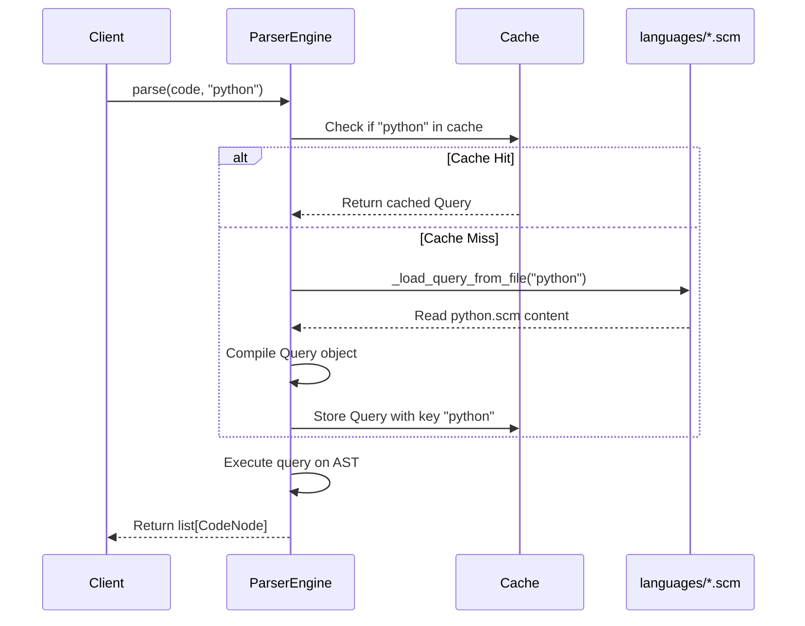

I have created the following plan after thorough exploration and analysis of the codebase. Follow the below plan verbatim. Trust the files and references. Do not re-verify what's written in the plan. Explore only when absolutely necessary. First implement all the proposed file changes and then I'll review all the changes together at the end.

## Observations

The codebase currently uses a hardcoded `LANGUAGE_QUERIES` dictionary in `file:src/codemap/mapper/engine.py` (lines 25-27) that maps language IDs to query strings imported from `file:src/codemap/mapper/queries.py`. The `ParserEngine` class implements query caching via `_query_cache` (line 76) with cache keys based on `language_id`. The `get_supported_languages()` function (lines 29-35) returns dictionary keys. The project uses Python 3.11+ with setuptools packaging, strict mypy typing, and 100% test coverage requirements.

## Approach

Refactor from dictionary-based to file-based query loading using `importlib.resources.files()` (Python 3.11+ stable API) for pip-installable package compatibility. Remove `LANGUAGE_QUERIES` and `PYTHON_ALL_QUERY` import from `file:src/codemap/mapper/engine.py`, implement `_load_query_from_file()` private method for dynamic `.scm` file loading, preserve existing cache mechanism with `language_id` keys, and update `get_supported_languages()` to scan the `languages/` package directory. This maintains backward compatibility for all public APIs while enabling polyglot extensibility through filesystem-based query definitions.

## Implementation Steps

### 1. Remove Hardcoded Query Dictionary and Import

**File: `file:src/codemap/mapper/engine.py`**

- **Line 14**: Remove import statement `from codemap.mapper.queries import PYTHON_ALL_QUERY`
- **Lines 22-27**: Delete the `LANGUAGE_QUERIES` dictionary definition entirely (including comments)
- **Lines 17-20**: Update `LANGUAGE_MAP` comment to remove reference to `LANGUAGE_QUERIES` (change "add entry here AND in LANGUAGE_QUERIES below" to "add entry here AND create corresponding .scm file in languages/")

### 2. Add Import for Resource Loading

**File: `file:src/codemap/mapper/engine.py`**

- **After line 7** (after `from pathlib import Path`): Add import statement:
  ```python
  from importlib.resources import files
  ```

### 3. Implement Dynamic Query File Loader

**File: `file:src/codemap/mapper/engine.py`**

- **After line 76** (after `self._query_cache: dict[str, Query] = {}`): Add new private method `_load_query_from_file()`:

**Method Signature:**
```python
def _load_query_from_file(self, language: str) -> str:
```

**Implementation Requirements:**
- Use `files("codemap.mapper.languages")` to get package resource reference
- Construct file path using `/ f"{language}.scm"` operator
- Call `.read_text(encoding="utf-8")` on the resource file
- Wrap in try-except to catch `FileNotFoundError` (when `.scm` file doesn't exist)
- Raise `ValueError` with message: `f"No query file found for language: {language}. Expected file: languages/{language}.scm"`
- Include type hints: `-> str` return type

**Error Handling:**
- Catch `FileNotFoundError` from `read_text()` when `.scm` file is missing
- Re-raise as `ValueError` with descriptive message including expected file path
- Preserve original exception chain using `raise ... from e` pattern

### 4. Update `parse()` Method to Use Dynamic Loading

**File: `file:src/codemap/mapper/engine.py`**

- **Lines 158-167**: Replace dictionary-based query lookup with file-based loading:

**Current Logic (lines 158-167):**
```python
# Validate language has query patterns defined (uses LANGUAGE_QUERIES as source of truth)
if language_id not in LANGUAGE_QUERIES:
    supported = ", ".join(sorted(LANGUAGE_QUERIES.keys()))
    raise ValueError(...)

# Get the query string for this language from LANGUAGE_QUERIES
query_string = LANGUAGE_QUERIES[language_id]
```

**New Logic:**
- Remove the `if language_id not in LANGUAGE_QUERIES:` validation block entirely
- Replace `query_string = LANGUAGE_QUERIES[language_id]` with:
  ```python
  query_string = self._load_query_from_file(language_id)
  ```
- The `ValueError` for unsupported languages will now be raised by `_load_query_from_file()` when the `.scm` file is not found
- Update comment from "Get the query string for this language from LANGUAGE_QUERIES" to "Load query string dynamically from .scm file"

**Cache Behavior (lines 176-181):**
- **No changes needed** - caching logic remains identical
- Cache key continues to be `language_id`
- Cache check happens before file loading (performance optimization)

### 5. Update `get_supported_languages()` Function

**File: `file:src/codemap/mapper/engine.py`**

- **Lines 29-35**: Replace dictionary-based implementation with directory scanning:

**Current Implementation:**
```python
def get_supported_languages() -> set[str]:
    """Return the set of language IDs that have query patterns defined.
    
    Returns:
        Set of language identifier strings (e.g., {"python"}).
    """
    return set(LANGUAGE_QUERIES.keys())
```

**New Implementation:**
- Use `files("codemap.mapper.languages")` to get package directory reference
- Call `.iterdir()` to iterate over files in the package
- Filter for files with `.scm` suffix using `.suffix == ".scm"`
- Extract language ID from filename using `.stem` (removes extension)
- Return as `set[str]`
- Update docstring: Change "that have query patterns defined" to "that have .scm query files in the languages/ directory"

**Implementation Pattern:**
```python
languages_dir = files("codemap.mapper.languages")
return {f.stem for f in languages_dir.iterdir() if f.suffix == ".scm"}
```

**Error Handling:**
- Wrap in try-except to catch potential `FileNotFoundError` if `languages/` package doesn't exist
- Return empty `set()` if directory is missing (graceful degradation)

### 6. Update Class and Method Docstrings

**File: `file:src/codemap/mapper/engine.py`**

- **Lines 44-48** (ParserEngine extensibility section): Update to reflect file-based approach:
  - Change "Add query string in LANGUAGE_QUERIES" to "Create .scm query file in languages/ directory"
  - Change "No changes to ParserEngine methods are required" to "ParserEngine will automatically discover new .scm files"

- **Lines 50-55** (Architecture section): Update point 2:
  - Change "LANGUAGE_QUERIES: maps language IDs to tree-sitter query strings" to "languages/ directory: contains .scm files with tree-sitter queries"
  - Change point 4 from "validates language against LANGUAGE_QUERIES" to "loads query from .scm file (raises ValueError if missing)"

- **Lines 136-140** (parse() method docstring): Update language validation description:
  - Change "Must be present in LANGUAGE_QUERIES" to "Must have corresponding .scm file in languages/ directory"
  - Change "Use get_supported_languages() to see available options" to "Use get_supported_languages() to see languages with .scm files"

### 7. Verification Checklist

**Expected Test Results:**
- All existing tests in `file:tests/unit/mapper/test_engine.py` should pass (assuming `languages/python.scm` exists with correct content)
- New RED phase tests (if implemented) should now pass:
  - `test_loads_query_from_disk`: Verifies `_load_query_from_file()` reads from filesystem
  - `test_query_file_not_found_raises_error`: Verifies `ValueError` when `.scm` file missing
  - `test_get_supported_languages_scans_directory`: Verifies dynamic directory scanning

**Breaking Changes:**
- `LANGUAGE_QUERIES` is no longer available in `file:src/codemap/mapper/engine.py` (will be removed from exports in subsequent REFACTOR phase)
- Error messages for unsupported languages will reference `.scm` files instead of dictionary keys

**Type Safety:**
- All new code must pass `mypy --strict` validation
- Use explicit type hints for `_load_query_from_file()` return type and parameters
- `get_supported_languages()` return type remains `set[str]`

**Performance:**
- Query caching behavior unchanged (cache hit avoids file I/O)
- First parse of each language triggers one file read via `importlib.resources`
- `get_supported_languages()` performs directory scan on each call (consider caching if called frequently)

## Architecture Diagram



## File Structure After Implementation

```
src/codemap/mapper/
├── __init__.py          (exports LANGUAGE_QUERIES - to be removed in REFACTOR phase)
├── engine.py            (refactored: no LANGUAGE_QUERIES, has _load_query_from_file)
├── queries.py           (unchanged: still contains PYTHON_ALL_QUERY for now)
├── models.py
├── reader.py
└── languages/           (created in Phase 1)
    ├── __init__.py      (empty file for package recognition)
    └── python.scm       (contains tree-sitter query from PYTHON_ALL_QUERY)
```