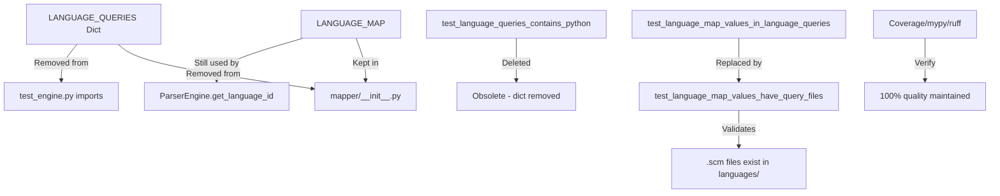

I have created the following plan after thorough exploration and analysis of the codebase. Follow the below plan verbatim. Trust the files and references. Do not re-verify what's written in the plan. Explore only when absolutely necessary. First implement all the proposed file changes and then I'll review all the changes together at the end.

## Observations

The codebase currently exports `LANGUAGE_QUERIES` from `file:src/codemap/mapper/__init__.py` (lines 13, 22), which is imported and tested in `file:tests/unit/mapper/test_engine.py` (lines 14, 26-29, 38-42). After implementing dynamic query loading from `.scm` files, this dictionary is no longer needed as a public API. The project enforces 100% test coverage (`file:pyproject.toml` line 47), strict mypy typing (line 71), and ruff linting (lines 82-93). No external code (demos, other modules) imports `LANGUAGE_QUERIES` directly.

## Approach

Remove `LANGUAGE_QUERIES` from public exports while preserving `LANGUAGE_MAP` (still needed for extension-to-language mapping). Update tests to validate the new file-based query system instead of the removed dictionary. This completes the polyglot refactor by eliminating hardcoded query strings from the public API, while maintaining backward compatibility for `LANGUAGE_MAP` and all other exports. Verify code quality with existing tooling (pytest coverage, mypy, ruff) to ensure 100% compliance with project standards.

## Implementation Steps

### 1. Remove `LANGUAGE_QUERIES` from Module Exports

**File**: `file:src/codemap/mapper/__init__.py`

Remove `LANGUAGE_QUERIES` from imports and `__all__` list:

- **Line 9**: Remove `LANGUAGE_QUERIES` from the import statement (keep `LANGUAGE_MAP`, `ParserEngine`, `get_supported_languages`)
- **Line 21**: Remove `"LANGUAGE_QUERIES"` from the `__all__` list

**Before**:
```python
from codemap.mapper.engine import (
    LANGUAGE_MAP,
    LANGUAGE_QUERIES,  # ← Remove this
    ParserEngine,
    get_supported_languages,
)

__all__ = [
    "CodeNode",
    "ContentReader",
    "ContentReadError",
    "LANGUAGE_MAP",
    "LANGUAGE_QUERIES",  # ← Remove this
    "ParserEngine",
    "get_supported_languages",
]
```

**After**:
```python
from codemap.mapper.engine import (
    LANGUAGE_MAP,
    ParserEngine,
    get_supported_languages,
)

__all__ = [
    "CodeNode",
    "ContentReader",
    "ContentReadError",
    "LANGUAGE_MAP",
    "ParserEngine",
    "get_supported_languages",
]
```

**Rationale**: `LANGUAGE_QUERIES` is no longer part of the public API since queries are now loaded dynamically from `.scm` files. `LANGUAGE_MAP` remains exported as it's still needed for extension-to-language mapping.

---

### 2. Remove Obsolete Test for `LANGUAGE_QUERIES` Dictionary

**File**: `file:tests/unit/mapper/test_engine.py`

Remove the import and the test that validates the now-removed dictionary:

- **Line 10**: Remove `LANGUAGE_QUERIES` from imports (keep `LANGUAGE_MAP`, `ParserEngine`, `get_supported_languages`)
- **Lines 24-28**: Delete entire `test_language_queries_contains_python()` method

**Before**:
```python
from codemap.mapper.engine import (
    LANGUAGE_MAP,
    LANGUAGE_QUERIES,  # ← Remove this
    ParserEngine,
    get_supported_languages,
)

class TestLanguageConfiguration:
    def test_language_queries_contains_python(self) -> None:  # ← Delete entire method
        """Test LANGUAGE_QUERIES contains python query string."""
        assert "python" in LANGUAGE_QUERIES
        assert isinstance(LANGUAGE_QUERIES["python"], str)
        assert len(LANGUAGE_QUERIES["python"]) > 0
```

**After**:
```python
from codemap.mapper.engine import (
    LANGUAGE_MAP,
    ParserEngine,
    get_supported_languages,
)

class TestLanguageConfiguration:
    # test_language_queries_contains_python removed - dict no longer exists
```

**Rationale**: This test validated the hardcoded `LANGUAGE_QUERIES` dictionary structure, which no longer exists after the refactor to file-based loading.

---

### 3. Update Test to Validate `.scm` File Existence

**File**: `file:tests/unit/mapper/test_engine.py`

Replace `test_language_map_values_in_language_queries()` (lines 36-41) with a new test that verifies `.scm` files exist for each language in `LANGUAGE_MAP`:

**Before**:
```python
def test_language_map_values_in_language_queries(self) -> None:
    """Test all languages in LANGUAGE_MAP have queries in LANGUAGE_QUERIES."""
    for lang_id in LANGUAGE_MAP.values():
        assert lang_id in LANGUAGE_QUERIES, (
            f"Language '{lang_id}' is in LANGUAGE_MAP but not in LANGUAGE_QUERIES"
        )
```

**After**:
```python
def test_language_map_values_have_query_files(self) -> None:
    """Test all languages in LANGUAGE_MAP have corresponding .scm query files."""
    from pathlib import Path
    
    # Locate the languages/ directory relative to the mapper module
    mapper_dir = Path(__file__).parent.parent.parent / "src" / "codemap" / "mapper"
    languages_dir = mapper_dir / "languages"
    
    for lang_id in LANGUAGE_MAP.values():
        query_file = languages_dir / f"{lang_id}.scm"
        assert query_file.exists(), (
            f"Language '{lang_id}' is in LANGUAGE_MAP but query file not found: {query_file}"
        )
        assert query_file.is_file(), (
            f"Query path exists but is not a file: {query_file}"
        )
```

**Rationale**: This test ensures the contract between `LANGUAGE_MAP` and the file-based query system: every language ID in `LANGUAGE_MAP` must have a corresponding `.scm` file in `file:src/codemap/mapper/languages/`. This replaces the old dict-based validation with filesystem-based validation.

**Alternative (if using `importlib.resources`)**: If the GREEN phase implementation uses `importlib.resources` for loading, adjust the path resolution:

```python
def test_language_map_values_have_query_files(self) -> None:
    """Test all languages in LANGUAGE_MAP have corresponding .scm query files."""
    from importlib.resources import files
    
    languages_pkg = files("codemap.mapper.languages")
    
    for lang_id in LANGUAGE_MAP.values():
        query_file = languages_pkg / f"{lang_id}.scm"
        assert query_file.is_file(), (
            f"Language '{lang_id}' is in LANGUAGE_MAP but query file not found: {lang_id}.scm"
        )
```

---

### 4. Verify 100% Test Coverage

Run pytest with coverage reporting to ensure all code paths are tested:

```bash
pytest --cov=src/codemap --cov-report=term-missing --cov-report=html
```

**Expected outcome**: 
- Coverage should remain at 100% (as configured in `file:pyproject.toml` line 47: `fail_under = 100`)
- No missing lines in coverage report
- All tests pass (including the new `test_language_map_values_have_query_files`)

**If coverage drops below 100%**:
- Check if any code in `file:src/codemap/mapper/engine.py` became unreachable after removing `LANGUAGE_QUERIES`
- Verify that `_load_query_from_file()` method (added in GREEN phase) is fully covered by existing tests
- Ensure `get_supported_languages()` directory scanning logic is tested

**Coverage report location**: `htmlcov/index.html` (generated by pytest-cov)

---

### 5. Run Type Checking with mypy

Execute mypy to verify strict type compliance:

```bash
mypy src/codemap
```

**Expected outcome**: 
- No type errors
- All strict mode checks pass (configured in `file:pyproject.toml` lines 71-80)

**Common issues to watch for**:
- If `_load_query_from_file()` uses `importlib.resources`, ensure return type is correctly annotated as `str`
- Verify `get_supported_languages()` still returns `set[str]` after directory scanning changes
- Check that Path operations in the new test have proper type annotations

**If mypy fails**:
- Add missing type annotations
- Use `# type: ignore[specific-error]` with justification comments only if unavoidable
- Ensure all imports have type stubs available

---

### 6. Run Linting with ruff

Execute ruff to ensure code style compliance:

```bash
ruff check src/codemap tests/
ruff format --check src/codemap tests/
```

**Expected outcome**:
- No linting errors
- Code formatting matches project standards (configured in `file:pyproject.toml` lines 82-93)

**Common issues to watch for**:
- Unused imports after removing `LANGUAGE_QUERIES` (ruff will flag these)
- Import sorting (ruff's `I` rule) - ensure imports are alphabetically sorted
- Line length violations (100 char limit per line 83)

**Auto-fix available**: Run `ruff check --fix` and `ruff format` to automatically resolve most issues

---

## Verification Checklist

After completing all steps, verify:

| Check | Command | Expected Result |
|-------|---------|-----------------|
| ✅ Tests pass | `pytest` | All tests green, no failures |
| ✅ Coverage 100% | `pytest --cov` | `fail_under = 100` satisfied |
| ✅ Type checking | `mypy src/codemap` | No errors, strict mode passes |
| ✅ Linting | `ruff check src/ tests/` | No violations |
| ✅ Formatting | `ruff format --check src/ tests/` | No formatting issues |
| ✅ No broken imports | `python -c "from codemap.mapper import *"` | No ImportError |

---

## Summary of Changes



| Component | Action | Rationale |
|-----------|--------|-----------|
| `LANGUAGE_QUERIES` export | ❌ Removed | No longer part of public API (queries loaded from files) |
| `LANGUAGE_MAP` export | ✅ Kept | Still needed for extension-to-language mapping |
| `test_language_queries_contains_python` | ❌ Deleted | Tests removed dictionary |
| `test_language_map_values_in_language_queries` | 🔄 Replaced | Now validates `.scm` file existence |
| Coverage/mypy/ruff | ✅ Verified | Ensures 100% quality standards maintained |