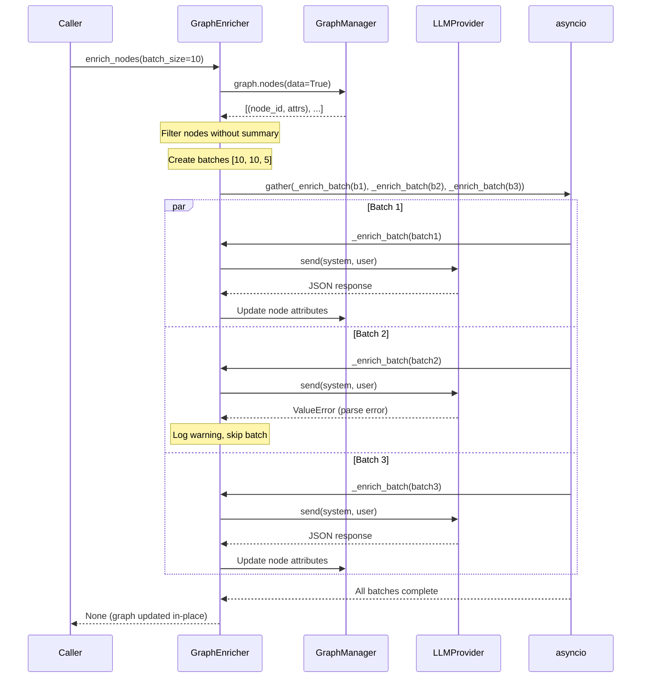

I have created the following plan after thorough exploration and analysis of the codebase. Follow the below plan verbatim. Trust the files and references. Do not re-verify what's written in the plan. Explore only when absolutely necessary. First implement all the proposed file changes and then I'll review all the changes together at the end.

## Observations

The codebase follows strict TDD with 100% coverage requirements. Existing patterns show:
- **DI Pattern**: `MapBuilder` uses constructor injection for components (`FileWalker`, `ContentReader`, `ParserEngine`, `GraphManager`)
- **Async Support**: `LLMProvider` protocol defines async `send()` method; `CerebrasProvider` uses `AsyncOpenAI` with tenacity retry logic
- **Graph Structure**: NetworkX DiGraph stores nodes with attributes (type, name, start_line, end_line); new attributes (summary, risks) will be added dynamically
- **JSON Parsing**: `orjson.loads()` used in `GraphManager.load()` with try/except for `JSONDecodeError`
- **Test Patterns**: pytest-asyncio with `@pytest.mark.asyncio`, `AsyncMock` for mocking async methods, comprehensive docstrings

## Approach

Implement `GraphEnricher` following strict TDD workflow (RED → GREEN → REFACTOR). The enricher will iterate over graph nodes, identify code elements (functions/classes) without summaries, batch them for efficient LLM processing, and update graph attributes with AI-generated insights. Use `asyncio.gather` for parallel batch processing to minimize latency. Robust JSON parsing handles LLM response inconsistencies. Batch-level error isolation ensures partial failures don't block other batches.

---

## Implementation Steps

### **Phase 1: RED - Write Failing Tests**

#### 1.1 Create Test File Structure
Create `file:tests/unit/engine/test_enricher.py` with comprehensive test suite following existing patterns from `file:tests/unit/engine/test_builder.py`.

#### 1.2 Test: `test_enricher_batches_nodes`
**Purpose**: Verify batching logic splits 25 nodes into 3 batches (10+10+5)

**Setup**:
- Create `GraphManager` with 25 code nodes (mix of functions/classes)
- None have `summary` attribute initially
- Mock `LLMProvider` to track batch sizes

**Assertions**:
- Verify LLM provider called exactly 3 times
- First two calls receive 10 nodes each
- Third call receives 5 nodes
- Verify batch content structure (node IDs, names, types)

#### 1.3 Test: `test_enricher_updates_graph`
**Purpose**: Verify graph attributes updated with LLM response

**Setup**:
- Create `GraphManager` with 2 code nodes
- Mock `LLMProvider.send()` to return valid JSON:
  ```json
  [
    {"node_id": "file.py::func1", "summary": "Does X", "risks": ["Risk A"]},
    {"node_id": "file.py::func2", "summary": "Does Y", "risks": ["Risk B", "Risk C"]}
  ]
  ```

**Assertions**:
- Verify `graph.nodes["file.py::func1"]["summary"]` == "Does X"
- Verify `graph.nodes["file.py::func1"]["risks"]` == ["Risk A"]
- Verify `graph.nodes["file.py::func2"]["summary"]` == "Does Y"
- Verify `graph.nodes["file.py::func2"]["risks"]` == ["Risk B", "Risk C"]

#### 1.4 Test: `test_enricher_handles_llm_errors`
**Purpose**: Verify batch failures isolated (other batches succeed)

**Setup**:
- Create `GraphManager` with 25 code nodes (3 batches)
- Mock `LLMProvider.send()` to:
  - Batch 1: Return valid JSON
  - Batch 2: Raise `ValueError` (simulating JSON parse error)
  - Batch 3: Return valid JSON

**Assertions**:
- Verify nodes from batch 1 have `summary` and `risks` attributes
- Verify nodes from batch 2 do NOT have `summary` or `risks` (unchanged)
- Verify nodes from batch 3 have `summary` and `risks` attributes
- Verify no exception propagates to caller

#### 1.5 Additional Edge Case Tests
- `test_enricher_skips_nodes_with_existing_summary`: Nodes with `summary` attribute not re-enriched
- `test_enricher_handles_empty_graph`: No nodes to enrich, no LLM calls
- `test_enricher_handles_invalid_json_response`: LLM returns malformed JSON, logs warning, continues
- `test_enricher_handles_partial_json_response`: LLM returns JSON missing some node IDs, updates available ones
- `test_enricher_custom_batch_size`: Verify `batch_size=5` creates 5 batches from 25 nodes

---

### **Phase 2: GREEN - Implement GraphEnricher**

#### 2.1 Create Implementation File
Create `file:src/codemap/engine/enricher.py` with module docstring following existing patterns.

#### 2.2 Implement `GraphEnricher.__init__`
```python
def __init__(self, graph_manager: GraphManager, llm_provider: LLMProvider) -> None:
```
- Store `graph_manager` and `llm_provider` as instance attributes
- Follow DI pattern from `MapBuilder`
- Add comprehensive docstring with Args, Example sections

#### 2.3 Implement `GraphEnricher.enrich_nodes`
```python
async def enrich_nodes(self, batch_size: int = 10) -> None:
```

**Step 1: Collect Unenriched Nodes**
- Iterate `self._graph_manager.graph.nodes(data=True)`
- Filter nodes where:
  - `attrs.get("type") in ["function", "class"]` (exclude "file", "import")
  - `"summary" not in attrs` (not already enriched)
- Collect as list of tuples: `[(node_id, attrs), ...]`

**Step 2: Create Batches**
- Split collected nodes into chunks of `batch_size`
- Use list slicing: `batches = [nodes[i:i+batch_size] for i in range(0, len(nodes), batch_size)]`

**Step 3: Process Batches in Parallel**
- Create coroutines: `tasks = [self._enrich_batch(batch) for batch in batches]`
- Execute with `await asyncio.gather(*tasks, return_exceptions=True)`
- `return_exceptions=True` ensures one batch failure doesn't cancel others

**Step 4: Add Comprehensive Docstring**
- Document async nature, parameters, return value
- Explain batching strategy, parallelization, error handling
- Include usage example

#### 2.4 Implement `GraphEnricher._enrich_batch` (Private Helper)
```python
async def _enrich_batch(self, batch: list[tuple[str, dict]]) -> None:
```

**Step 1: Build Prompt**
- System prompt: "You are a code analysis assistant. Analyze the following code elements and return a JSON array with summary and risks for each."
- User prompt: Format batch as:
  ```
  Analyze these code elements:
  1. node_id: file.py::func1, type: function, name: func1, lines: 10-20
  2. node_id: file.py::Class1, type: class, name: Class1, lines: 25-50
  ...
  
  Return JSON array: [{"node_id": "...", "summary": "...", "risks": ["..."]}]
  ```

**Step 2: Call LLM**
- `response = await self._llm_provider.send(system_prompt, user_prompt)`
- Wrap in try/except to catch LLM errors (ValueError, APIError)

**Step 3: Parse JSON Response**
- Use `orjson.loads(response)` with try/except for `orjson.JSONDecodeError`
- Handle edge cases:
  - LLM wraps JSON in markdown code blocks (```json ... ```)
  - Extra whitespace or newlines
  - Missing fields in JSON objects
- Extract with regex if needed: `re.search(r'\[.*\]', response, re.DOTALL)`

**Step 4: Update Graph Attributes**
- Iterate parsed results
- For each result with valid `node_id`:
  - Verify node exists in graph
  - Update: `self._graph_manager.graph.nodes[node_id]["summary"] = result["summary"]`
  - Update: `self._graph_manager.graph.nodes[node_id]["risks"] = result.get("risks", [])`

**Step 5: Error Handling**
- Log warnings for:
  - JSON parse failures
  - Missing node IDs in response
  - Node IDs in response not found in graph
- Use `logging.getLogger(__name__).warning(...)`
- Do NOT raise exceptions (batch-level isolation)

#### 2.5 Add Logging
- Import `logging` at module level
- Create logger: `logger = logging.getLogger(__name__)`
- Log info: "Enriching {count} nodes in {num_batches} batches"
- Log warnings: "Failed to parse JSON response for batch", "Node ID {node_id} not found in graph"

---

### **Phase 3: REFACTOR - Achieve 100% Coverage**

#### 3.1 Run Tests and Verify Coverage
```bash
pytest tests/unit/engine/test_enricher.py --cov=src/codemap/engine/enricher --cov-report=term-missing
```

#### 3.2 Add Missing Tests
- Test logger calls with `caplog` fixture
- Test regex JSON extraction fallback
- Test empty batch handling
- Test concurrent batch processing (verify asyncio.gather behavior)

#### 3.3 Update Module Exports
Edit `file:src/codemap/engine/__init__.py`:
```python
from codemap.engine.builder import MapBuilder
from codemap.engine.enricher import GraphEnricher

__all__ = [
    "MapBuilder",
    "GraphEnricher",
]
```

#### 3.4 Add Type Hints and Docstrings
- Verify all methods have complete type hints
- Ensure docstrings follow Google style (Args, Returns, Raises, Example)
- Add module-level docstring explaining enricher purpose

#### 3.5 Code Quality Checks
```bash
ruff check src/codemap/engine/enricher.py
mypy src/codemap/engine/enricher.py
```

#### 3.6 Integration Test (Optional Enhancement)
Create `test_enricher_integration` in test file:
- Build real graph with `MapBuilder`
- Use `MockProvider` to return deterministic JSON
- Verify end-to-end enrichment workflow
- Assert all function/class nodes have summary and risks

---

## Key Design Decisions

### Batching Strategy
- **Default batch_size=10**: Balances token usage (LLMs have context limits) and API call efficiency
- **Configurable**: Allow callers to adjust based on model capabilities (e.g., batch_size=20 for larger context models)

### Parallelization with asyncio.gather
- **Why**: Minimize total enrichment time by processing batches concurrently
- **return_exceptions=True**: Critical for batch isolation—one failure doesn't cancel others
- **Trade-off**: Higher memory usage (all batches in flight) vs. faster completion

### Robust JSON Parsing
- **Challenge**: LLMs often return JSON wrapped in markdown (```json ... ```) or with extra text
- **Solution**: Multi-stage parsing:
  1. Try direct `orjson.loads(response)`
  2. If fails, extract JSON with regex: `re.search(r'\[.*\]', response, re.DOTALL)`
  3. If still fails, log warning and skip batch
- **Validation**: Check each result has required fields (`node_id`, `summary`)

### Error Isolation
- **Batch-level**: Failures in one batch don't affect others (asyncio.gather with return_exceptions)
- **Node-level**: Missing node IDs in response don't block other nodes in same batch
- **Logging**: All errors logged as warnings for debugging, but execution continues

### Graph Attribute Updates
- **In-place**: Directly modify `graph.nodes[node_id]["summary"]` (NetworkX supports dynamic attributes)
- **No validation**: Assume LLM responses are reasonable (summary is string, risks is list)
- **Idempotent**: Re-running enricher on same graph skips already-enriched nodes

---

## Testing Strategy

### Test Organization
```
tests/unit/engine/test_enricher.py
├── TestGraphEnricherInitialization
│   ├── test_enricher_instantiates_with_dependencies
│   └── test_enricher_stores_graph_manager_and_llm_provider
├── TestEnrichNodesBatching
│   ├── test_enricher_batches_nodes (25 → 10+10+5)
│   ├── test_enricher_custom_batch_size (25 → 5x5)
│   └── test_enricher_handles_partial_batch (23 → 10+10+3)
├── TestEnrichNodesGraphUpdates
│   ├── test_enricher_updates_graph (verify attributes set)
│   ├── test_enricher_skips_existing_summary
│   └── test_enricher_handles_empty_graph
├── TestEnrichNodesErrorHandling
│   ├── test_enricher_handles_llm_errors (batch isolation)
│   ├── test_enricher_handles_invalid_json
│   ├── test_enricher_handles_partial_json_response
│   └── test_enricher_handles_missing_node_ids
└── TestEnrichNodesIntegration
    └── test_enricher_end_to_end_workflow
```

### Mock Patterns
- **LLMProvider**: Use `AsyncMock` for `send()` method
- **Return Values**: Configure `side_effect` for different batch responses
- **Assertions**: Verify call count, call arguments, graph attribute updates

---

## Sequence Diagram



---

## Files to Create/Modify

| File | Action | Description |
|------|--------|-------------|
| `file:tests/unit/engine/test_enricher.py` | **CREATE** | Comprehensive test suite (RED phase) |
| `file:src/codemap/engine/enricher.py` | **CREATE** | GraphEnricher implementation (GREEN phase) |
| `file:src/codemap/engine/__init__.py` | **MODIFY** | Add GraphEnricher to exports (REFACTOR phase) |

---

## Dependencies Required

All dependencies already available in `requirements-dev.txt`:
- `orjson>=3.9.0` - JSON parsing
- `openai>=1.0.0` - LLM provider (AsyncOpenAI)
- `tenacity` - Retry logic (already in CerebrasProvider)
- `pytest-asyncio` - Async test support
- `networkx>=3.0.0` - Graph management

---

## Success Criteria

✅ All tests pass (RED → GREEN)  
✅ 100% code coverage on `file:src/codemap/engine/enricher.py`  
✅ `ruff check` passes (no linting errors)  
✅ `mypy` passes (strict type checking)  
✅ GraphEnricher exported from `file:src/codemap/engine/__init__.py`  
✅ Docstrings follow Google style with comprehensive examples  
✅ Batch processing uses `asyncio.gather` for parallelization  
✅ Robust JSON parsing handles LLM response variations  
✅ Error isolation ensures partial failures don't block enrichment