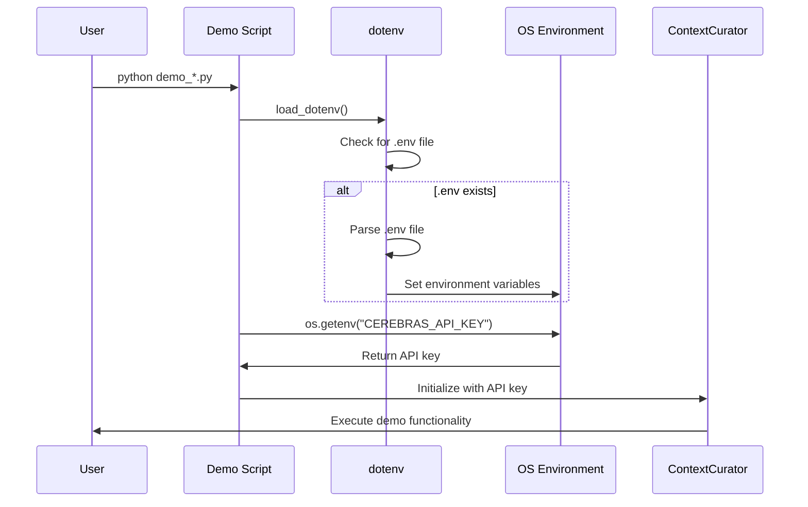

I have created the following plan after thorough exploration and analysis of the codebase. Follow the below plan verbatim. Trust the files and references. Do not re-verify what's written in the plan. Explore only when absolutely necessary. First implement all the proposed file changes and then I'll review all the changes together at the end.

## Observations

The codebase is a Python project called ContextCurator with a clean structure following TDD practices. It has 5 demo scripts in the root directory that currently require manual environment variable setup for API keys (specifically `CEREBRAS_API_KEY`). The `requirements-dev.txt` file is well-organized with sections for Core Dependencies, TDD/QA Tools, and Documentation. The `.gitignore` file exists but lacks entries for environment files. No `.env.example` template exists yet.

## Approach

The implementation follows a developer-friendly pattern: add the `python-dotenv` dependency, secure environment files via `.gitignore`, provide a template via `.env.example`, and integrate automatic `.env` loading into all demo scripts. This enables developers to run demos with `python demo_*.py` without manual environment variable exports. The dotenv import will be placed after standard library imports but before project-specific imports, maintaining clean separation of concerns.

## Implementation Steps

### 1. Add python-dotenv Dependency

**File**: `file:requirements-dev.txt`

Add `python-dotenv` to the TDD/QA Tools section (after line 16, before line 17):

```
# TDD/QA Tools
pytest
pytest-cov
pytest-sugar
pytest-asyncio
python-dotenv
ruff
mypy
types-networkx
```

**Rationale**: Placing it in TDD/QA Tools section makes sense as it's a development convenience tool, though it could also fit in Core Dependencies. The current placement keeps it with other developer experience tools.

---

### 2. Secure Environment Files in .gitignore

**File**: `file:.gitignore`

Add a new section after line 42 (after "# Demo output") and before the final blank line:

```
# Demo output
output/

# Environment Variables
.env
.env.local
```

**Rationale**: Creates a dedicated section for environment files, preventing accidental commits of sensitive API keys. Both `.env` (standard) and `.env.local` (local overrides) are excluded.

---

### 3. Create Environment Template

**File**: `file:.env.example` (new file in root directory)

Create this file with the following content:

```
# API Keys for ContextCurator
# Copy this file to .env and fill in your keys

CEREBRAS_API_KEY="csk-..."
```

**Rationale**: Provides clear documentation for developers on what environment variables are needed. The `csk-...` placeholder indicates the expected key format.

---

### 4. Update Demo Scripts with dotenv Loading

Update all 5 demo scripts following the same pattern. Insert the dotenv import and load call after standard library imports but before the `sys.path.append` line.

#### 4.1 demo_enrichment.py

**File**: `file:demo_enrichment.py`

Insert after line 4 (after `from pathlib import Path`):

```python
from dotenv import load_dotenv

# Load environment variables from .env file if present
load_dotenv()
```

The import section will become:
```python
import asyncio
import sys
import time
from pathlib import Path
from dotenv import load_dotenv

# Load environment variables from .env file if present
load_dotenv()

# Pfad-Setup
sys.path.append(str(Path.cwd() / "src"))
```

---

#### 4.2 demo_advisor.py

**File**: `file:demo_advisor.py`

Insert after line 4 (after `from pathlib import Path`):

```python
from dotenv import load_dotenv

# Load environment variables from .env file if present
load_dotenv()
```

---

#### 4.3 demo_full_scan.py

**File**: `file:demo_full_scan.py`

Insert after line 4 (after `from pathlib import Path`):

```python
from dotenv import load_dotenv

# Load environment variables from .env file if present
load_dotenv()
```

---

#### 4.4 demo_builder.py

**File**: `file:demo_builder.py`

Insert after line 4 (after `from pathlib import Path`):

```python
from dotenv import load_dotenv

# Load environment variables from .env file if present
load_dotenv()
```

---

#### 4.5 demo_tree.py

**File**: `file:demo_tree.py`

Insert after line 3 (after `from pathlib import Path`):

```python
from dotenv import load_dotenv

# Load environment variables from .env file if present
load_dotenv()
```

---

## Verification Steps

After implementation, verify the changes:

1. **Install dependency**: Run `pip install -r requirements-dev.txt` to install `python-dotenv`
2. **Create local .env**: Copy `.env.example` to `.env` and add a real API key
3. **Test demo script**: Run `python demo_tree.py` (simplest demo) without exporting environment variables
4. **Verify .gitignore**: Run `git status` to confirm `.env` is not tracked
5. **Test with API**: Run `python demo_advisor.py` to verify the API key is loaded correctly

## Architecture Overview



## File Modification Summary

| File | Action | Lines Affected |
|------|--------|----------------|
| `file:requirements-dev.txt` | Add dependency | Insert after line 16 |
| `file:.gitignore` | Add exclusions | Insert after line 42 |
| `file:.env.example` | Create new file | N/A (new file) |
| `file:demo_enrichment.py` | Add dotenv loading | Insert after line 4 |
| `file:demo_advisor.py` | Add dotenv loading | Insert after line 4 |
| `file:demo_full_scan.py` | Add dotenv loading | Insert after line 4 |
| `file:demo_builder.py` | Add dotenv loading | Insert after line 4 |
| `file:demo_tree.py` | Add dotenv loading | Insert after line 3 |