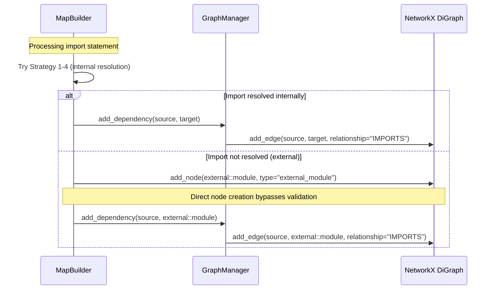

I have created the following plan after thorough exploration and analysis of the codebase. Follow the below plan verbatim. Trust the files and references. Do not re-verify what's written in the plan. Explore only when absolutely necessary. First implement all the proposed file changes and then I'll review all the changes together at the end.

## Observations

The `_resolve_and_add_import()` method in `file:src/codemap/engine/builder.py` currently implements 4 resolution strategies for imports (same-directory, dotted path, package __init__ in same dir, package __init__ from root). When none succeed, it silently skips the import (line 268-269). The `GraphManager.add_dependency()` requires both source and target nodes to exist, throwing `ValueError` otherwise. Current tests verify that external imports like `os`, `pathlib`, and `pytest` are silently skipped with no edges created.

## Approach

Modify `_resolve_and_add_import()` to create virtual external module nodes instead of silently skipping unresolved imports. After all 4 resolution strategies fail, create a node with ID `external::{module_name}` and `type="external_module"`, then add an IMPORTS edge. This treats external dependencies as first-class graph entities, enabling dependency analysis and visualization. The implementation directly uses `self._graph.graph.add_node()` to create the external node before calling `add_dependency()`, avoiding the need for lazy node creation in this phase.

## Implementation Steps

### 1. Modify `_resolve_and_add_import()` fallback behavior

In `file:src/codemap/engine/builder.py`, replace the silent skip at line 268-269 with external node creation logic:

**Location**: After line 266 (after the last resolution strategy fails)

**Changes**:
- Remove or replace the comment "Import could not be resolved - silently skip"
- Create external node ID using format `external::{import_name}`
- Add node to graph using `self._graph.graph.add_node()` with attributes:
  - `type="external_module"`
  - `name=import_name`
- Call `self._graph.add_dependency(source_file_id, external_node_id)` to create IMPORTS edge

**Implementation details**:
```
# After line 266, replace lines 268-269 with:

# Strategy 4 failed - treat as external module
external_node_id = f"external::{import_name}"

# Create external module node if it doesn't exist yet
if external_node_id not in self._graph.graph.nodes:
    self._graph.graph.add_node(
        external_node_id,
        type="external_module",
        name=import_name,
    )

# Add IMPORTS edge from source file to external module
self._graph.add_dependency(source_file_id, external_node_id)
```

### 2. Update method docstring

Update the docstring of `_resolve_and_add_import()` (lines 197-235) to reflect the new behavior:

**Changes to "Limitations" section** (lines 230-235):
- Remove "External stdlib/third-party modules are silently skipped"
- Add "External stdlib/third-party modules are added as virtual nodes with ID format `external::{module_name}` and type `external_module`"
- Update "Only resolves imports to files already in the graph" to "Resolves imports to files in the graph, or creates external module nodes for unresolved imports"

**Add new section** after "Limitations":
```
External Module Handling:
    When an import cannot be resolved to a file in the project, it is treated
    as an external dependency (stdlib or third-party package). A virtual node
    is created with:
    - Node ID: "external::{module_name}" (e.g., "external::os")
    - Attribute type: "external_module"
    - Attribute name: module name string
    An IMPORTS edge is added from the source file to this external node.
```

### 3. Verify no logging changes needed

Confirm that no warning/error logging is added for external modules, as specified in the task ("Keine Warnungen/Fehler für externe Module loggen"). The current implementation at line 268-269 has no logging, and the new implementation should maintain this behavior.

## Architecture Diagram



## Impact Summary

| Component | Change Type | Description |
|-----------|-------------|-------------|
| `_resolve_and_add_import()` | Logic modification | Add external node creation after failed resolution |
| Method docstring | Documentation | Update to reflect external module handling |
| Graph structure | Schema extension | New node type `external_module` with ID prefix `external::` |
| Edge semantics | No change | IMPORTS edges work identically for internal and external targets |