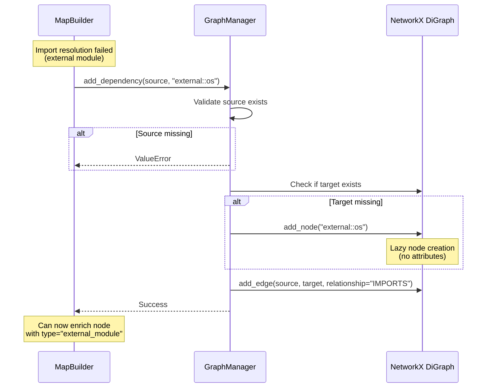

I have created the following plan after thorough exploration and analysis of the codebase. Follow the below plan verbatim. Trust the files and references. Do not re-verify what's written in the plan. Explore only when absolutely necessary. First implement all the proposed file changes and then I'll review all the changes together at the end.

## Observations

The `GraphManager.add_dependency()` method (lines 183-214 in `file:src/codemap/graph/manager.py`) currently validates that both source and target nodes exist before creating an IMPORTS edge, raising `ValueError` if either is missing. This strict validation blocks the builder from creating edges to external module nodes without pre-creating them via direct NetworkX access (`self._graph.graph.add_node()`), breaking encapsulation. Test coverage includes `test_add_dependency_without_target_node` (line 271-277 in `file:tests/unit/graph/test_manager.py`) which expects ValueError for missing targets—this test will need updating by the subsequent phase team.

## Approach

Implement lazy node creation in `add_dependency()` by removing target validation and automatically creating missing target nodes with minimal attributes (just the node ID). This allows the builder to call `add_dependency()` for external modules without pre-creating nodes, maintaining proper encapsulation. Source validation remains to ensure the importing file exists. The lazy-created nodes have no `type` attribute initially, allowing callers to set attributes later if needed. This approach aligns with the builder's external module handling while keeping the GraphManager API flexible for other use cases.

## Implementation Steps

### 1. Remove target node validation in `add_dependency()`

**Location**: `file:src/codemap/graph/manager.py`, lines 211-212

**Changes**:
- Delete lines 211-212 that raise `ValueError` for missing target nodes
- Remove the validation check entirely

**Before**:
```python
if target_file_id not in self._graph.nodes:
    raise ValueError(f"Target node '{target_file_id}' not found in graph")
```

**After**: (delete these lines)

---

### 2. Add lazy node creation logic

**Location**: `file:src/codemap/graph/manager.py`, after line 209 (after source validation)

**Changes**:
- Add conditional check: if target node doesn't exist, create it
- Use `self._graph.add_node(target_file_id)` with no attributes
- This creates a minimal node that can be enriched later

**Implementation**:
```python
# After line 209, add:

# Create target node lazily if it doesn't exist
if target_file_id not in self._graph.nodes:
    self._graph.add_node(target_file_id)
```

---

### 3. Update `add_dependency()` docstring

**Location**: `file:src/codemap/graph/manager.py`, lines 183-214

**Changes to existing sections**:

**Line 184-187** (method description):
- Change: "Creates a directed edge from source to target with relationship='IMPORTS'."
- To: "Creates a directed edge from source to target with relationship='IMPORTS'. If the target node does not exist, it is created automatically with no attributes."

**Lines 196-198** (Raises section):
- Remove: "ValueError: If target_file_id does not exist in graph."
- Keep: "ValueError: If source_file_id does not exist in graph."

**Add new section** after line 198 (before "Returns"):
```
Lazy Node Creation:
    If target_file_id does not exist in the graph, a minimal node is created
    automatically with only the node ID. This allows adding dependencies to
    external modules or forward references without pre-creating nodes. The
    caller can later enrich the node with attributes (e.g., type, name) using
    direct graph access or by calling add_file().
```

**Update Example section** (lines 200-206):
- Add comment showing lazy creation behavior:
```python
>>> manager = GraphManager()
>>> manager.add_file(FileEntry(Path("src/main.py"), 512, 128))
>>> # Target node doesn't exist yet - will be created lazily
>>> manager.add_dependency("src/main.py", "external::os")
>>> "external::os" in manager.graph.nodes
True
>>> manager.graph.edges["src/main.py", "external::os"]["relationship"]
'IMPORTS'
```

---

### 4. Verify no other methods are affected

**Action**: Review other methods in `GraphManager` to ensure they don't rely on the removed target validation

**Methods to check**:
- `add_node()` (lines 139-181): Uses parent validation, not affected
- `add_file()` (lines 113-137): No dependencies on `add_dependency()`, not affected
- `save()` and `load()` (lines 216-290): Work with any graph structure, not affected

**Conclusion**: No other methods require changes

---

## Architecture Diagram



---

## Impact Summary

| Component | Change Type | Description |
|-----------|-------------|-------------|
| `add_dependency()` logic | Behavior change | Removes target validation, adds lazy node creation |
| `add_dependency()` docstring | Documentation | Updated to reflect lazy creation behavior |
| Source validation | No change | Still raises ValueError if source doesn't exist |
| Edge creation | No change | IMPORTS edges created identically |
| Node attributes | New behavior | Lazy-created nodes have no attributes initially |
| Test `test_add_dependency_without_target_node` | Will break | Expects ValueError, now succeeds (subsequent phase will fix) |
| Other GraphManager methods | No change | No dependencies on removed validation |
| Builder encapsulation | Improvement | No longer needs direct `_graph` access for external nodes |