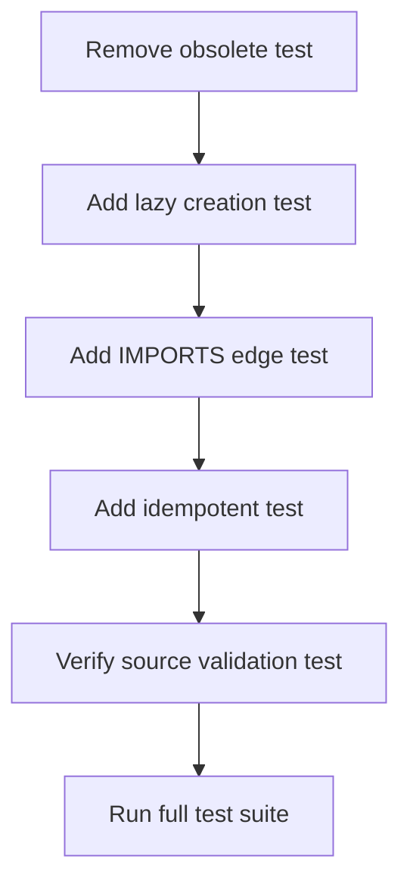

I have created the following plan after thorough exploration and analysis of the codebase. Follow the below plan verbatim. Trust the files and references. Do not re-verify what's written in the plan. Explore only when absolutely necessary. First implement all the proposed file changes and then I'll review all the changes together at the end.

## Observations

The `GraphManager.add_dependency()` method has been updated to support lazy target node creation, but `test_manager.py` still contains a test (`test_add_dependency_without_target_node`, lines 271-277) that expects a `ValueError` when the target node doesn't exist. This test will now fail. Additionally, no tests currently verify the new lazy creation behavior—that missing target nodes are automatically created with minimal attributes and that IMPORTS edges are correctly established. The source node validation test (`test_add_dependency_without_source_node`, lines 263-269) remains valid and should continue to pass.

## Approach

Update `TestGraphManagerHierarchy` class in `file:tests/unit/graph/test_manager.py` by replacing the failing test with three new tests that validate lazy target node creation: (1) verify automatic node creation when target is missing, (2) confirm IMPORTS edge is correctly added to the lazy-created node, and (3) ensure source node validation still raises `ValueError`. This aligns with the updated `add_dependency()` contract in `file:src/codemap/graph/manager.py` (lines 183-214) while maintaining test coverage for error cases.

## Implementation Steps

### 1. Remove Obsolete Test for Missing Target Node

**File**: `file:tests/unit/graph/test_manager.py`

- **Location**: Lines 271-277 in `TestGraphManagerHierarchy` class
- **Action**: Delete `test_add_dependency_without_target_node()` entirely
- **Reason**: This test expects `ValueError` for missing target nodes, which contradicts the new lazy creation behavior

---

### 2. Add Test for Lazy Target Node Creation

**File**: `file:tests/unit/graph/test_manager.py`

- **Location**: After `test_add_dependency_without_source_node()` (around line 269)
- **Test Name**: `test_add_dependency_creates_missing_target_node()`
- **Setup**:
  - Create `GraphManager` instance
  - Add source file node via `add_file()` (e.g., `"src/main.py"`)
  - Do NOT add target file node
- **Action**: Call `add_dependency("src/main.py", "external::os")`
- **Assertions**:
  - Target node `"external::os"` exists in graph: `assert "external::os" in manager.graph.nodes`
  - Target node was created (graph has 2 nodes total): `assert manager.graph.number_of_nodes() == 2`
  - No attributes set on lazy-created node (only node ID): `assert manager.graph.nodes["external::os"] == {}`

---

### 3. Add Test for IMPORTS Edge with Lazy Node

**File**: `file:tests/unit/graph/test_manager.py`

- **Location**: After the test from Step 2
- **Test Name**: `test_add_dependency_with_lazy_node_creates_imports_edge()`
- **Setup**:
  - Create `GraphManager` instance
  - Add source file node via `add_file()` (e.g., `"src/app.py"`)
- **Action**: Call `add_dependency("src/app.py", "external::networkx")`
- **Assertions**:
  - IMPORTS edge exists: `assert manager.graph.has_edge("src/app.py", "external::networkx")`
  - Edge has correct relationship attribute: `assert manager.graph.edges["src/app.py", "external::networkx"]["relationship"] == "IMPORTS"`
  - Graph has 1 edge: `assert manager.graph.number_of_edges() == 1`

---

### 4. Add Test for Idempotent Lazy Node Creation

**File**: `file:tests/unit/graph/test_manager.py`

- **Location**: After the test from Step 3
- **Test Name**: `test_add_dependency_lazy_node_idempotent()`
- **Setup**:
  - Create `GraphManager` instance
  - Add source file node via `add_file()` (e.g., `"src/main.py"`)
- **Action**: 
  - Call `add_dependency("src/main.py", "external::pytest")` twice
- **Assertions**:
  - Only one target node created: `assert manager.graph.number_of_nodes() == 2`
  - Only one IMPORTS edge: `assert manager.graph.number_of_edges() == 1`
  - Target node still exists: `assert "external::pytest" in manager.graph.nodes`

---

### 5. Verify Source Node Validation Still Works

**File**: `file:tests/unit/graph/test_manager.py`

- **Location**: Lines 263-269 (existing test)
- **Test Name**: `test_add_dependency_without_source_node()`
- **Action**: No changes needed
- **Verification**: Confirm this test still passes after implementation
- **Reason**: Source node validation must remain strict per specification

---

## Test Execution Order

---

## Expected Test Coverage

| Scenario | Test Method | Validates |
|----------|-------------|-----------|
| Missing target node → auto-create | `test_add_dependency_creates_missing_target_node` | Lazy node creation with no attributes |
| Lazy node → IMPORTS edge | `test_add_dependency_with_lazy_node_creates_imports_edge` | Edge creation to lazy-created node |
| Duplicate lazy creation | `test_add_dependency_lazy_node_idempotent` | No duplicate nodes/edges |
| Missing source node → error | `test_add_dependency_without_source_node` (existing) | Source validation preserved |