I have created the following plan after thorough exploration and analysis of the codebase. Follow the below plan verbatim. Trust the files and references. Do not re-verify what's written in the plan. Explore only when absolutely necessary. First implement all the proposed file changes and then I'll review all the changes together at the end.

## Observations

The current `file:src/codemap/scout/tree.py` implementation uses `max_depth` parameter (default=2) and returns a string. The test suite in `file:tests/unit/scout/test_tree.py` contains 470 lines with extensive coverage for depth limiting (TestTreeGeneratorMaxDepth class), hidden directory filtering, sorting, and formatting. The `pathspec` library is already available in `file:requirements-dev.txt`. No `models.py` exists yet in the scout module, and this will be the first dataclass in the codebase.

## Approach

Following strict TDD RED phase: First create the TreeReport dataclass model, then rewrite tests to expect TreeReport objects instead of strings, remove all max_depth-related tests, and add new tests for unlimited depth traversal and .gitignore integration. Tests must fail initially since the implementation still returns strings and accepts max_depth parameter. This ensures proper RED-GREEN-REFACTOR cycle adherence with 100% coverage requirement.

## Implementation Steps

### 1. Create TreeReport Dataclass Model

**File:** `file:src/codemap/scout/models.py` (new file)

Create a dataclass with the following structure:
- Import `dataclass` from `dataclasses`
- Define `TreeReport` class with `@dataclass` decorator
- Add four fields with type annotations:
  - `tree_string: str` - The visual tree structure (Unix tree style)
  - `total_files: int` - Count of scanned files
  - `total_folders: int` - Count of scanned folders (directories)
  - `estimated_tokens: int` - Token estimation using formula `len(tree_string) / 3.5` (rounded to int)
- Add docstring explaining the purpose: "Report containing tree visualization and statistics"
- Add field-level docstrings or comments for clarity

**Type Safety:**
- Use strict type annotations for all fields
- Ensure mypy strict mode compatibility
- Consider adding `__post_init__` if token estimation should be calculated automatically

### 2. Rewrite Test Suite for TreeReport

**File:** `file:tests/unit/scout/test_tree.py`

**Import Changes:**
- Add import: `from codemap.scout.models import TreeReport`
- Keep existing imports: `Path`, `pytest`, `TreeGenerator`

**Remove Obsolete Test Classes:**
- Delete entire `TestTreeGeneratorMaxDepth` class (lines 63-138)
  - Includes: `test_generate_respects_max_depth_default`, `test_generate_max_depth_zero`, `test_generate_max_depth_one`, `test_generate_max_depth_three`
- Remove max_depth parameters from all remaining test calls

**Modify TestTreeGeneratorBasic Class:**

Update `test_generate_returns_string` → rename to `test_generate_returns_tree_report`:
- Change assertion from `isinstance(result, str)` to `isinstance(result, TreeReport)`
- Add assertion: `assert isinstance(result.tree_string, str)`
- Add assertion: `assert result.total_files >= 0`
- Add assertion: `assert result.total_folders >= 0`

Update `test_generate_empty_directory`:
- Change result access from `result` to `result.tree_string`
- Add assertions: `assert result.total_files == 0` and `assert result.total_folders == 0`
- Verify `tmp_path.name` appears in `result.tree_string`

Update `test_generate_single_file`:
- Change string checks to use `result.tree_string`
- Add assertion: `assert result.total_files == 1`
- Add assertion: `assert result.total_folders == 0`
- Verify "README.md" in `result.tree_string`

Update `test_generate_single_directory`:
- Change string checks to use `result.tree_string`
- Add assertion: `assert result.total_files == 0`
- Add assertion: `assert result.total_folders == 1`
- Verify "src/" in `result.tree_string`

**Add New Test: test_returns_report_object (Test A from requirements):**
- Create temp structure with exactly 3 files (e.g., `file1.py`, `file2.py`, `file3.py`)
- Call `generator.generate(tmp_path)` (no max_depth parameter)
- Assert `isinstance(result, TreeReport)`
- Assert `result.total_files == 3`
- Assert `result.total_folders == 0`
- Assert all three filenames appear in `result.tree_string`
- Assert `result.estimated_tokens > 0`

**Add New Test: test_deep_nesting (Test B from requirements):**
- Create deep nested structure: 10 levels deep (e.g., `a/b/c/d/e/f/g/h/i/j/deep_file.py`)
- Use loop to create nested directories programmatically
- Call `generator.generate(tmp_path)` (no max_depth parameter)
- Assert `"deep_file.py" in result.tree_string` (proves no depth limit)
- Assert `result.total_files == 1`
- Assert `result.total_folders == 10`
- Verify all intermediate folder names appear in tree_string

**Add New Test: test_respects_gitignore (Test C from requirements):**
- Create `.gitignore` file with content: `*.txt\n`
- Create `secret.txt` file with content
- Create `allowed.py` file with content
- Call `generator.generate(tmp_path)`
- Assert `"secret.txt" not in result.tree_string` (gitignore rule applied)
- Assert `"allowed.py" in result.tree_string` (not ignored)
- Assert `result.total_files == 1` (only allowed.py counted)
- Assert `.gitignore` itself is not in tree_string (meta-file)

**Add New Test: test_gitignore_directory_pattern:**
- Create `.gitignore` with content: `node_modules/\n`
- Create `node_modules/` directory with `package.json` inside
- Create `src/` directory with `main.py` inside
- Call `generator.generate(tmp_path)`
- Assert `"node_modules" not in result.tree_string`
- Assert `"package.json" not in result.tree_string`
- Assert `"src/" in result.tree_string`
- Assert `"main.py" in result.tree_string`

**Update TestTreeGeneratorIgnoreHidden Class:**
- Remove all `max_depth=5` parameters from test calls
- Update all string assertions to use `result.tree_string`
- Tests remain: `test_generate_ignores_git_directory`, `test_generate_ignores_venv_directory`, `test_generate_ignores_pycache_directory`, `test_generate_ignores_multiple_hidden`

**Update TestTreeGeneratorSorting Class:**
- Remove max_depth parameters
- Update all string operations to use `result.tree_string`
- Keep sorting verification logic intact
- Tests remain: `test_generate_sorts_files_alphabetically`, `test_generate_sorts_directories_alphabetically`, `test_generate_sorts_mixed_deterministically`

**Update TestTreeGeneratorFormat Class:**
- Remove all `max_depth` parameters from `generate()` calls
- Update all string assertions to use `result.tree_string`
- In `test_generate_tree_structure_format`: Remove max_depth=2 parameter, adjust expected output to show full depth (helper.py should appear)
- Update `test_generate_uses_tree_symbols` and `test_generate_indentation_consistency` to use `result.tree_string`

**Update TestTreeGeneratorEdgeCases Class:**
- Remove `test_generate_raises_error_for_negative_max_depth` (obsolete)
- Update remaining tests to use `result.tree_string`
- Keep: `test_generate_with_nonexistent_path`, `test_generate_with_file_instead_of_directory`, `test_generate_with_special_characters_in_names`

### 3. Verify RED Phase

**Execute Tests:**
```bash
pytest tests/unit/scout/test_tree.py -v
```

**Expected Failures:**
- All tests expecting `TreeReport` will fail with `AttributeError` (TreeReport not defined yet or not imported)
- Tests calling `generate()` without max_depth will fail if implementation still requires it
- Tests checking `.gitignore` behavior will fail (pathspec not integrated)
- Tests checking deep nesting will fail if depth limits still exist

**Verification Checklist:**
- [ ] At least 15+ test failures
- [ ] Import errors for `TreeReport`
- [ ] Type mismatches (expecting TreeReport, getting str)
- [ ] Missing .gitignore functionality
- [ ] Deep nesting tests fail due to depth limits

### 4. Documentation Updates

**File:** `file:src/codemap/scout/models.py`
- Add module-level docstring explaining TreeReport purpose
- Document token estimation formula rationale
- Add usage example in docstring

**File:** `file:tests/unit/scout/test_tree.py`
- Update module docstring to reflect new TreeReport-based testing
- Add comments explaining .gitignore test scenarios
- Document deep nesting test rationale (proving no artificial limits)

## Test Structure Overview

```mermaid
graph TD
    A[TestTreeGeneratorBasic] --> B[test_generate_returns_tree_report]
    A --> C[test_generate_empty_directory]
    A --> D[test_generate_single_file]
    A --> E[test_generate_single_directory]
    A --> F[test_returns_report_object - NEW]
    A --> G[test_deep_nesting - NEW]
    A --> H[test_respects_gitignore - NEW]
    A --> I[test_gitignore_directory_pattern - NEW]
    
    J[TestTreeGeneratorIgnoreHidden] --> K[Hidden dir tests - UPDATED]
    
    L[TestTreeGeneratorSorting] --> M[Sorting tests - UPDATED]
    
    N[TestTreeGeneratorFormat] --> O[Format tests - UPDATED]
    
    P[TestTreeGeneratorEdgeCases] --> Q[Edge case tests - UPDATED]
    
    R[REMOVED] --> S[TestTreeGeneratorMaxDepth - DELETED]
    R --> T[test_negative_max_depth - DELETED]
```



## Key Files Modified

| File | Action | Purpose |
|------|--------|---------|
| `file:src/codemap/scout/models.py` | CREATE | Define TreeReport dataclass |
| `file:tests/unit/scout/test_tree.py` | MODIFY | Rewrite tests for TreeReport, remove max_depth tests, add gitignore tests |

## Deterministic Testing Requirements

- **Alphabetical Sorting:** All tests must verify deterministic ordering (already present, maintain)
- **Fixture Usage:** Use `tmp_path` fixture for isolated test environments
- **Explicit Counts:** Assert exact file/folder counts in TreeReport
- **String Containment:** Verify specific filenames appear in tree_string
- **Negative Assertions:** Verify ignored files/folders do NOT appear

## Coverage Targets

- TreeReport dataclass: 100% (all fields accessed in tests)
- Test modifications: Maintain 100% coverage of TreeGenerator
- New gitignore tests: Cover pathspec integration paths
- Deep nesting test: Prove unlimited depth traversal