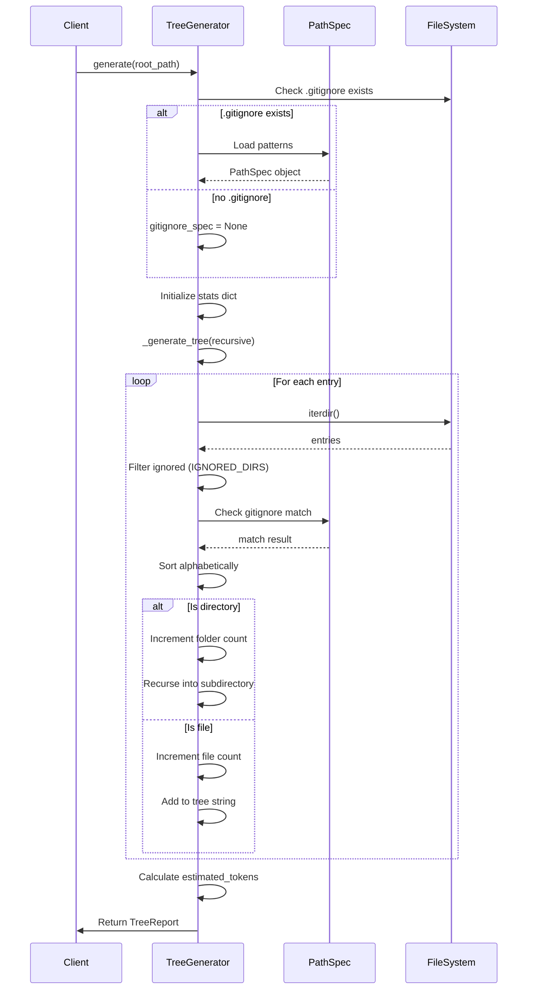

I have created the following plan after thorough exploration and analysis of the codebase. Follow the below plan verbatim. Trust the files and references. Do not re-verify what's written in the plan. Explore only when absolutely necessary. First implement all the proposed file changes and then I'll review all the changes together at the end.

## Observations

The current `file:src/codemap/scout/tree.py` uses a recursive `_generate_tree()` helper with `max_depth` parameter (default=2) and returns a plain string. The implementation already has good foundations: alphabetical sorting (case-insensitive), hardcoded ignore list (`IGNORED_DIRS`), and tree symbols (`BRANCH`, `LAST_BRANCH`, `VERTICAL`, `SPACE`). The `file:src/codemap/scout/models.py` is empty and needs the `TreeReport` dataclass. The `pathspec` library is available in `file:requirements-dev.txt` for `.gitignore` parsing. Tests in `file:tests/unit/scout/test_tree.py` have been updated (RED phase) to expect `TreeReport` objects with statistics and gitignore support.

## Approach

Implement the GREEN phase by creating the `TreeReport` dataclass with automatic token estimation, then refactoring `TreeGenerator` to remove all depth limits, integrate `pathspec` for `.gitignore` parsing, and track statistics during traversal. The key is to maintain the existing recursive structure while adding counters for files/folders, loading `.gitignore` rules at initialization, and wrapping the final string output in a `TreeReport` object. This ensures all updated tests pass while preserving deterministic sorting and formatting behavior.

## Implementation Steps

### 1. Implement TreeReport Dataclass

**File:** `file:src/codemap/scout/models.py`

Create a dataclass to encapsulate tree generation results:

- Import `dataclass` from `dataclasses`
- Define `TreeReport` class with `@dataclass` decorator
- Add four fields with strict type annotations:
  - `tree_string: str` - The visual tree structure
  - `total_files: int` - Count of files scanned
  - `total_folders: int` - Count of directories scanned
  - `estimated_tokens: int` - Token estimate calculated as `int(len(tree_string) / 3.5)`
- Add module docstring: "Data models for scout module tree generation"
- Add class docstring: "Report containing tree visualization and statistics from directory traversal"
- Consider using `field(init=False)` for `estimated_tokens` with `__post_init__` to auto-calculate from `tree_string`, OR accept it as a regular parameter (simpler for the generator to calculate)
- Ensure mypy strict mode compatibility with explicit types

**Type Safety Considerations:**
- All fields must have explicit type annotations
- No `Any` types allowed (strict mypy)
- Consider adding `frozen=True` if immutability is desired

---

### 2. Refactor TreeGenerator to Return TreeReport

**File:** `file:src/codemap/scout/tree.py`

#### 2.1 Update Imports

- Add: `from pathlib import Path` (already present)
- Add: `from typing import Optional`
- Add: `import pathspec`
- Add: `from codemap.scout.models import TreeReport`

#### 2.2 Modify TreeGenerator Class

**Update `__init__` method:**
- Change signature to: `def __init__(self) -> None:`
- Keep initialization minimal (no state needed)

**Refactor `generate` method:**
- **Remove** `max_depth` parameter entirely
- Change signature to: `def generate(self, root_path: Path) -> TreeReport`
- Update docstring to reflect return type change and removal of depth limiting
- Keep existing validation (path exists, is directory)
- **Remove** `max_depth < 0` validation (obsolete)
- Initialize counters: `file_count = 0`, `folder_count = 0`
- Load `.gitignore` rules using `pathspec` (see section 2.3)
- Build tree string using modified `_generate_tree()` (see section 2.4)
- Calculate `estimated_tokens = int(len(tree_string) / 3.5)`
- Return `TreeReport(tree_string=tree_string, total_files=file_count, total_folders=folder_count, estimated_tokens=estimated_tokens)`

#### 2.3 Integrate pathspec for .gitignore

**Add new method `_load_gitignore`:**
```python
def _load_gitignore(self, root_path: Path) -> Optional[pathspec.PathSpec]:
    """Load .gitignore patterns from root directory.
    
    Args:
        root_path: Root directory to check for .gitignore
        
    Returns:
        PathSpec object if .gitignore exists, None otherwise
    """
```

- Check if `root_path / ".gitignore"` exists
- If exists: read file, parse with `pathspec.PathSpec.from_lines('gitwildmatch', lines)`
- If not exists: return `None`
- Handle file read errors gracefully (return `None` on error)

**Update `_should_ignore` method:**
- Change signature to: `def _should_ignore(self, path: Path, root_path: Path, gitignore_spec: Optional[pathspec.PathSpec]) -> bool:`
- First check: `if path.name in IGNORED_DIRS: return True` (keep existing behavior)
- If `gitignore_spec` is not None:
  - Calculate relative path: `rel_path = path.relative_to(root_path)`
  - Convert to string with forward slashes: `rel_path_str = str(rel_path).replace('\\', '/')`
  - Add trailing slash for directories: `if path.is_dir(): rel_path_str += '/'`
  - Check match: `if gitignore_spec.match_file(rel_path_str): return True`
- Return `False` if no match

**Important:** `.gitignore` file itself should be ignored (add to IGNORED_DIRS or handle specially)

#### 2.4 Remove Depth Limiting and Add Statistics Tracking

**Refactor `_generate_tree` method:**
- **Remove** `max_depth` parameter from signature
- Change signature to: `def _generate_tree(self, path: Path, prefix: str, root_path: Path, gitignore_spec: Optional[pathspec.PathSpec], stats: dict[str, int]) -> list[str]:`
- Add `stats` parameter as mutable dict with keys `'files'` and `'folders'` for tracking counts
- **Remove** all depth checking logic (lines 111-112, 120-125 in current implementation)
- Update `_should_ignore` calls to pass `root_path` and `gitignore_spec`
- When processing directories:
  - Increment `stats['folders'] += 1`
  - Recursively call `_generate_tree` with updated parameters
- When processing files:
  - Increment `stats['files'] += 1`
  - Add to result list (no depth check)
- Keep alphabetical sorting: `entries = sorted(entries, key=lambda p: p.name.lower())`
- Keep tree symbol logic (BRANCH, LAST_BRANCH, VERTICAL, SPACE)

**Update `generate` method to use refactored `_generate_tree`:**
- Initialize stats dict: `stats = {'files': 0, 'folders': 0}`
- Load gitignore: `gitignore_spec = self._load_gitignore(root_path)`
- Call `_generate_tree(root_path, "", root_path, gitignore_spec, stats)`
- Extract counts: `file_count = stats['files']`, `folder_count = stats['folders']`

---

### 3. Update Module Exports

**File:** `file:src/codemap/scout/__init__.py`

- Add import: `from codemap.scout.models import TreeReport`
- Update `__all__` to: `__all__ = ["TreeGenerator", "TreeReport"]`
- Update module docstring if needed to mention TreeReport

---

### 4. Handle Edge Cases

**Considerations for robust implementation:**

- **Circular symlinks:** Use `Path.iterdir()` which doesn't follow symlinks by default (safe)
- **Permission errors:** Wrap `path.iterdir()` in try-except to handle `PermissionError`, skip inaccessible directories
- **Empty directories:** Already handled (empty list from iterdir)
- **Large trees:** Use list comprehension and string joining (already efficient)
- **.gitignore syntax:** `pathspec` handles standard gitignore patterns (wildcards, negation, directory-specific)
- **Missing .gitignore:** Handled by returning `None` from `_load_gitignore`

---

### 5. Verification Steps

**Run tests to ensure GREEN phase:**
```bash
pytest tests/unit/scout/test_tree.py -v
```

**Expected outcomes:**
- All tests pass (GREEN phase achieved)
- `test_returns_report_object`: Validates TreeReport structure and counts
- `test_deep_nesting`: Proves unlimited depth (10 levels deep)
- `test_respects_gitignore`: Validates pathspec integration for file patterns
- `test_gitignore_directory_pattern`: Validates directory exclusion
- All existing tests (sorting, formatting, hidden dirs) pass with TreeReport

**Quick validation:**
```bash
# Should pass with 100% coverage
pytest tests/unit/scout/test_tree.py --cov=src/codemap/scout --cov-report=term-missing
```

---

## Implementation Flow



---

## Key Files Modified

| File | Action | Lines Changed | Purpose |
|------|--------|---------------|---------|
| `file:src/codemap/scout/models.py` | CREATE | ~20 | Define TreeReport dataclass |
| `file:src/codemap/scout/tree.py` | REFACTOR | ~50-70 | Remove depth limits, add pathspec, return TreeReport |
| `file:src/codemap/scout/__init__.py` | UPDATE | ~2 | Export TreeReport |

---

## Statistics Tracking Strategy

**Approach:** Use mutable dictionary passed through recursive calls

- **Why dict over class attributes:** Avoids state management issues, thread-safe for single call
- **Keys:** `'files'` and `'folders'` for clarity
- **Increment points:**
  - `stats['folders'] += 1` when entering a directory (after ignore check)
  - `stats['files'] += 1` when adding a file to result (after ignore check)
- **Root directory:** Not counted in `total_folders` (only subdirectories)

---

## Token Estimation Formula

**Formula:** `estimated_tokens = int(len(tree_string) / 3.5)`

**Rationale:**
- Average English word: ~4-5 characters
- Tokenizers typically split on whitespace and punctuation
- Tree strings contain paths, symbols, indentation
- Factor of 3.5 is a reasonable heuristic (conservative estimate)
- Cast to `int` for clean reporting

**Alternative:** Could use `math.ceil()` for upper bound, but `int()` (floor) is simpler and sufficient

---

## pathspec Integration Details

**Library:** `pathspec` (already in `file:requirements-dev.txt`)

**Usage pattern:**
```python
import pathspec

# Load .gitignore
with open('.gitignore') as f:
    spec = pathspec.PathSpec.from_lines('gitwildmatch', f)

# Check if path matches
if spec.match_file('node_modules/package.json'):
    # Ignore this file
```

**Key considerations:**
- Use `'gitwildmatch'` pattern style (standard gitignore syntax)
- Convert paths to forward slashes (Windows compatibility)
- Add trailing slash for directories (`node_modules/`)
- Use relative paths from repository root