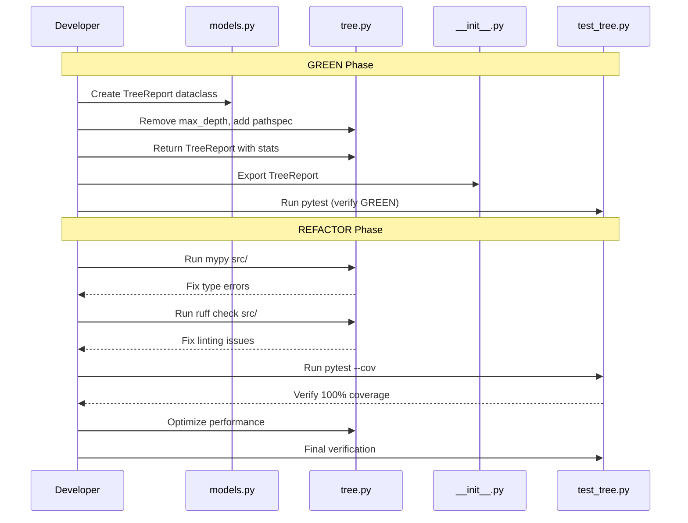

I have created the following plan after thorough exploration and analysis of the codebase. Follow the below plan verbatim. Trust the files and references. Do not re-verify what's written in the plan. Explore only when absolutely necessary. First implement all the proposed file changes and then I'll review all the changes together at the end.

## Observations

The codebase currently contains the **old implementation** with `max_depth` limits. The `file:src/codemap/scout/models.py` is empty, `file:src/codemap/scout/tree.py` still uses the depth-limited approach, and `file:tests/unit/scout/test_tree.py` contains all old tests including `TestTreeGeneratorMaxDepth`. The `pathspec` library is available in `requirements-dev.txt`. No `TreeReport` dataclass exists yet, and the module doesn't export it.

## Approach

Since the GREEN phase implementation is incomplete, this plan covers **both GREEN and REFACTOR phases** in sequence. First, implement the `TreeReport` dataclass and refactor `TreeGenerator` to remove limits, add gitignore support via `pathspec`, and return structured reports. Then, ensure type safety (mypy strict), code quality (ruff), 100% test coverage, proper exports, and performance optimization using list-based string building.

---

## Implementation Steps

### Phase 1: Complete GREEN Phase Implementation

#### 1.1 Create TreeReport Dataclass

**File:** `file:src/codemap/scout/models.py`

- Import `dataclass` from `dataclasses`
- Define `TreeReport` dataclass with four fields:
  - `tree_string: str` - Visual tree structure (Unix tree style)
  - `total_files: int` - Count of scanned files
  - `total_folders: int` - Count of scanned directories
  - `estimated_tokens: int` - Token estimate using formula `int(len(tree_string) / 3.5)`
- Make the dataclass frozen for immutability (optional but recommended for data objects)
- Add docstring explaining each field's purpose

#### 1.2 Refactor TreeGenerator Class

**File:** `file:src/codemap/scout/tree.py`

**Imports:**
- Add `from pathlib import Path`
- Add `import pathspec` for gitignore parsing
- Add `from codemap.scout.models import TreeReport`

**Remove:**
- Delete `max_depth` parameter from `generate()` method signature
- Remove all `max_depth` validation logic (lines 52-54)
- Remove depth-checking logic in `_generate_tree()` (lines 111-112, 120-125)

**Update `generate()` method:**
- Change signature to `generate(self, root_path: Path) -> TreeReport`
- Update docstring to reflect no depth limits and new return type
- Initialize statistics dictionary: `stats = {"files": 0, "folders": 0}`
- Load `.gitignore` if present:
  - Check if `root_path / ".gitignore"` exists
  - Read patterns using `pathspec.PathSpec.from_lines("gitwildmatch", gitignore_lines)`
  - Handle file not found gracefully (set `spec = None`)
- Build tree string using existing list-based approach
- After tree generation, calculate `estimated_tokens = int(len(tree_string) / 3.5)`
- Return `TreeReport(tree_string=tree_string, total_files=stats["files"], total_folders=stats["folders"], estimated_tokens=estimated_tokens)`

**Update `_should_ignore()` method:**
- Add parameter `spec: pathspec.PathSpec | None`
- Keep existing `IGNORED_DIRS` check (`.git`, `.venv`, `__pycache__`)
- Add gitignore check: if `spec` is not None, check `spec.match_file(str(path.relative_to(root)))` where `root` is passed as context
- Ignore `.gitignore` file itself
- Return `True` if any condition matches

**Update `_generate_tree()` method:**
- Add parameters: `spec: pathspec.PathSpec | None`, `root: Path`, `stats: dict[str, int]`
- Remove all `depth` and `max_depth` parameters and logic
- When processing directories: increment `stats["folders"]` and recurse without depth checks
- When processing files: increment `stats["files"]`
- Pass `spec`, `root`, and `stats` to recursive calls
- Maintain alphabetical sorting (case-insensitive) using `sorted(entries, key=lambda p: p.name.lower())`
- Keep tree symbol formatting (`BRANCH`, `LAST_BRANCH`, `VERTICAL`, `SPACE`)

**Error Handling:**
- Keep existing validation for path existence and directory check
- Add try-except around `path.iterdir()` to handle permission errors gracefully (skip inaccessible directories)

#### 1.3 Update Module Exports

**File:** `file:src/codemap/scout/__init__.py`

- Add import: `from codemap.scout.models import TreeReport`
- Update `__all__` list to include both `"TreeGenerator"` and `"TreeReport"`

---

### Phase 2: REFACTOR Phase - Quality Gates

#### 2.1 Type Safety with mypy (Strict Mode)

**Command:** `mypy src/`

**Expected Issues & Fixes:**

- **Missing type annotations:** Ensure all function parameters and return types are annotated
- **pathspec types:** Add `from typing import Optional` and use `Optional[pathspec.PathSpec]` or `pathspec.PathSpec | None` (Python 3.10+ union syntax)
- **dict types:** Change `stats` parameter type to `dict[str, int]` explicitly
- **Path operations:** Ensure `Path.relative_to()` calls are wrapped in try-except for type safety
- **Any types:** Avoid `Any` - use specific types for all variables

**Files to check:**
- `file:src/codemap/scout/models.py` - Ensure dataclass fields are properly typed
- `file:src/codemap/scout/tree.py` - All methods, parameters, and variables must have explicit types
- `file:src/codemap/scout/__init__.py` - Verify imports are typed correctly

#### 2.2 Code Quality with ruff

**Command:** `ruff check src/`

**Expected Issues & Fixes:**

- **Import ordering (I):** Ensure imports are sorted (stdlib → third-party → local)
- **Unused imports (F401):** Remove any unused imports
- **Line length (E501):** Keep lines under 100 characters (configured in `pyproject.toml`)
- **Naming conventions (N):** Ensure constants are UPPER_CASE, classes are PascalCase
- **Whitespace (W):** Fix any trailing whitespace or blank line issues

**Auto-fix:** Run `ruff check --fix src/` to automatically resolve fixable issues

#### 2.3 Test Coverage Verification

**Command:** `pytest --cov=src/codemap --cov-report=term-missing`

**Coverage Requirements:**
- Must achieve **100% coverage** (configured in `pyproject.toml` with `fail_under = 100`)
- All branches must be covered (branch coverage enabled)

**Areas to verify:**
- `TreeReport` dataclass: Covered by instantiation in tests
- `TreeGenerator.generate()`: All code paths (with/without gitignore, empty dirs, errors)
- `TreeGenerator._should_ignore()`: All ignore conditions (IGNORED_DIRS, gitignore patterns, .gitignore file itself)
- `TreeGenerator._generate_tree()`: Recursion, file/folder counting, sorting, formatting
- Error handling: Path validation, permission errors, missing directories

**If coverage < 100%:**
- Check `--cov-report=term-missing` output for uncovered lines
- Add tests for missing branches (e.g., permission errors, edge cases)
- Verify all conditional branches are tested (if/else, try/except)

#### 2.4 Performance Optimization

**Current Implementation Review:**
- Verify list-based string building is used (not string concatenation in loops)
- Check that `pathspec` matching is efficient (compiled patterns, not re-parsing)

**Optimizations to Apply:**

**String Building:**
- Confirm `result: list[str]` is used throughout
- Use `"\n".join(result)` only once at the end
- Avoid intermediate string concatenations

**Path Operations:**
- Cache `root_path.name` to avoid repeated property access
- Use `Path.iterdir()` directly (already efficient)
- Avoid redundant `Path()` object creation

**Gitignore Matching:**
- Compile `PathSpec` once in `generate()`, reuse in all recursive calls
- Use relative paths for matching (avoid absolute path conversions in loops)
- Consider caching `path.relative_to(root)` if used multiple times

**Statistics Tracking:**
- Use mutable dict passed by reference (already efficient)
- Avoid creating new dicts in recursive calls

**Memory Efficiency:**
- For very large trees, consider generator-based approach (future optimization)
- Current list-based approach is acceptable for typical codebases (<10k files)

#### 2.5 Final Verification

**Run Full Test Suite:**
```bash
pytest tests/unit/scout/test_tree.py -v
```

**Verify All Quality Gates:**
1. `mypy src/` → No errors
2. `ruff check src/` → No violations
3. `pytest --cov=src/codemap --cov-report=term-missing` → 100% coverage
4. All tests pass (GREEN)

**Documentation Check:**
- Ensure docstrings are updated for new signatures
- Verify `TreeReport` fields are documented
- Update any inline comments referencing old `max_depth` behavior

---

## Summary



| Phase | Tool | Target | Success Criteria |
|-------|------|--------|------------------|
| GREEN | pytest | All tests | All pass, TreeReport returned |
| REFACTOR | mypy | `src/` | Zero type errors (strict mode) |
| REFACTOR | ruff | `src/` | Zero violations |
| REFACTOR | pytest-cov | `src/codemap` | 100% coverage |
| REFACTOR | Manual | Code | Optimized string building |